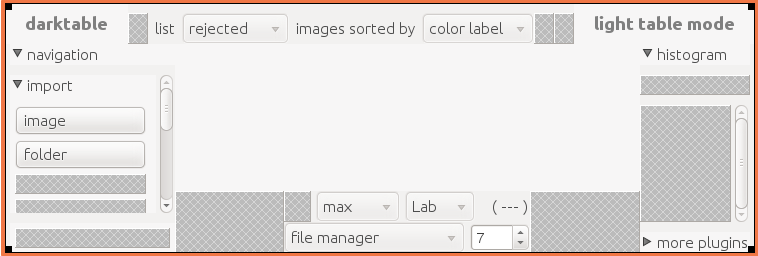
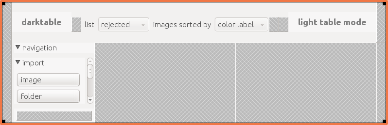

author: bieber
comments: true
date: 2011-05-31 21:34:22+00:00
layout: post
link: http://www.darktable.org/2011/05/libglade-removal-the-first-week/
slug: libglade-removal-the-first-week
title: libglade Removal: The First Week
wordpress_id: 447
tags: GSoC

I’m now a week into my first task of removing darktable’s dependency on libglade, so here’s a quick look at my progress so far.  In the first week I started out by diving in and figuring out how to instantiate all the widgets I would need, starting with the lowest levels and working my way up.  It took a little while, but with a combination of the Gtk documentation and some guesswork aided by autocomplete I’ve more or less figured out all the function calls that I need to create widgets, modify their states, attach them to containers, and so forth.

Now that I’ve learned more or less as much as I need for this task, I’ve been steadily chugging along replacing elements of the glade file with function calls in the applications GUI initialization.  So far, I’ve removed the center drawing area, the lower toolbar, the right panel area, and the left and right borders from the glade file.  For a little visual comparison, this is the glade file in the current master branch.

@

This is the current glade file in my working branch.

@

By the end of this week, I hope to get the rest of that interface moved into the code and get rid of the libglade dependency altogether.  Then I can get this all merged into master and start working on the fun tasks.  Up next on my list will be renovating the keyboard shortcut system.

