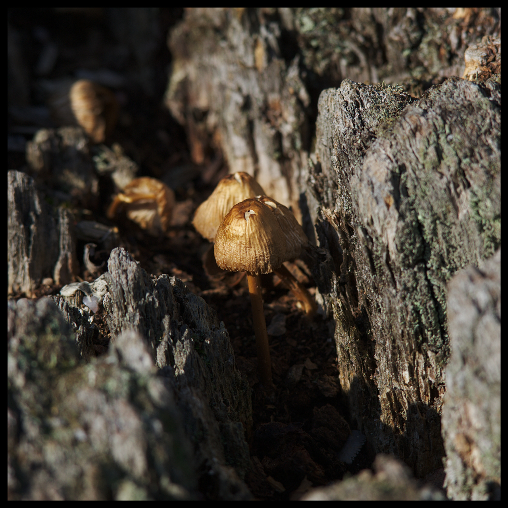
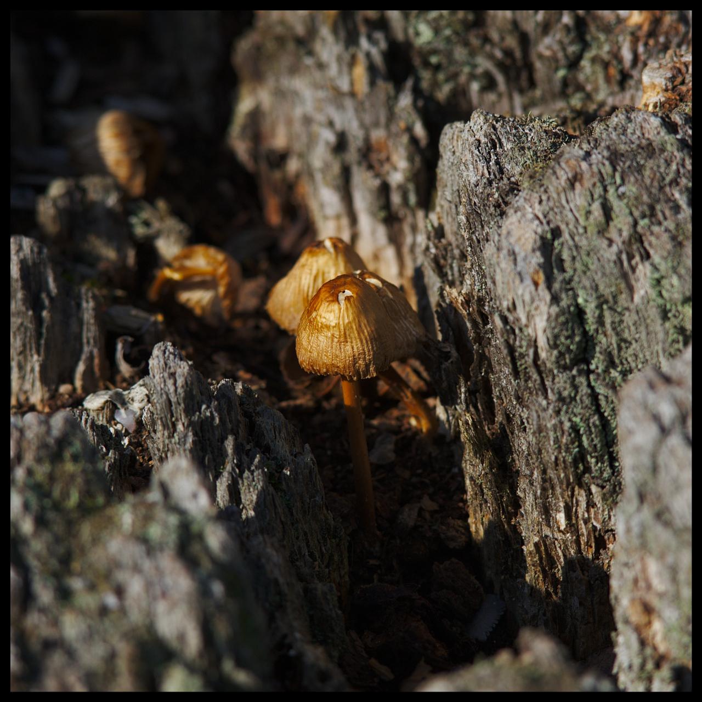

author: Henrik Andersson
comments: true
date: 2011-10-22 21:08:53+00:00
layout: post
link: http://www.darktable.org/2011/10/different-kind-of-saturation/
slug: different-kind-of-saturation
title: different kind of saturation
wordpress_lede: mushrooms_small.jpg
wordpress_id: 806
tags: blog, color, darktable, saturation, velvia, vibrance

**different kind of saturation**

@

there are many different ways of tuning saturation, darktable does offer a few alternative ways to alter saturation and the reason for this post is to clarify what they do and how they work. the image on left is the original untouched image used for the different examples below, use it as a reference for comparing the results of the different kind of saturation described below, the resulting effects is exaggerated to make it easier to spot the differences.

**color correction**

@

using this module you will use the standard "way" to change the saturation of an image, saturation of each pixel are increased/decreased evenly through all pixels, this module do have an saturation correction, ranging from -3 to +3 of saturation, 0.0 equals no saturation at all (black and white), 1.0 is unchanged and above 1.0 will add saturation to the image. saturation below zero will invert the colors eg. -1.0 inverts colors with same saturation as original.

**velvia**

@

this was my first module i developed for darktable, i had an idea to mimic velvia film colors but did not reach the whole way but the final results of my thoughts was good and the module has been around since then, however the name is not the best for what it does. velvia simply adds more saturation to low saturated pixels than high saturated ones. the mid-tones bias slider, controls the spread of saturation added to the image, setting this value to zero, the result of the saturation will not be restrained to low saturated pixels.

**vibrance**

@

this is a new experimental module that will show up in upcoming version of darktable, vibrance adds weighted saturation to saturated pixels and deepens the color by decreasing the lightness, the weighting needs some tuning but it's pretty usable in its unpolished state. generally vibrance pops the saturated colors in the image slightly.
