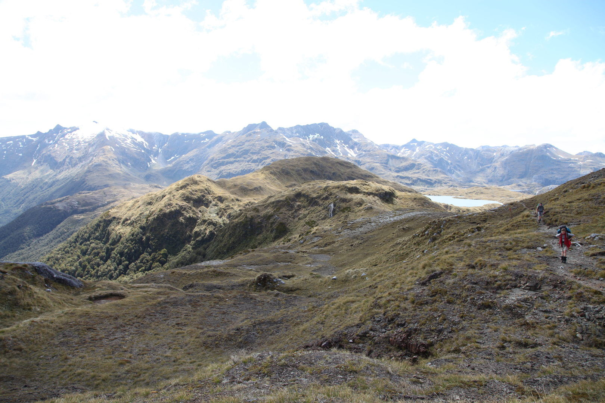
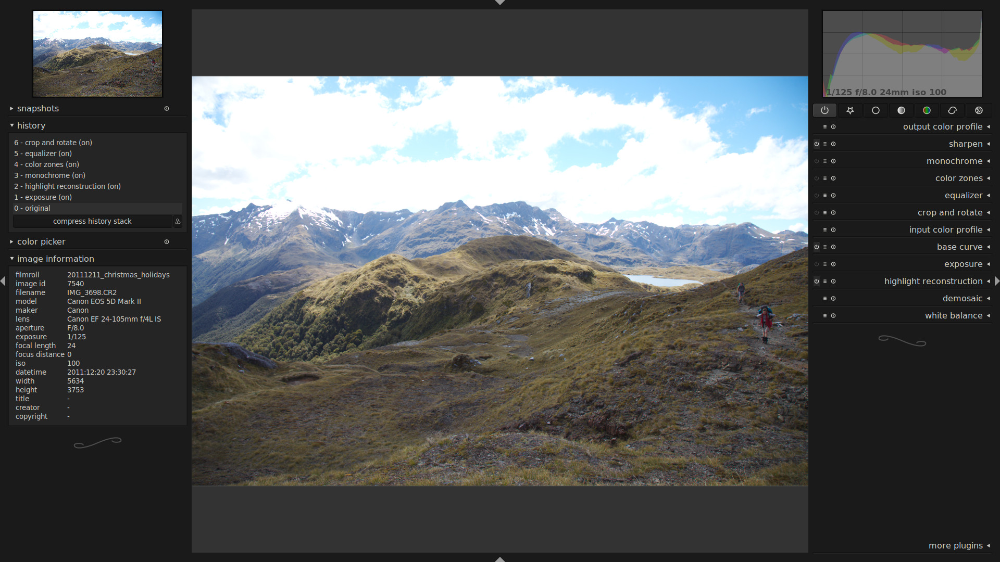
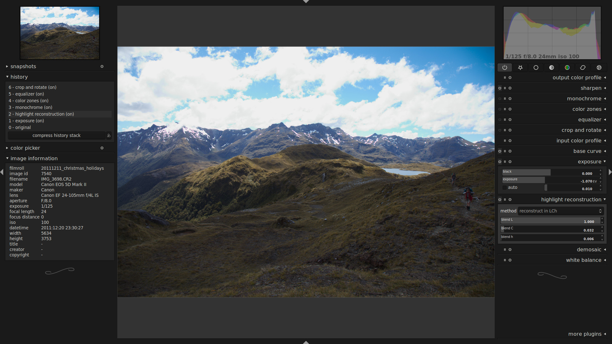
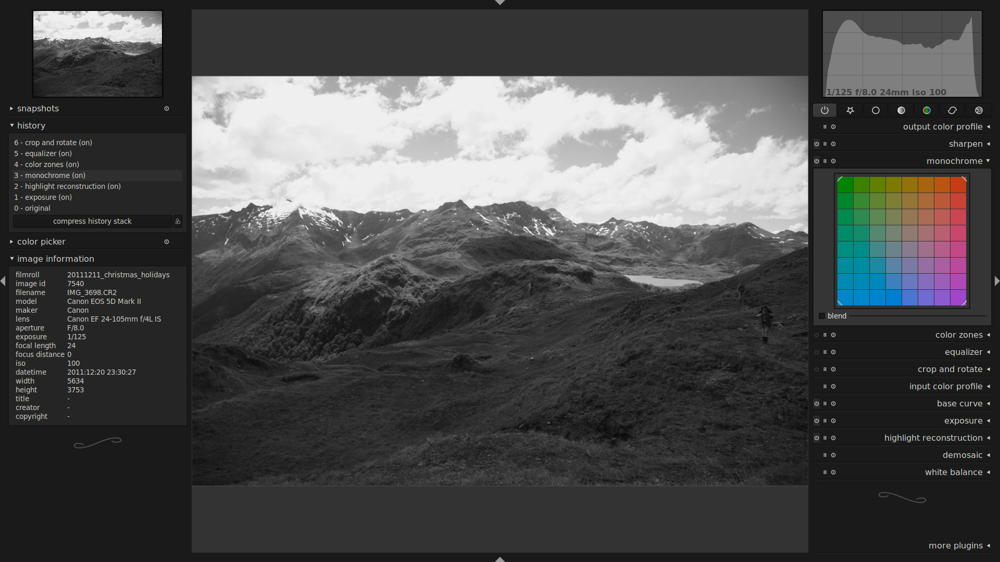
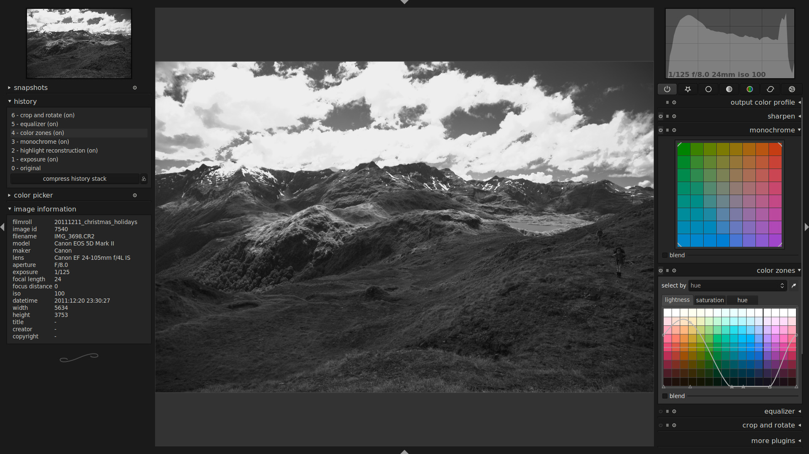
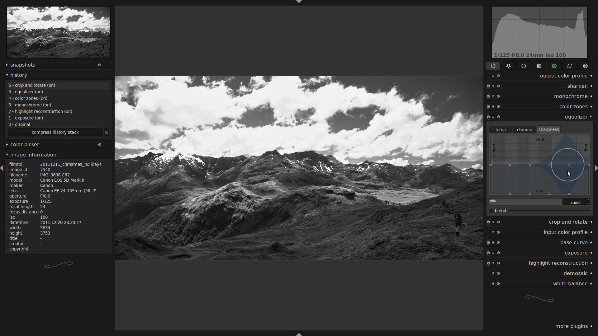
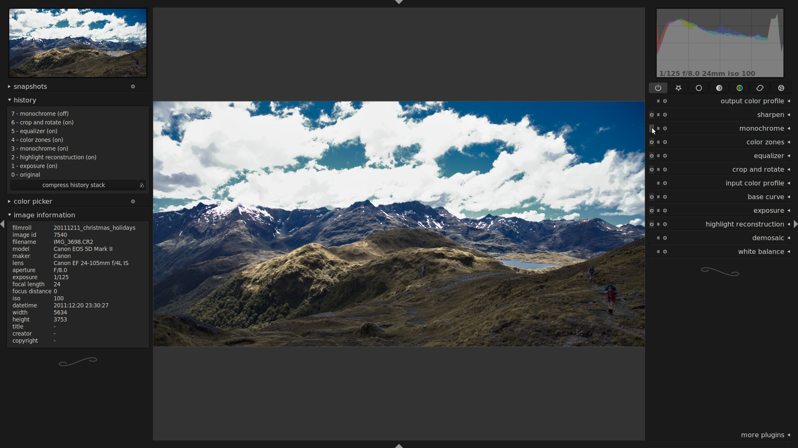

author: jo
comments: true
date: 2012-02-02 05:31:06+00:00
layout: post
link: http://www.darktable.org/2012/02/why-you-want-raw/
slug: why-you-want-raw
title: why you want raw
wordpress_lede: 00-output.jpg
wordpress_id: 985
tags: blog, color zones, highlights, monochrome, tutorial

## or: how to rescue your shot after the fact.

## also: how to use color zones for black and white.

sometimes i'm surprised by what kind of data is hidden in my raw images, and i want to pass this on to those of our users who happily take pictures in jpg. actually it's just a short story about a typical communication problem between me and my camera and the way darktable moderates that, after the fact.

this time, it was the auto exposure measurement. for some reason my camera thought the people in the foreground were pretty important here. this is the embedded jpg thumbnail as it came from the camera:

@

what i actually meant was more like this:

@

small persons in a wide mountain range with a nice cloudy sky. which is totally overexposed and almost gone in the picture as seen by my camera.

## get these details back, step by step

this is what darktable did to it by default (don't be confused by the history stack, i was going back to the original after the edits to create this post):

@

the highlights are already a bit better, we get more detail in the clouds due to higher sensor saturation values. but there's more.

stopping down the exposure a bit and switching highlight reconstruction on brings back a lot more. you can play with the blend weights for LCh separately to restore a more natural color in the clipped areas (click on the screenshot here and open it in a new tab to see the exact settings):

@

if you're not satisfied with the results, you can still convert the image to monochrome to avoid the color artifacts:

@

use the color zones module to make the sky darker and get more contrast in the clouds, by mixing more red and less blue into the lightness channel:

@

enhance it further by using the subtle clarity preset of the equalizer, double click the smoothness curve to avoid halos around the ridges of the mountains:

@

note the light on the hills on the left and the restored detail in the clouds. actually this is quite a useful shot after all!

just out of curiosity, this it what it looks like in color after our color zones adjustment. not very natural, more of a lomo look.

@

exercises for the reader:

* try to get a natural color for the lake on the right hand side (the color zones module supports color picking).
* try to get even more detail in the clouds using the tone curve or base curve.
* use the graduated density module (instead of exposure) to only stop down the sky for the highlight reconstruction step, but not the foreground.
