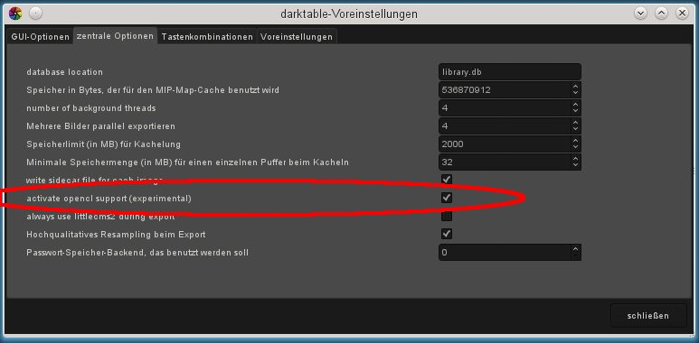

author: upegelow
comments: true
date: 2012-03-02 20:29:00+00:00
layout: post
link: http://www.darktable.org/2012/03/darktable-and-opencl/
slug: darktable-and-opencl
title: darktable and OpenCL (updated)
wordpress_lede: ocl-menu-thumb.jpeg
wordpress_id: 1279
tags: blog, development, darktable, OpenCL, tutorial

Many readers will have already heard about GPU processing and the fact that darktable can make use of OpenCL to improve performance. As we still lack a detailed documentation of that topic, please find here a few explanations and howtos.

## The Background

Processing high resolution images belongs to the more demanding tasks in modern computing. Both, in terms of memory requirements and in terms of CPU power, getting the best out of a typical 15, 20 or 25 Megapixel image can quickly bring your computer to its limits.

darktable’s requirements are no exception. Our decision to not compromise processing quality, has led to all calculations being done on 4 × 32bit floating point numbers. This is slower than “ordinary” 8 or 16bit integer algebra, but eliminates all problems of tonal breaks or loss of information.

A lot of hand optimization has been invested to make darktable as fast as possible. If you run a current version of darktable on a modern computer, you might not even notice any “slowness”. However, there are conditions and certain modules where you feel (or hear from the howling of your CPU fan) how much your poor multi-core processor has to struggle.

That’s where OpenCL comes in. OpenCL allows us to take advantage of the enormous power of modern graphics cards. It has been gamer’s demand for more and more highly detailed 3D worlds in modern ego shooters, that has fostered GPU development. ATI, NVIDIA and Co had to put enormous FPU processing power into their GPUs to meet these demands. The result is modern graphics cards with highly parallelized GPUs to quickly calculate surfaces and textures at high frame rates.

You are not a gamer and you don’t take advantage of that power? Well, then you should at least use it in darktable!

For the task of highly parallel floating point calculations modern GPUs are much faster than CPUs. That is especially true, when you want to do the same few processing steps over millions of items. Typical use case: processing of megapixel images.

## How OpenCL works

As you can imagine, hardware architectures of GPUs can vary significantly. There are different producers, and even different generations of GPUs from the same producer may differ clearly. At the same time GPU manufacturers are normally not willing to disclose many hardware details of their products to the public. One of the known consequences is the need to use proprietary drivers under Linux, if you want to take full advantage of your graphics card.

Fortunately an industry consortium lead by [The Khronos Group](https://www.khronos.org) has developed an open, standardized interface called [OpenCL](https://www.khronos.org/registry/cl/specs/opencl-1.0.pdf). It eases the use of your GPU as a numerical processing device. OpenCL offers a C99-like programming language with a strong focus on parallel computing. An application that wants to use OpenCL will need to bring along a suited OpenCL source code that it then hands over to a hardware specific OpenCL compiler at run-time. This way the application can use OpenCL on different GPU architectures (even at the same time). All “hardware secrets” are hidden in this compiler and are normally not visible to the user (or the application). The compiled OpenCL code is loaded onto your GPU and&nbsp;– with certain API calls&nbsp;– it is ready to do calculations for you.

## How to activate OpenCL in darktable

Using OpenCL in darktable requires that your PC is equipped with a suitable graphics card and that it has the required libraries in place. Namely modern graphics cards from NVIDIA and ATI come with full OpenCL support. The OpenCL compiler is normally shipped as part of the proprietary graphics driver; it is reachable as a dynamic library called “libOpenCL.so”. This library must be in a folder where it is found by your system’s dynamic linker.

When darktable starts, it will first try to find and load libOpenCL.so and&nbsp;– on success&nbsp;– check if the available graphics card comes with OpenCL support. A sufficient amount of graphics memory (1GB+) needs to be available to take advantage of the GPU. If that is OK, darktable tries to setup its OpenCL environment: a processing context needs to be initialized, a calculation pipeline to be started, OpenCL source code files (extension is .cl) need to be read and compiled and the included routines (called OpenCL kernels) need to be prepared for DT’s modules. If all that is done, the preparation is finished.

As we still regard darktable’s OpenCL support as experimental, we require the user in addition to positively activate OpenCL. Go into the preferences dialog and look for core options. Here you find a checkbox that says: “activate opencl support (experimental)”. Check that box and from that on OpenCL is used by darktable.

@

You can at any time switch it off and on again. Depending on the type of modules you are using, you will notice the effect as a general speed-up during interactive work and during export. Not all modules can take advantage of OpenCL at the moment and not all modules are demanding enough to make a noticeable difference. In order to feel a real difference, take modules like “shadows & highlights”, “sharpen”, “lowpass”, “highpass” or as an extreme case “equalizer”.

Let’s have a look at an example. I took an image of 20 MPx and processed it with a typical history stack for my way of working. This covers modules equalizer, tone curve, highpass and sharpen.

My computer is equipped with an i7-2600 CPU and an NVIDIA GeForce GTS 450 graphics card with 1GB memory. Core memory is 16GB.

For a single run of my pixelpipe in interactive mode (so called “full” pipeline), I get the following figures:

<table cellpadding="7" width="433" cellspacing="0" >
<tbody >
<tr valign="TOP" >

<td width="210" >OpenCL not activated
</td>

<td width="193" >0.76 seconds
</td>
</tr>
<tr valign="TOP" >

<td width="210" >OpenCL activated
</td>

<td width="193" >0.11 seconds
</td>
</tr>
</tbody>
</table>

This would be the typical delay, if you change a parameter or if you pan or zoom into the image.

With the same image and the same settings, I profiled the export pixelpipe when generating a JPEG file with full resolution. Here are the results:

<table cellpadding="7" width="433" cellspacing="0" >
<tbody >
<tr valign="TOP" >

<td width="210" >OpenCL not activated
</td>

<td width="193" >25.2 seconds
</td>
</tr>
<tr valign="TOP" >

<td width="210" >OpenCL activated
</td>

<td width="193" >6.5 seconds
</td>
</tr>
</tbody>
</table>

If you are interested in more profiling figures, you can call darktable with command line parameters -d opencl -d perf. After each run of the pixelpipe you will get a detailed allocation of processing time to each module plus an even more fine grained profile for all used OpenCL kernels.

Besides the speed-up you should not see any difference in the results between CPU and GPU processing. Except of rounding errors, the results are designed to be identical. If, for some reasons, darktable fails to properly finish a GPU calculation, it will normally notice and automatically (and transparently) fall back to CPU processing.

## Possible Problems and Solutions

If severe OpenCL errors occur at run-time, or the setup of our OpenCL environment fails during initialization, OpenCL will be automatically deactivated. You will notice if you open the preferences dialog and the activation checkbox has been reset to “off”.

There can be various reasons why OpenCL failed. We depend on hardware requirements and on the presence of certain drivers and libraries. In addition all these have to fit in terms of maker model and revision number. If anything does not fit, e.g. your graphics driver (loaded as a kernel module) does not match the version of your libOpenCL.so, OpenCL support is likely to fail and CPU is taking over.

In that case, the best thing to do is start darktable from a console with

    darktable -d opencl

This will give additional debugging output about the initialization and use of OpenCL. First see if you find a line that starts with “[opencl_init] FINALLY …” This should tell you, if OpenCL support is available for you or not. If initialization failed, look at the messages above for anything that reads like “could not be detected” or “could not be created”. Check if there is a hint about where it failed.

Here are a few cases observed in the past:

DT might tell you that no OpenCL aware graphics card is detected or that the available memory on your GPU is too low and the device is discarded. In that case you might need to buy a new card, if you really want OpenCL support.

DT might also tell you that a context could not be created. This often indicates a version mismatch between (loaded) graphics driver and libOpenCL. Check if you have left-over kernel modules or graphics libraries of an older install and take appropriate action. In doubt, make a clean reinstall of your graphics driver. Sometimes, immediately after a driver update, the loaded kernel driver does not match the newly installed libraries: reboot your system in that case.

DT might crash in very rare cases directly during startup. This can happen if your OpenCL setup is completely broken or if driver/library contains a severe bug. If you can’t fix it, you can still use darktable with option --disable-opencl, which will skip the entire OpenCL initialization step.

DT might on some systems fail to compile its OpenCL source files at run-time. In that case you will get a number of error messages looking like typical compiler errors. This could indicate an incompatibility between your OpenCL implementation and our interpretation of the standard. In that case visit us at [darktable-devel@sourceforge.net](mailto:darktable-devel@sourceforge.net) and report the problem. Chances are good that we can help you. Please also report in case you see significant differences between CPU and GPU processing of an image!

There also exist a few on-CPU implementations of OpenCL. These come as drivers provided by INTEL or AMD. We observed that they do not give us any speed gain versus our hand-optimized CPU code. Therefore we simply discard these devices.

## Summary

Although OpenCL support in darktable is still experimental and incomplete, it is already very usable. Give it a try and see what it can do for you!

## [Update]

Here are a few more words about optimization of your OpenCL setup once it's running. As a general rule, darktable tries to catch all OpenCL runtime errors and take appropriate action. Therefore OpenCL should normally not cause darktable to crash or give garbled output. Instead, in case of errors, DT will notice and reprocess everything again on CPU; an additional step which could slow-down processing significantly for you! Therefore it is worth investing some effort to avoid those errors.

The most limiting resource for OpenCL is GPU memory. Modern graphics cards might be equipped with 1GB or even 2GB RAM, but this is low compared to core memory and it is not too much if we want to do an export of a high resolution image. One further problem with GPU memory is the fact, that we do not know what is really free. At startup we will read from each OpenCL device the amount of available memory, but we can not take all of it. There is some (unknown) amount which the GPU driver will need for its overhead and for X11 video tasks. Trying to allocate more memory for our purposes than is available at a time will cause allocation failures and the pixelpipe to abort.

darktable's escape route out of this limitation is “tiling”. Images that are too big are processed in smaller parts (rectangular tiles) one after the other and then combined again. This happens on a per-module basis, i.e. for each module that we want to process, a decision is taken if and how many tiles we will need.

Before going into the details, the above already makes clear that we should not process several images in parallel with OpenCL. We already make maximum use of GPU memory by tiling and the nature of GPU processing will already parallelize processing to the max on a pixel by pixel basis. No room for additional parallelization. In preferences set "export multiple images in parallel" to 1.

When you are running darktable with OpenCL support and if you suspect slow processing (namely during image exports), restart DT from a console with option `-d opencl`.

Watch out for modules that fail with an error message. Pay special attention to error code -4; this is the error we get when on-GPU memory allocation fails. Module “equalizer” is a hot candidate for this. Sometimes you might get a message on a module failing due to not fulfilled “roi” requests (esp. module “demosaic”). This can be ignored; it is a current darktable limitation but does not indicate any OpenCL problem.

If you get “-4” errors, go into file `$HOME/.config/darktable/darktablerc`, where DT stores its configuration parameters and look for `opencl_memory_headroom`. This value tells darktable how many megabytes (out of the totally available amount) should be left free for driver and video purposes. By default it is set to 300MB, which works well with current NVIDIA cards. If you increase this value (steps of 50 are a good choice), you even further reduce danger to run into allocation failures. On the negative side, this requires stronger tiling (more but smaller tiles) which is a bit less efficient. In the end you should rather accept more tiling than more allocation failures!

With current Radeon cards users have observed a different issue. Those cards will often only report to have less available memory than they physically own; typically 512MB out of 1GB. In the first place this will prevent them from being accepted as valuable OpenCL devices by DT (we set a minimum requirement of 768MB). You can change this behavior if you set opencl_memory_requirement to 512. The good news is that Radeon cards seem to have less memory overhead (at least within the reported 512MB). Therefore you can try to set opencl_memory_headroom to a value as low as 150 or even 100. This should leave you with a quite reasonable amount of free GPU memory for OpenCL processing. Give it a try and share your success stories at [darktable-users@sourceforge.net](mailto:darktable-users@sourceforge.net).
