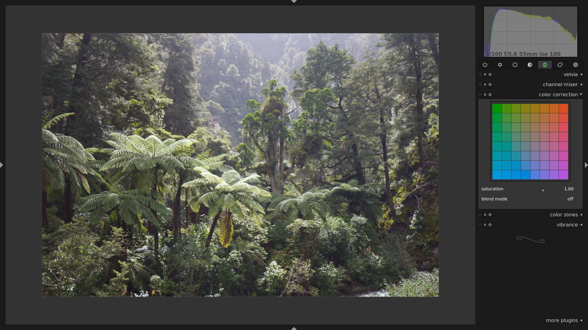
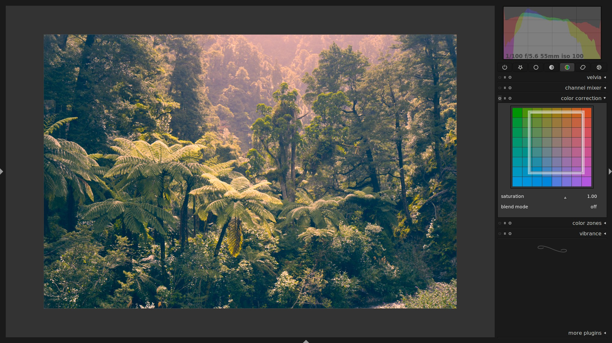
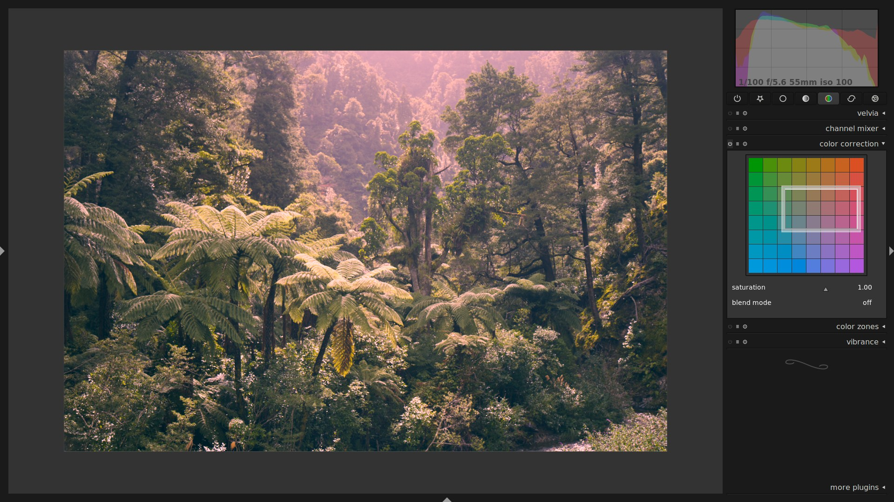
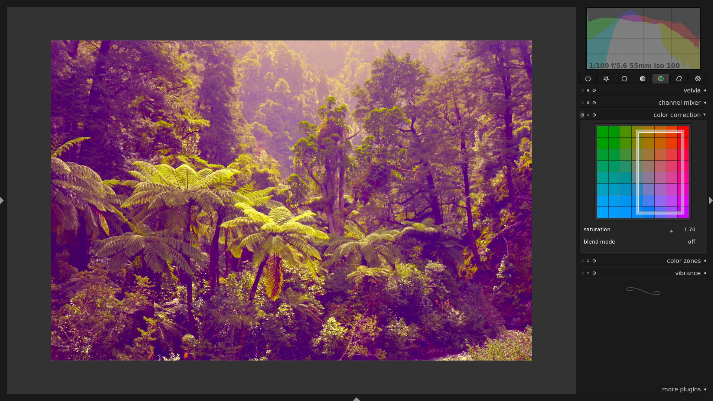
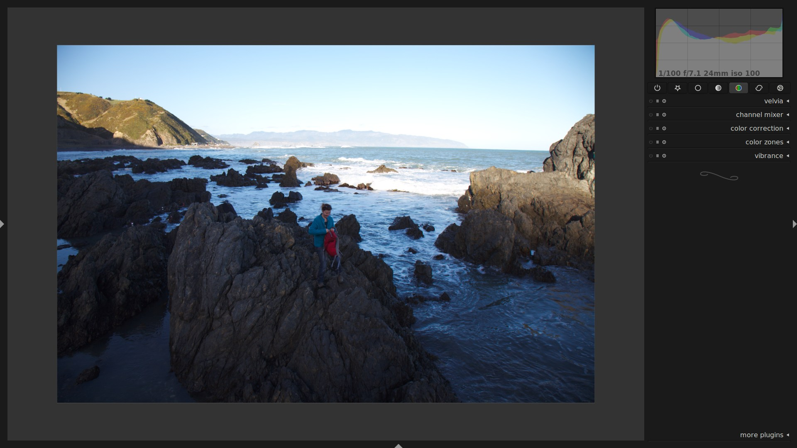
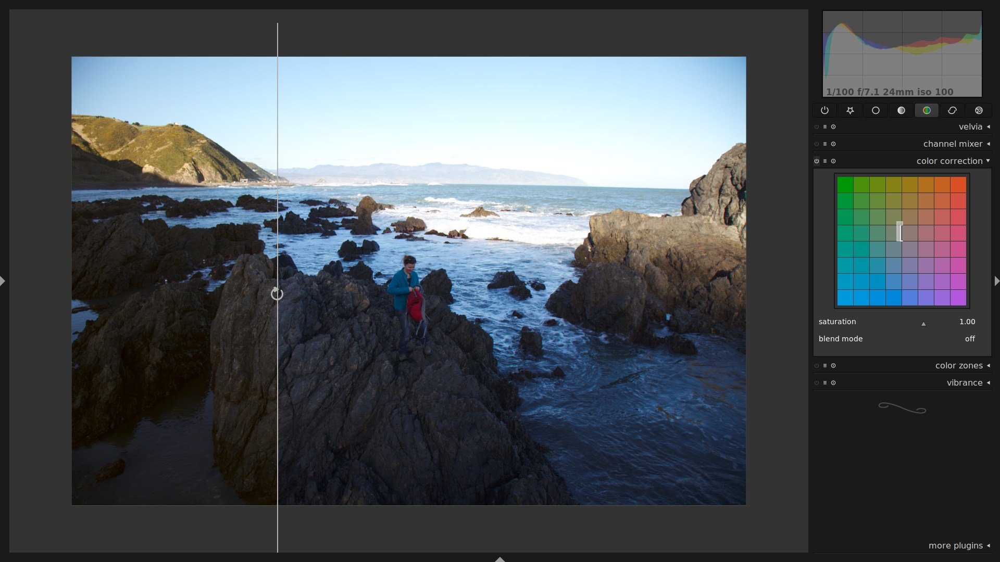

this is one of the oldest modules in darktable. it appeared to me that it probably lacks an example to discover how useful it can be ... so here goes the example.

this started off to be a wrapper around the [gegl:whitebalance operation](http://gegl.org/operations.html#op_gegl:whitebalance), which works in Lab color space and is able to give dark and bright colors a different color tint, interpolating between the two for mid tones.

so suppose you have the following image:

and want to adjust white balance for the highlights and the shadows separately. you can do that by pulling the box inside the color panel around:

with the box open, you'll notice that two edges are dark, and two are light. these define the color shift for shadows and highlights, respectively. in the example above, i pulled highlights towards red, and the shadows towards blue. play around with them, to get a better feel for it:

you can also use the mouse wheel to adjust saturation:

and finally, to give you a real-world example, so you don't discard this module as b-movie relevant only. the following is an image which has a double-whitebalance situation. the dark rocks in the foreground have a bluish tint, whereas i like the warm tones of the cliff and the sky in the background.

by leaving the light edges where they were, and just dragging the dark edges a bit up towards yellow, you can achieve the following (screen capture with active snapshot, to make the comparison more obvious. left: after, right: before).

note how the sky and the hill on the left hardly changed at all, while the rock in the foreground now nicely blends into the warm white balance of the bright parts.

sidenote: this also works for black and white images, to tint your image after monochrome conversion.

