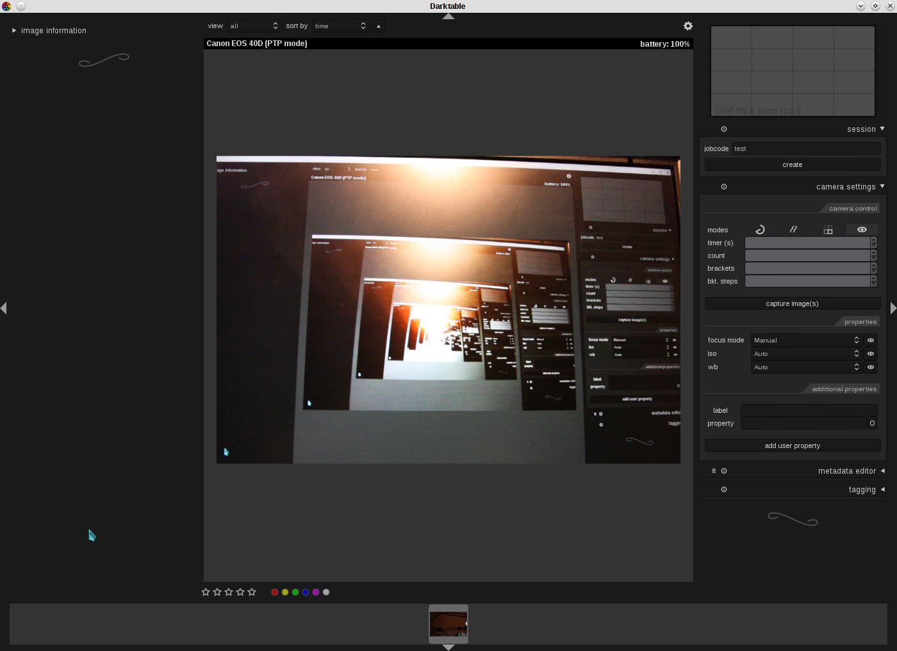

author: houz
comments: true
date: 2012-05-30 22:10:52+00:00
layout: post
link: http://www.darktable.org/2012/05/live-view/
slug: live-view
title: Live view
lede: Bildschirmphoto116_wide.jpg
wordpress_id: 1683
tags: blog, development, live view, tethering

@

For quite some time darktable supports tethering your camera. What was missing all the time was live view. This is about to change though. If you use master (and have a camera supporting it) you can now either use the eye button in the “camera settings” module or hit ‘v’ on your keyboard to start live view from within tethering mode. Since the preview is scaled to fit your screen it might be a good idea to hide some of the side panels. If you are using a Canon EOS (I only tested this with my 40D) you can also use your middle mouse button to zoom into the preview. Another click brings you back to regular live view.

There are a few things left to do:

* When stopping life view/leaving tethered mode the mirror of the camera doesn't return to its normal position
* The zoomed preview doesn't look nice when the side panels are expanded. I didn't want to scale this down.
* Zooming doesn't work for non-Canon cameras.
* Sometimes turning off live view doesn't work.
* At least with my camera the release button no longer works when doing live view. I have no idea if there is anything we can do about it. Using the “capture image(s)” button in darktable works though.
* Possibly some other unnoticed bugs.

So, feel free to play around with it, try to break it and report back. And keep in mind that this will suck your batteries dry really fast ...

End of transmission

_Update_: There is a video of the current state in this [blog post](https://tatica.org/2012/06/21/darktable-liveview/).
