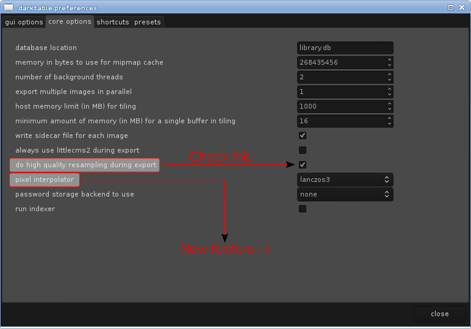
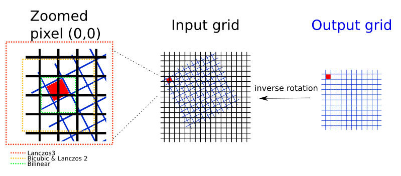
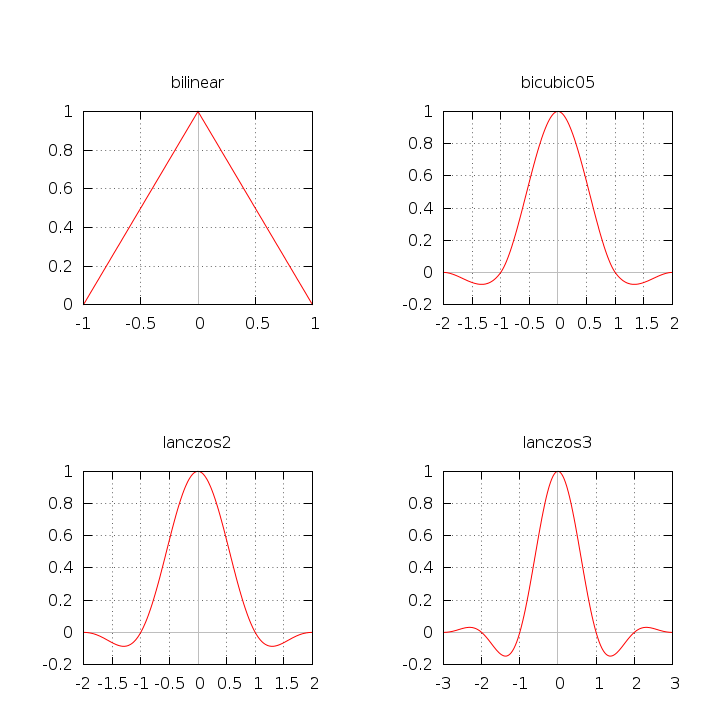

author: edgomez
comments: true
date: 2012-06-02 07:34:51+00:00
layout: post
link: http://www.darktable.org/2012/06/upcoming-features-new-interpolation-modes-and-better-resize/
slug: upcoming-features-new-interpolation-modes-and-better-resize
title: Upcoming features: New interpolation modes and better resize
wordpress_lede: dt-interpolation-results-testchart.png
wordpress_id: 1527
tags: blog, development, upcoming feature, bicubic, bilinear, interpolation, lanczos, lens correction, rotation

darktable is all about providing you the best tools in order to get the most out of your photographies. This blog entry will explain how an existing feature can help you get more detailed exports and it will try to give you a glimpse of what is cooking in an unscheduled but upcoming version of darktable for even better detail preservation.

# Make sure to enable High Quality Resampling for exporting your photographies

In darktable, the pixel pipeline is responsible for processing your photography from demosaic up to the point it is passed over to the output subsystem (saving in tiff, jpeg...).

The option _“Do high quality resampling ...”_, available in the core preferences panel, controls when the photo is resized to its final dimensions during the export process.

<figure markdown="span" role="group">
@
<figcaption>Preferences panel showing HQ resampling and new interpolators</figcaption>
</figure>

For a long time, the default setting was to resize early in the pixel pipeline in order to lower both memory requirements and processing time. This may seem appealing but it has a serious drawback; an early resize throws away lot of precious detail that modules could use at your advantage.

When _“Do high quality resampling ...”_ is enabled, darktable processes the image as its full resolution until the very end of the pixel pipeline, and only then, resizes it. In this mode, detail is preserved but more memory and CPU power is required to process the photography.

# Beware arbitrary angle rotation and Lens distortion correction in 1.0.x

Some users complain about some observable blurriness when they use the _lens distortion correction_ module or an arbitrary rotation in the _crop/rotate_ module.

These two modules work the same way. They iterate over the output sampling grid and for an output pixel (x,y), they compute its corresponding pixel (x', y') in the original image. So far so good, but the computed (x', y') coordinates are rarely aligned on the original photo sampling grid (read x' and y' aren't integers anymore); It is then necessary to interpolate the pixel value using its neighbors.

<figure markdown="span" role="group">
@
<figcaption>Interpolation input pixels</figcaption>
</figure>

For doing so, darktable 1.0.x used to implement bilinear interpolation. The bilinear interpolation considers only the four pixels surrounding the pixel at (x', y') position. This algorithm is fast, and good enough for lot of applications.

However, bilinear interpolation falls short when looking at the detail preservation it achieves.

## New interpolation modes to the rescue

The interpolation problem, which is tightly related to the sampling theory is a well known and important part of the Digital Signal Processing theory. An ideal solution for our interpolation blurriness exists: the sin(t)/t function. However, the fact that it has an infinite support makes it impossible to transpose into a real applicable algorithm.

But some smart men already detailed practical solutions that try to approximate the ideal function. Two of these solutions are named bicubic interpolation and lanczos interpolation.

See their 1D graph:

<figure markdown="span" role="group">
@
<figcaption>Interpolation functions</figcaption>
</figure>

As you can see on the graphics, the bicubic and lanczos family of interpolation functions have a greater kernel support. In 1D sampling, the kernel size is only 2 samples large for the bilinear function, 4 pixels large for the bicubic and the lanczos2 functions, and finally reaches 6 samples large for the lanczos3 function. You can see the 2D kernel support size in the figure explaining the rotation module.

All that extra samples used for a single output sample make the new interpolation filters keep more details and be more accurate.

# A real High Quality Resampling

By now, you know that the hq export option helps getting sharper exports, you also know that new interpolation modes will help you when using arbitrary rotations and lens distortion correction. But what if I told you that the very same hq export resampling I praised so much, isn't really hq at all!

A downsampling algorithm ensures no moiré/aliasing occurs during its processing using what is called a lowpass filter function. darktable 1.0.x uses the  box filter function. As you might have guessed, better functions exist.

Hopefully, all interpolation functions detailed in this blog entry are also lowpass filter functions. And moreover, they perform better than the box filter. The photography resampling will be more accurate, and keep more detail.

As a conclusion see the results for a sensor test chart where arbitrary rotation/lens distortion correction is applied and the export is done using a 512 pixel width:

<figure markdown="span" role="group">
@
<figcaption>Interpolation results&nbsp;– See fullsize version for better review</figcaption>
</figure>
