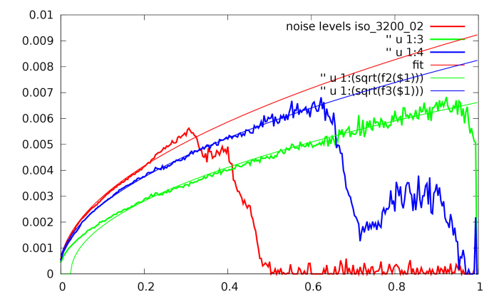
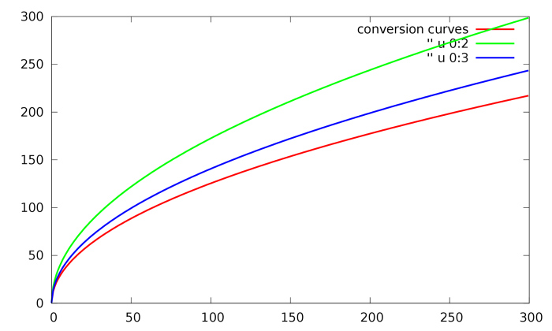
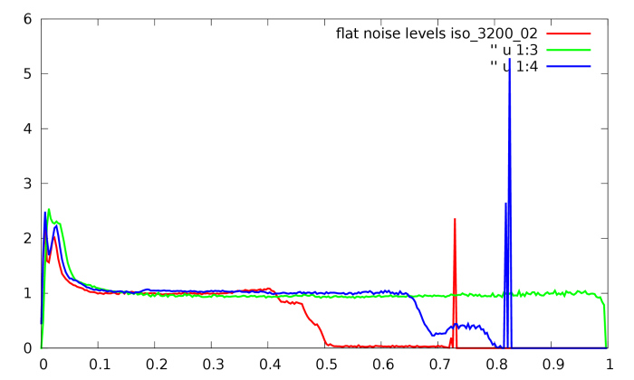
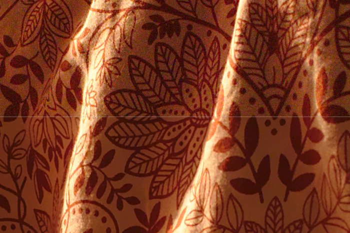
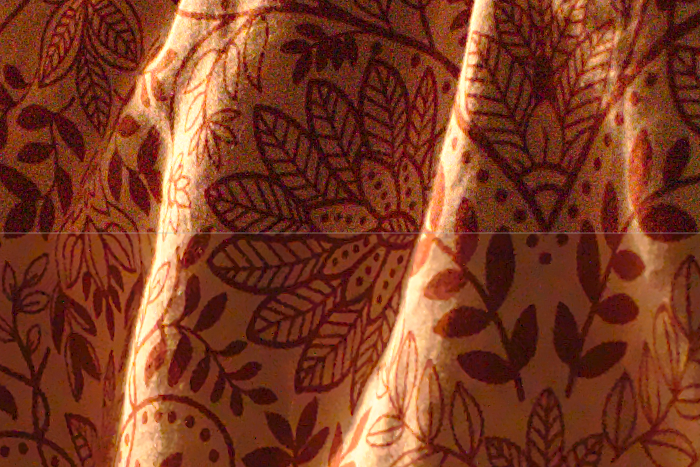
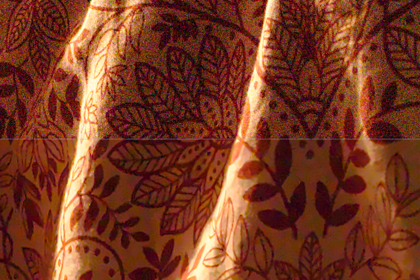
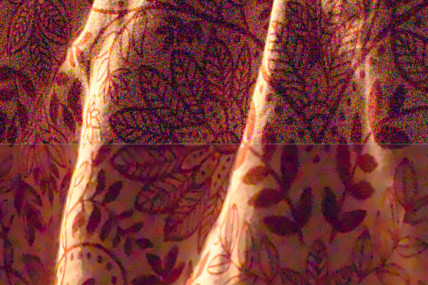
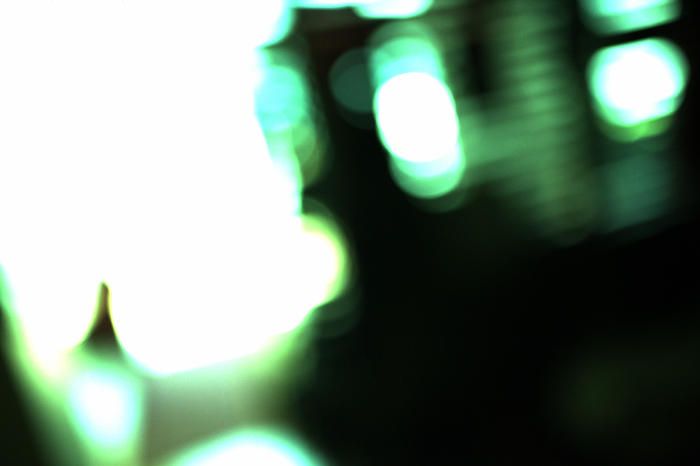
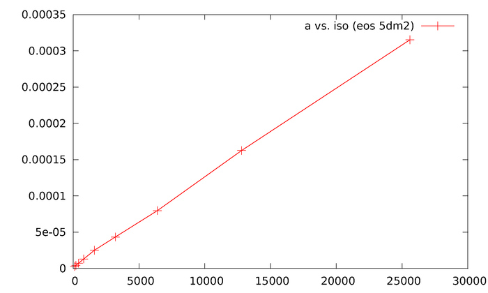
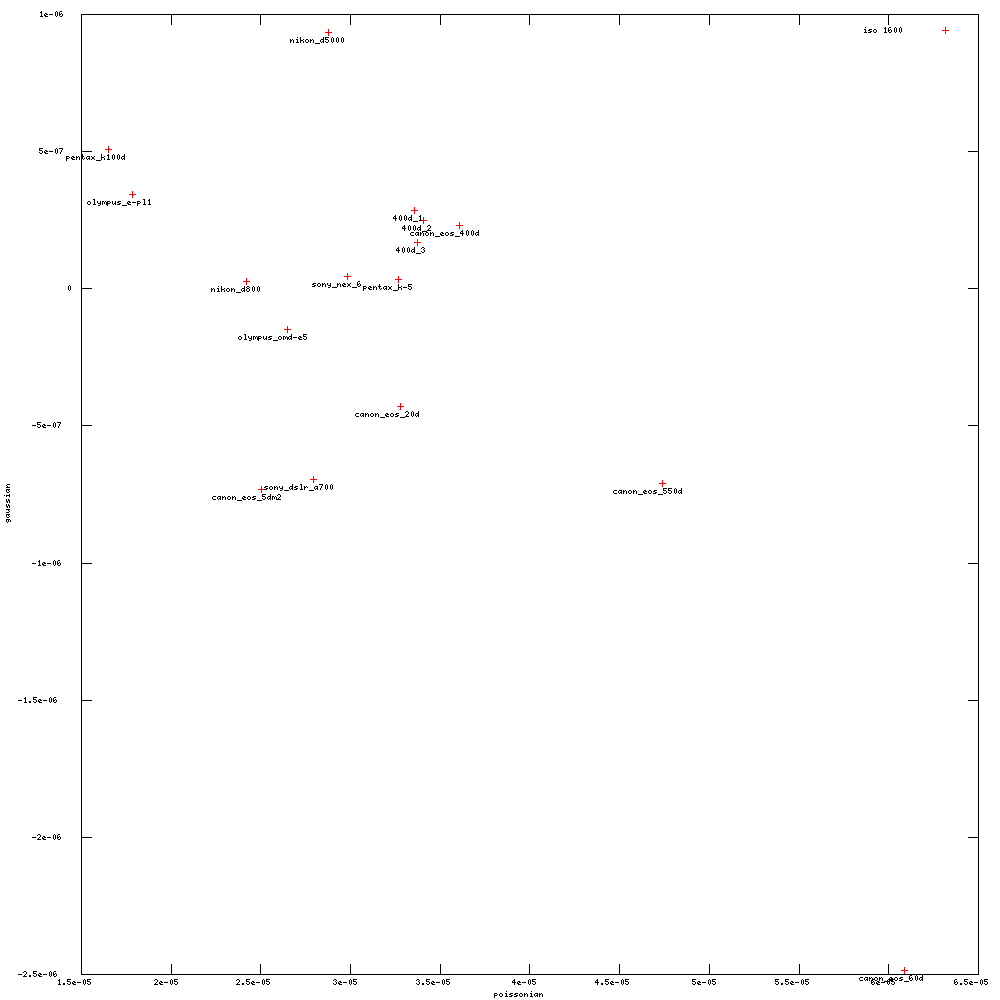

author: jo
comments: true
date: 2012-12-11 06:48:50+00:00
layout: post
link: http://www.darktable.org/2012/12/profiling-sensor-and-photon-noise/
slug: profiling-sensor-and-photon-noise
title: profiling sensor and photon noise
wordpress_lede: denoise_teaser.jpg
wordpress_id: 2368
tags: blog, development, upcoming feature

# ... and how to get rid of it.

**[update 02/05/2018 The information how to create camera noise profiles is outdated please read [this tutorial](https://pixls.us/articles/how-to-create-camera-noise-profiles-for-darktable/) instead!]**

**[update 20/12/2012: ‘how to profile your camera’ includes instructions with the new gen-profile script]**

**[update 15/12/2012: no more recompile needed, updated the instructions in the benchmark section and how to run make.sh.]**

to summarize the current situation in dt: we have a lot of cool tools wrapped around great algorithms with almost all the knobs you need to get perfect results. while you can actually get really great results it’s this sheer number of knobs that makes finding a good parameter set quite a time consuming task. even creating per-iso presets is not straight forward, as most of the current modules depend on a lot more stuff early on in the pipe (whitebalance, exposure, basecurve, etc).

in the following, i’d like to look into automating this process and (after some calibration work, which could be optional, but less optimal) then something closer to a single-click solution. the plan is:

* design a module where the denoising performance only depends on camera and iso setting.
* profile (camera, iso) pairs and store presets for each one of those (can be interpolated potentially).
* auto-apply them in switched-off state, so you can enable the right thing by just clicking the module’s ‘off button’ once.

**[update 20/12/2012: this work is now in git master]**

# background

a lot of research is centered around denoising images corrupted by additive white gaussian noise. this means that your input signal x is observed as

$$y = x + n, n \sim \mathcal{N}(0, \sigma^2).$$

unfortunately, digital cameras don’t follow that pattern, so the noise is mostly dominated by some sort of signal-independent sensor noise and signal-dependent photon noise (or ‘shot noise’). this non uniform noise follows a poissonian-gaussian distribution [2]

$$y = \alpha p_i + n_i, p_i \sim \mathcal{P}(x), n_i \sim \mathcal{N}(0, \sigma^2).$$

a poissonian is a discrete distribution, emerging from quantized photon behaviour. alpha converts this to a number range we use in image processing ([0, 1] with extrapolated hdr headroom in the case of dt). to be able to apply general denoising procedures, we need to stabilize this noise via a transform [0].

denoising is then done in three steps:

1. transform to map variance to unity uniformly all over the image,
2. denoise with a generic method against additive white gaussian noise,
3. backtransform

academia seems to fight additive white gaussian noise with current king-of-the-hill bm3d [6] and extensions. dt uses bilateral filters or non-local means [5]. the latter combined with a relatively simple extension [4] has been shown to perform quite well (fast, next to no implementation overhead for us).

there are very elegant wavelet based methods, too [3], so i also tried to drop in our wavelet code using bayes-shrink with an overcomplete wavelet transform, i.e. do a soft threshold shrinkage with threshold:

$$T = \sigma^2/\sigma_x = \sigma^2/\sqrt{\max\left\{0, \sigma_y^2-\sigma^2\right\}}.$$

the results had certain wavelety artifacts, so the following is using our nlmeans code to remove additive gaussian noise.

# example

to illustrate the above noise model, here’s a plot of noise standard deviation sigma vs. brightness from a canon eos 5dm2 at iso 3200:

@

note how noise increases at higher brightness (caused by the poissonian distribution) and has a global offset (caused by the additive gaussian). only the green channel is saturated, the other two channels absorb too much of the light to go all the way to the right.

noise is estimated via mad (median of absolute deviations) on the finest hh coefficients of a wavelet transform, assuming zero mean. this is why the calibration shot needs to be out of focus, we want to minimize the spill of edge information into the hh coefficients. the median estimator is robust to a few outliers, but we still want to violate the assumption that the finest wavelet coefficients only contain noise as little as possible.

to fit an analytical model to these curves, we approximate

$$\mathcal{P}(x) \approx \mathcal{N}(x, x)$$

and fit this noise model to it [2]:

$$\sigma(y) = \sqrt{\max\left\{0, a\cdot y + b \right\}}.$$

note that our fit in the above graph (smooth curve, green) goes below zero, which can be caused by the black level (which is subtracted in these input numbers).

these fits can be used to construct conversion curves [1], which look as follows:

@

applying those to an image, and then computing the noise levels vs. brightness again, we get this nice flat graph that mostly shows sigma=1 (which indicates white additive gaussian noise, yay!):

@

this is easy to process with your favourite denoising filter (wiener filter and dct, bm3d, wavelet-based methods, nlmeans etc).

all that remains to be done is to map the values back to their original range. note that the algebraic inverse of the mapping is the wrong thing to do; we want an unbiased inverse [1].

# results

this table shows some numerical results in terms of peak signal to noise ratio before and after denoising.
the reference image is the mean of two iso 100 shots.
<table >
<tbody >
<tr class="even" >

<td >iso
</td>

<td >psnr noisy
</td>

<td >psnr denoised
</td>

<td >psnr handtuned
</td>
</tr>
<tr class="odd" >

<td >100
</td>

<td >41.3101
</td>

<td >41.9915
</td>
</tr>
<tr class="even" >

<td >100
</td>

<td >40.6879
</td>

<td >41.3296
</td>
</tr>
<tr class="odd" >

<td >400
</td>

<td >34.5583
</td>

<td >38.4054
</td>
</tr>
<tr class="even" >

<td >800
</td>

<td >31.0149
</td>

<td >33.6109
</td>
</tr>
<tr class="odd" >

<td >1600
</td>

<td >29.5853
</td>

<td >33.9332
</td>
</tr>
<tr class="even" >

<td >3200
</td>

<td >25.8187
</td>

<td >29.4477
</td>
</tr>
<tr class="odd" >

<td >6400
</td>

<td >23.5462
</td>

<td >28.7782
</td>

<td >28.5843
</td>
</tr>
<tr class="even" >

<td >12800
</td>

<td >20.4019
</td>

<td >25.5775
</td>

<td >25.6052/25.629 (*)
</td>
</tr>
<tr class="odd" >

<td >25600
</td>

<td >17.1598
</td>

<td >24.7214
</td>
</tr>
</tbody>
</table>
(*) handtuned using old nlmeans/equalizer and handtuned using the new module.

interestingly, i get better results out of iso 1600 than from 800. this can have a lot of causes and it would have been a good idea to measure the camera’s native iso levels instead of powers of two.

here are a couple of 1:1 screen grabs to illustrate the numbers. from top to bottom: iso 3200, 6400, 12800 and 25600 with one-click denoise results:

@

@

@

iso 25600 seems to have trouble with the black level, judging by the color cast (lifting the black level manually helps a little, fixing whitebalance instead of using auto made things worse). apart from that i’m still not going to recommend it for everyday use, but maybe downsized resolutions will be useful for some purposes at times.

# how to profile your camera

**The following information is outdated please read [this tutorial](https://pixls.us/articles/how-to-create-camera-noise-profiles-for-darktable/) instead!**

the parameters (a, b) have to be found for each (camera, iso) pair. these are then stored in a preset for a new denoising module. there is a generic (poissonian only) preset, but you can’t dial in these values manually, you have to create a preset for your camera and iso (if it doesn’t already exist).

to generate a profile, dt ships a couple of scripts and tools in tools/noise/. it will create presets as well as a couple of detailed data plots used to verify the usefulness of the result, such as the curves seen above.

the steps in detail:

## taking noise profile images

**The following information is outdated please read [this tutorial](https://pixls.us/articles/how-to-create-camera-noise-profiles-for-darktable/) instead!**

take one shot per iso. it has to be out-of-focus and have a widespread histogram, i.e. be over- and underexposed at the same time (see example image below). if you want to be thorough, take 2–3 to verify the numbers.
this image looks very green, because the ‘raw linear’ style has been applied to it (find it in `darktable/tools/noise`). this makes sure we get linear camera raw rgb with no basecurves, no whitebalance, etc in the way. it is essential that you apply this style.

you can either take those shots manually or have

`~/darktable/tools/noise/gen-profile`

take them for you via gphoto2. you need gphoto2, exiv2 and gnuplot installed to run the script (well, plus various coreutils).

your images should look something like this:

@

## generate plots and fits

**The following information is outdated please read [this tutorial](https://pixls.us/articles/how-to-create-camera-noise-profiles-for-darktable/) instead!**

open a terminal, go to the directory you just exported your images to. from there, type

`~/darktable/tools/noise/gen-profile -d .`

this will create a ton of informative pdf files, which should look like the above examples. if the fit doesn’t match the curves, or the curves look wildly different than the general shape in the plots above, something went wrong (most likely your image wasn’t overexposed enough, so check the histogram). this script will output a file `presets.txt` with copy/pastable presets for your camera, to be shipped with dt. one line will look something like:

`{n_("canon eos 5dm2 iso 3200"), "Canon", "EOS 5D Mark 2", 3200, {1.0f, 1.0f, {4.494e-05, 4.494e-05, 4.494e-05}, {-1.063e-06, -1.063e-06, -1.063e-06}}},`

the exif data (model, maker, and iso) is used to do automatic matching of the correct preset, so you only need to enable the module.

additionally, this script will copy your darktable database, inject the newly created presets for you to test, and instruct you how to run dt with that library for a test.

## run a benchmark (optional)

this requires additional shots. since we want to verify what we did was reasonable, we want (and need) independent input.

to test the presets you just created, you have to run darktable as instructed at the end of the script, something like:

`darktable --library /tmp/library.db`

take one image for each iso setting you’re interested in (same iso sequence as above). for iso 100, take 2–3 of them. it is essential that these images only differ in iso and exposure time (take them with a sturdy tripod and aperture priority mode).

create a reference image (use the ‘create hdr’ button in lighttable mode with a couple of iso 100 shots).

you don’t need to apply any styles this time, leave the images as natural as possible (but all the same).

export your images as float pfm to the same directory (filename `iso$(EXIF_ISO)` is a good idea), also put the reference as `reference.pfm` in there.

apply the newly created presets to your images, export them in that directory too (float pfm, use `iso$(EXIF_ISO)_denoised` as a filename for example).

then run

`~/darktable/tools/noise/benchmark.sh`

to verify that the psnr values are reasonable. the denoised version should always have a higher psnr than the input (even for iso 100), the values should be in the range of the above table.

## ship it!

send your new presets to one of our mailing lists, or upload them to some pastebin or similar and let us know in irc. we might also be interested in the pdf files with the plots, to verify your fits worked out and everything looks fine.

# using the new ‘denoise (profiled)’ module

the goal of this work was to give you a simple, single-click denoiser that always just works (tm). there are still a few options exposed for your tweaking pleasure, though these affect how the nlmeans core works. the conversion curves are not exposed to the user, but there is a generic preset for non-profiled cameras which will try to roughly do something reasonable.

* patch size: 0 will degenerate to a bilateral filter. increasing the number will increase sharpness in your output, but you might have to increase ‘strength’ to counter balance the effect.
* strength: make denoising stronger (> 1) or weaker (< 1). mostly a matter of taste. the default setting was chosen to maximize psnr in my tests (with a patch size of 1) .

# future work

it seems that the fit parameters (a, b) behave quite nicely with iso, so it might be possible to interpolate them for your exact iso setting. see for example this plot of the parameter a (poissonian component) for a canon eos 5dm2 indicating that simple linear interpolation will be enough:

@

it should also be easy to auto-create this graph as a quick sanity check for new presets.

the influence of exposure time on the gaussian part is another thing to take into account, especially the case when the black frame is subtracted in camera.

**[update 23/12/2012: this interpolation is now happening automatically in git master when you enable or reset the module]**

# the bottom line

if you’re not into signal processing and don’t like to profile your gear, just hope someone already measured your camera, enable the new denoising module and enjoy parameter free optimal denoising. it’s magic!

# references

* [0] paul prucnal, bahaa saleh: transformation of image-signal-dependent noise into image-signal-independent noise, optics letters, vol. 6, no. 7, 1981.
* [1] markku makitalo, alessandro foi: optimal inversion of the generalized anscombe transformation for poisson-gaussian noise, ieee trans. image process.
* [2] alessandro foi et al.: practical poissonian-gaussian noise modeling and fitting for single-image raw-data, ieee trans. image process. vol. 17, no. 10, 2008.
* [3] frolian luisier, thierry blu: a new sure approach to image denoising: interscale orthonormal wavelet thresholding, ieee trans. image process. vol.16, no. 3, 2007.
* [4] charles kervrann and jerome boulanger: optimal spatial adaptation for patch-based image denoising. ieee trans. image process. vol. 15, no. 10, 2006.
* [5] antoni buades, bartomeu coll, jean-michel morel: a non-local algorithm for image denoising. proc. cvpr 2005.
* [6] k. dabov, a. foi, v. katkovnik, and k. egiazarian: image denoising with block-matching and 3d filtering. proc. spie electronic imaging, 2006.

# appendix

in this short time, you guys contributed presets for:

* canon eos-1ds mark ii
* canon eos 20d
* canon eos 30d
* canon eos 350d
* canon eos 400d
* canon eos 40d
* canon eos 450d
* canon eos 50d
* canon eos 550d
* canon eos 5d mark ii
* canon eos 5d mark iii
* canon eos 600d
* canon eos 60d
* canon eos 7d
* canon powershot g10
* canon powershot s90
* konica minolta dynax 5d
* nikon d300
* nikon d3100
* nikon d5000
* nikon d5100
* nikon d600
* nikon d7000
* nikon d80
* nikon d800
* nikon d90
* olympus e-30
* olympus e-400
* olympus e-420
* olympus e-m5
* olympus e-pl1
* panasonic dmc-fz18
* panasonic dmc-g3
* panasonic dmc-g5
* panasonic dmc-gf1
* panasonic dmc-gx1
* pentax k100d
* pentax k10d
* pentax k200d
* pentax k-5
* pentax k-7
* pentax k-x
* sony dslr-a200
* sony dslr-a230
* sony dslr-a550
* sony dslr-a700
* sony nex-3
* sony nex-6
* sony nex-7
* sony nex-c3
* sony slt-a55v
* sony slt-a65v

which seem to work great, thanks for that!

this also enables us to do nice cross-camera noise comparisons, like so:

@

lower would be better for both axes, but note that lower gaussian noise level might just mean higher black level. so i wouldn’t base my camera purchase on these plots just yet.

note how the four versions of the eos 400d gather around almost the same spot. three of those have been taken at almost the same time, and one of them comes from a different day with different lighting. this shows that the method can produce consistent results (and that you might gain some accuracy by averaging a few runs). it would now be interesting to see how far away from that cluster a different device of the same type is, to verify using someone else’s presets is a good idea.

someone noted that, at times, noise still stays in your image, visible as large color blotches (not fine grained anymore). these can be alleviated by the equalizer, using something [similar to this style](https://darktable.org/redmine/attachments/download/351/suppress%20color%20blotches.dtstyle).
