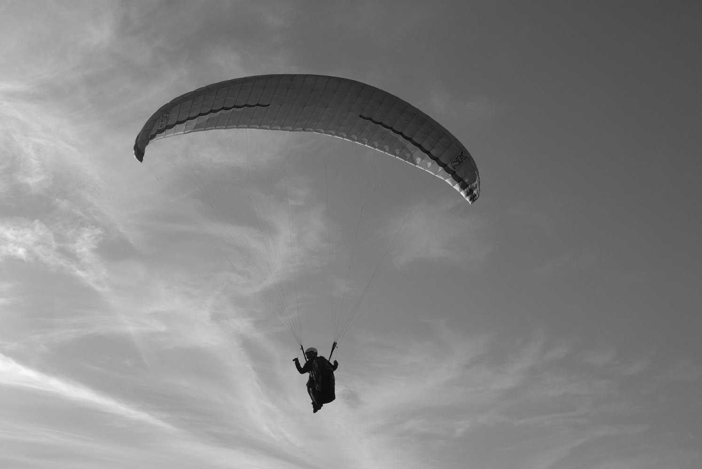
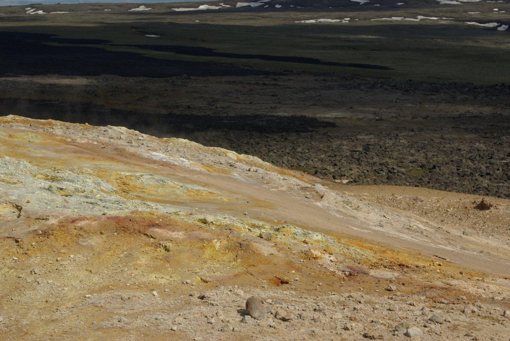
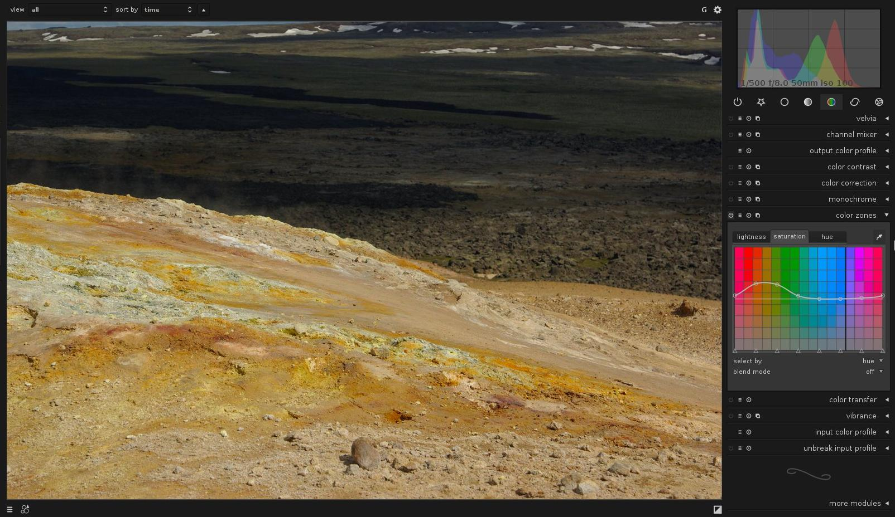
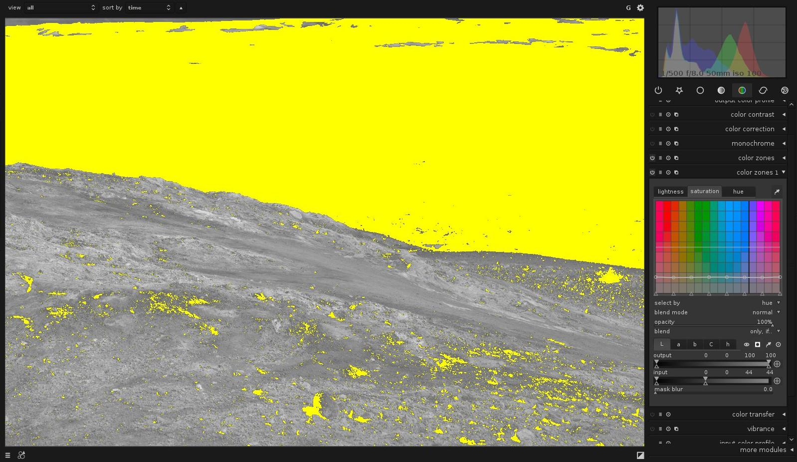
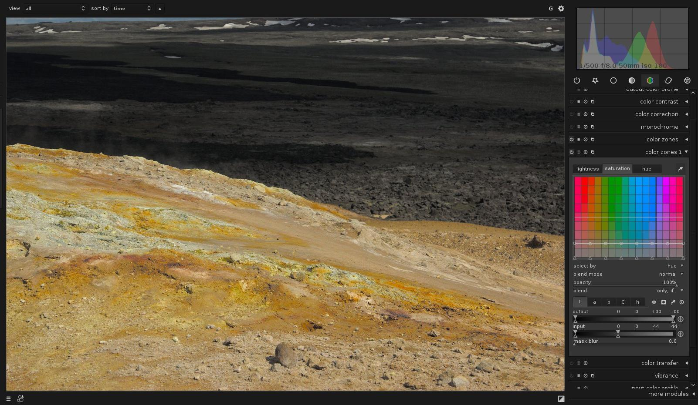

One of the upcoming new feature in darktable is the ability to use the same development module several times. By applying the same module multiple times and combining them with blendif it is possible to do some effects that could not be achieved previously without using external tools like the gimp.

Modules that can be instantiated multiple times have a new icon in their header, next to the "reset" button. Clicking that icon will open a pop-up menu that allows you to create a new instance of the module, change the order in which the different instances are applied, or delete an instance of the module. Each instance can have its own parameters, can be activated or deactivates separately and can use presets. Note that the last instance of a module can't be deleted, it can only be deactivated.

Keeping with darktable's philosophy, you can only rearrange modules of the same kind. The order of modules of different kind is optimized by the darktable developers in order to minimize quality loss. The different modules are, as usual, applied from bottom to top.

# first example

To illustrate this new feature, let's take a blake&white image:

Now we will add 2 new instances of graduated density. We now have three instances, including the first one.
We set up each instance with a different colored gradient.

Here is what can be achieve:

# real life example

The previous example is nice, but apart for illustrating diffraction, it is not that useful.
Multi-instance really shows its power when used with selective adjustments and the next example will show you how to do that.

darktable does not currently implement masks, but we have a very powerful alternative, conditional blending, that allows to select region based on their color and luminance rather than their position.
So here is another example using conditional blending :

Let's start from this simple image:

This image is nice but we want to saturate the sand a little more and turn the rest of the image into black and white.

First, let's work on the sand in the foreground. We will use the colorzone plugin to selectively increase the saturation of the yellow color. The result is shown below

Now that the sand is done, let's desaturate the background.

First we create a second instance of the colorzone plugin using the new icon next to the "reset" button.
Then we restring the area where that instance will be applied using blendif.

Our background is much darker than our foreground, so it is very easy to use blendif to select the background.

Now we simply desaturate the image by pulling down the saturation line. This gives us the following final image

# presets, styles ...

Each instance of a module can be considered like a completely independent module. In particular, each instance can have presets applied to it independently from the other presets.

A nice trick is to use a temporary preset to easily copy/paste the settings of a given instance to a new instance. A fine tuned blendif selection can thus be copied from one instance to another (and usually inverted right away) to easily apply different presets to different areas.

Styles, on the other hands are applied to images and not to modules. This means that styles contains the information on the number of instances used and how each instance was set. If you create a style from our first image you could easily apply our "diffraction effect" to any image you want

_Note : great thanks to Jeremy Rosen for his help in the writing of this blog post_
