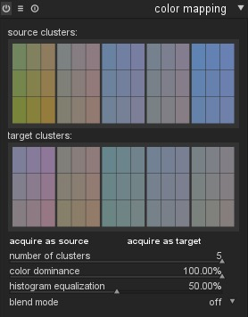
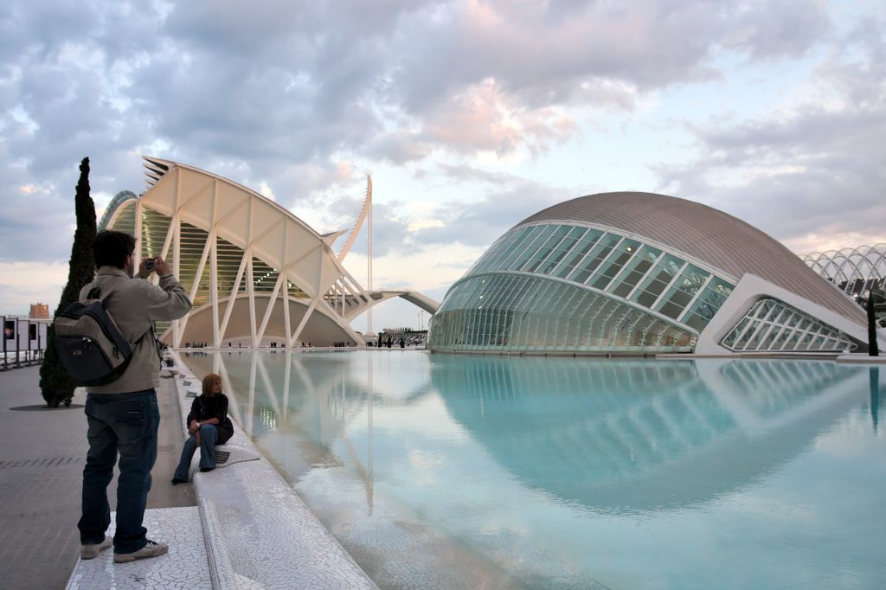
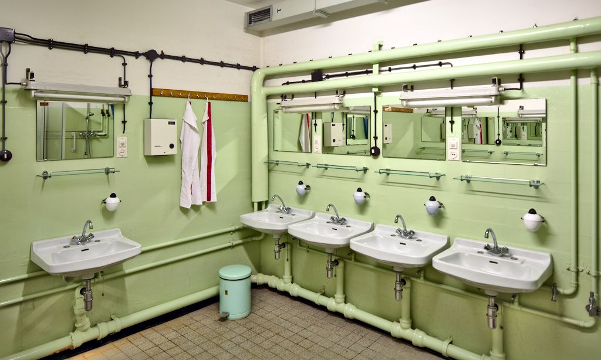
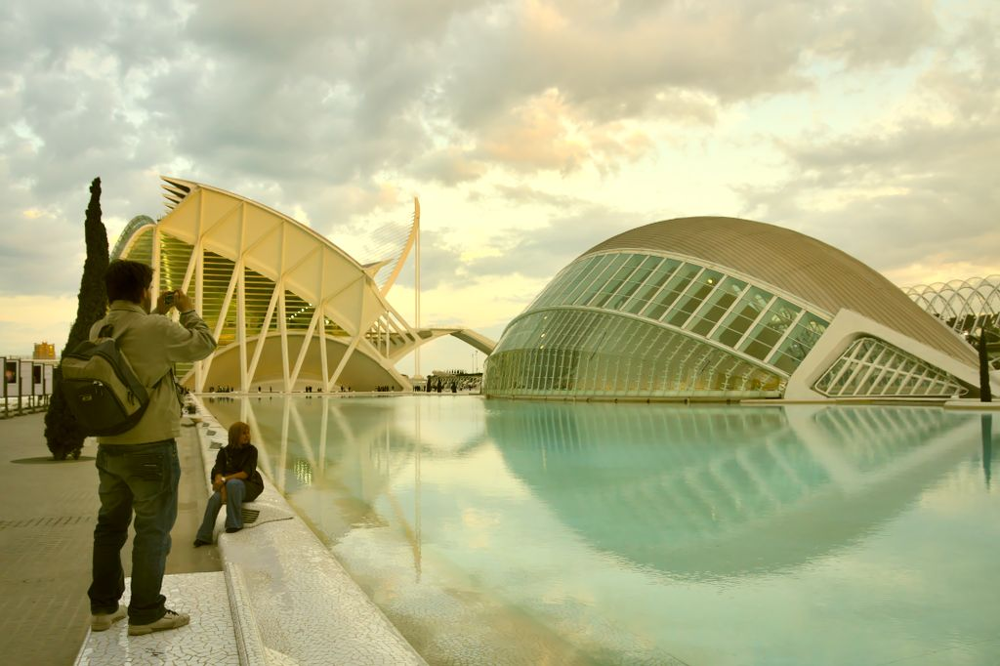
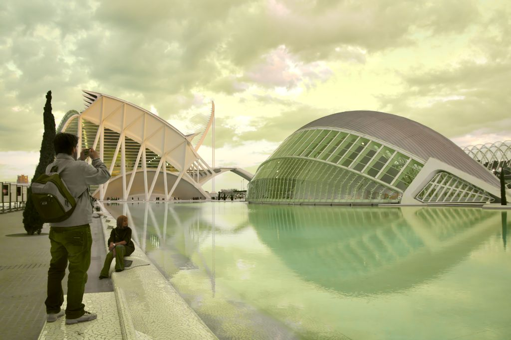
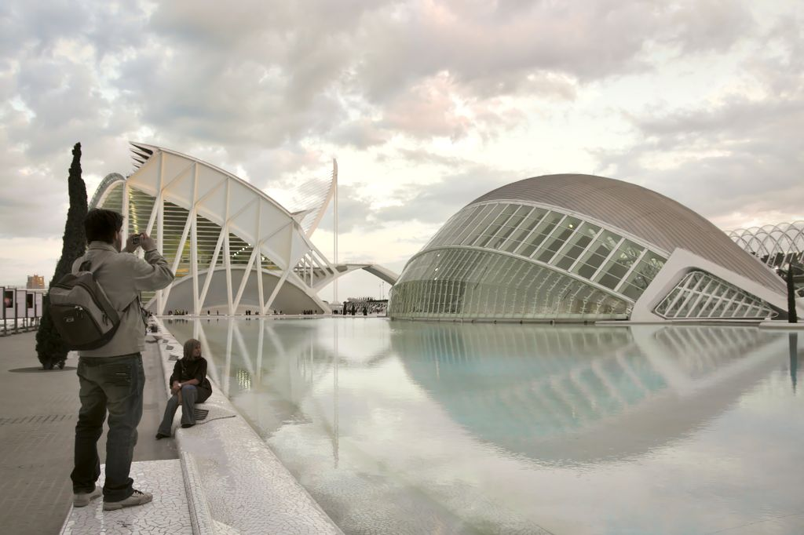
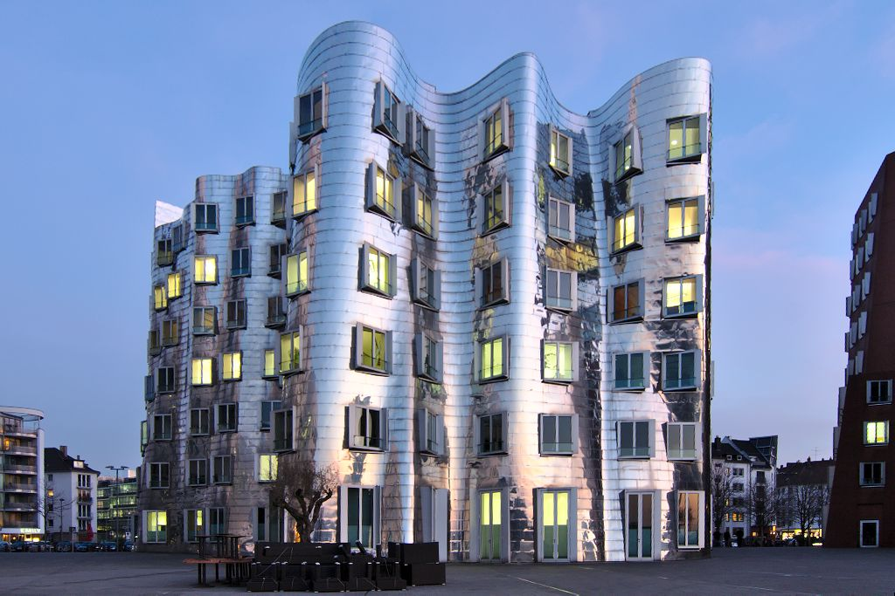
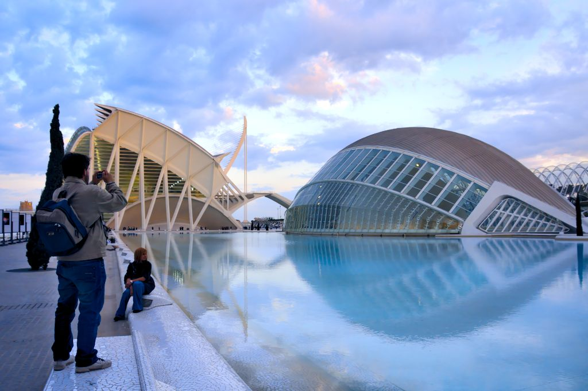

author: upegelow
comments: true
date: 2013-04-14 19:54:34+00:00
layout: post
link: http://www.darktable.org/2013/04/color-mapping/
slug: color-mapping
title: Color Mapping
wordpress_lede: cm_featured.jpg
wordpress_id: 2853
tags: blog, development, upcoming feature, blending, color, color mapping, Lab, tutorial

I'd like to give a few words on a new module named "color mapping" that is currently under development in our master branch. This module is a rework and enhancement of the older "color transfer" module. That older module had several issues which made a migration impossible. So we leave the old one behind as deprecated (old history stack still work as before) and for all new history stacks "color mapping" should be used instead.

@

The general aim of the module is transferring the look and feel of one image onto another. You can use it if you intend to harmonize the image's colors of a photo series&nbsp;– or you may want to completely change the atmoshpere of an image, maybe even into an unnatural, surrealistic look. As its purpose is mainly an artistic one, the new module was put into the effect group.

Mathematically "color mapping" uses an enhanced model of the groundbreaking work of Eric Reinhard et.al. [0]. The basic idea is to make a statistical match of lightness and colors between images by mapping their mean and variance values in an Lab-like color space. Our enhanced version analyses the color space of the images in form of color clusters to allow for a more fine-grained match of colors. In addition we use histogram equalization for lightness matching instead of the simpler mean/variance method.

To use this module two steps are required:

  * First you open the source image in darkroom mode and acquire its color characteristics by pressing the "acquire as source" button. A set of color clusters is generated and displayed in the source clusters area. Each cluster is represented by a set of nine color swatches with the mean value in the center surrounded by swatches indicating the color variance within that cluster. The clusters are sorted in ascending order by their weight, which reflects the relative number of pixels that contribute to the clusters.

  * Next you open your target image in darkroom mode. darktable has remembered the previously collected source clusters; if they are not yet displayed, press the reset button in the module's expander bar. You now press the "acquire as target" button to generate a corresponding set of color clusters for your target image. It is displayed in the target clusters area.

When both source and target clusters are collected an automatic color mapping is applied to the target image. In its default settings the overall effect can be quite exaggerated. A set of sliders gives you control of the effect's strength. You can also use blending operator "normal" to tame the effect. As the color mapping module comes early in the pixelpipe, you have a lot of freedom to further finetune the colors with modules like tone curve or color correction.

The number of color clusters to apply&nbsp;– from 1 to 5&nbsp;– is a central parameter. In the most simple case only one color cluster is applied to all colors of the target image. This will provide a color cast as if the scene was illuminated with a light in the corresponding color. Sometimes this is what you aim for but frequently the situation is more complex. Often the source and target image contain different dominant colors and you want them to be mapped in a more smooth way.

Let's look at an example. We will take the following image as our target image. It shows a scene of Valencia's Ciudad de las Artes y de las Ciencias.

@

First we go for a grotesque case with strong color shifts to make the effects obvious. I want to transfer the greenish color atmosphere of this image (an abandoned cold war shelter's washroom) to our target image.

@

If I only take one cluster I get the following output.

@

All colors are shifted towards the dominant green tint of the source image. The picture changes a bit if I take two clusters.

@

Within the source image a first cluster now represents the greens, the second cluster the more neutral tones. In our target image one cluster represents the more blueish colors and the second the more reddish ones. The cluster mapping will apply the green tones of the source image onto the blue tones of the target image leaving the other colors neutral. This gives the overall impression of a sky with poisoned green clouds. And here finally the image if we take five clusters:

@

Now the color variety of the target image is much better preserved. Still the greenish tint of the source image has found its way into the target. The overall result is more credible but also less pronounced as in the previous two examples. Generally a higher number of clusters leads to a less pronounced effect.

The mapping between source and target clusters is done automatically. Parameter "color dominance" gives you a level of control. If this parameter is set to zero, clusters are mapped according to color proximity. Each target cluster is checked against each source cluster and the color adjustment is done with the closest match. Depending on the source and target image this can lead to different target clusters being mapped to the same source cluster. If "color dominance" is set to its maximum 100%, the mapping is based on cluster weight. Instead of color proximity now the number of pixels contributing to a cluster plays the major role. The dominant color of the target image will be mapped to the dominant color of the source image. This is a bit similar to using a lower number of color clusters but allows a flexible adjustment without the need to recollect clusters in both source and target image.

Typically the colorizing effect at 0% is rather subtle whereas it is quite bold at 100%. In-between values lead to a transition between the extremes. This transition is incremental&nbsp;– the mapping flips at certain threshold values which depend on the source/target images.

Let's take a new source image: one of the Gehry buildings in Düsseldorf's Medienhafen shot shortly after sunset.

@

Obviously the image has two dominant colors: blue and orange. So let's take two color clusters. Here is the result if we set parameter "color dominance" to 0%.

@

The same source and target clusters, now applied with a color dominance of 100% give a much stronger effect.

@

In the last two cases I set parameter "histogram equalization" to 80%. This parameter controls how strong the tonal contrast of the source image is transferred onto the target image.

You need to do some experiments with the number of clusters and the other parameters of this module by yourself to find the best suited settings for your aim. The current status of this module can be found in darktable's master branch and will be part of darktable's next feature release.

[0] Erik Reinhard, Michael Ashikhmin, Bruce Gooch, Peter Shirley, "Color Transfer between Images", IEEE Computer Graphics and Applications, September/October 2001
