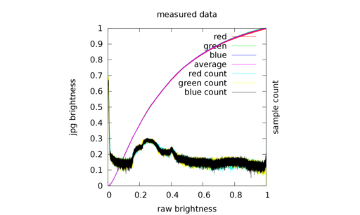
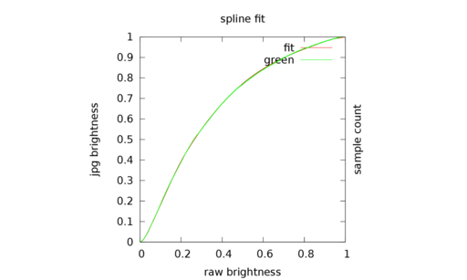

the purpose of the basecurve is to make the otherwise scene-referred linear (linear raw rgb) color look good on your output devices. this is done independently of any color managed transforms which are also done in the pipeline, so we can establish a certain look independent of the devices. this will affect how highlights and shadows are balanced against each other, the overall contrast of the image, as well as color saturation. it basically boils down to:

>Friends don’t let friends view scene-linear imagery without an “S-shaped” view transform. [0]

which is by the way a good reference to read up on, with comparison images between linear, naive gamma mapped, and images with s-curves applied to them.

in darktable we try to match approximately how vendors process their images by guessing the basecurves visually/manually. if your camera is not supported yet or you don't like the result or just want to play with it, there is also a way to measure the basecurve from a raw and jpg pair.

# measuring the basecurve

you'll need a raw file and a corresponding jpg from your camera. from this we can try to guess the basecurve applied in the jpg. credits for the initial version of this tool go to torsten bronger.

if you think about it it's surprising that we can get useful information from this, since there is a lot of processing done on chip on your raw data to create the jpg. for example there is white balancing, a color matrix, and then the basecurve (plus a lot more which we're conveniently going to ignore). actually the tool we use to solve for all these things at the same time is ignorance, so for best results you should make sure your input image makes the impact of those factors minimal:

* take a blurry shot, to rule out effects of sharpening, noise, and denoising.
* try to get as much dynamic range as you can, blacks and blown highlights (you probably need to go one or two stops over what you think you need to make the raw overexpose, too).
* Shoot using the camera's default image style (often called "standard" _not_ "neutral") if you have special image filters, hipster modes, dynamic light enhancement things in your camera, switch them off (such as `Nikon Active D-Light', `Canon Auto Lighting Optimizer (ALO)', `Sony Dynamic Range Optimizer (DRO)' or Samsung Smart Range, etc).
* try to make the target appear as black and white as possible (after camera white balancing).

a suitable shot might look like this user contributed shot here:

you will need a git checkout of darktable and build and run the tool as follows. note that you don't need to compile darktable itself from git, also you don't need most build dependencies. in the directory of your local git checkout, navigate [to the tools/basecurve subdirectory](https://github.com/darktable-org/darktable/tree/master/tools/basecurve) and execute a few commands:

    cd tools/basecurve
    make
    dcraw -6 -W -g 1 1 -w input.raw

    # now create the jpg by either /one/ of the two:
    # use thumbnail
    dcraw -e input.raw && mv inputraw_thumb.ppm inputjpg.ppm
    # use jpg you took in raw+jpg mode
    convert input.jpg inputjpg.ppm

    # create basecurve
    ./basecurve input.ppm inputjpg.ppm
    gnuplot plot
    evince basecurve.pdf

that should look something like

where the last plot compares the green channel to the fitted spline which will be exported for use in darktable. to improve the fit you can give a third parameter to the basecurve tool to set the number of nodes. 20 is the maximum.

# using your measured curve in darktable

to use your newly created curve, all you need to do is to copy/paste the output of the script above into a shell. beware, you're altering your database directly! please back it up first!

it might look something like:

    echo "INSERT INTO presets VALUES('measured basecurve','','basecurve',2,X'00000000c2b8d03a2c113f3bfbf7fe3a2c11bf3cc304b33c7c36a13d21750b3e2c113f3e1577ba3ec496ba3e62e7213f7c36213ff4135c3f0000803f0000803f0000000000000000000000000000000000000000000000000000000000000000000000000000000000000000000000000000000000000000000000000000000000000000000000000000000000000000000000000000000000000000000000000000000000000000000000000000000000000000000000000000000000000000000000000000000000000000000000000000000000000000000000000000000000000000000000000000000000000000000000000000000000000000000000000000000000000000000000000000000000000000000000000000000000000000000000000000000000000000000000000000000000000000000000000000000000000000000000000000000000000000000000000000000000000000000000000000000000000000000000000000000000000000000000000000000000000000000000000000000000000000000000000000000000000000000000000000000000000000000000000000000000000000000000000000000000000000000000000000000000000000000000000000000000000000000000000000000000000000080000000000000000000000020000000000000000000000',1,X'00000000180000000000C842000000000000000000000000000000000000000000000000000000000000000000000000000000000000803F0000803F00000000000000000000803F0000803F00000000000000000000803F0000803F00000000000000000000803F0000803F00000000000000000000803F0000803F00000000000000000000803F0000803F00000000000000000000803F0000803F00000000000000000000803F0000803F00000000000000000000803F0000803F00000000000000000000803F0000803F00000000000000000000803F0000803F00000000000000000000803F0000803F00000000000000000000803F0000803F00000000000000000000803F0000803F00000000000000000000803F0000803F00000000000000000000803F0000803F',7,0,'','%','%','%',0.0,51200.0,0.0,10000000.0,0.0,100000000.0,0.0,1000.0,0,0,0,0,2);" | sqlite3 ~/.config/darktable/library.db

if you restart darktable after doing that, you should have a new preset by the name you gave above (`measured basecurve') in the basecurve module. enjoy!

# references

* [0] [Cinematic Color](http://cinematiccolor.com/)

    From Your Monitor to the Big Screen

    A VES Technology Committee White Paper

    Oct 17, 2012
