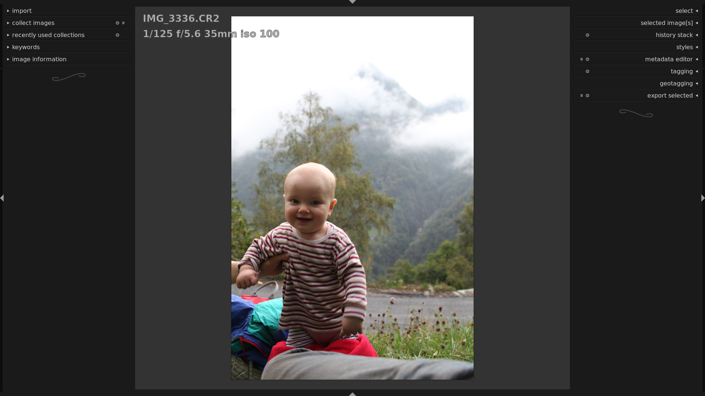
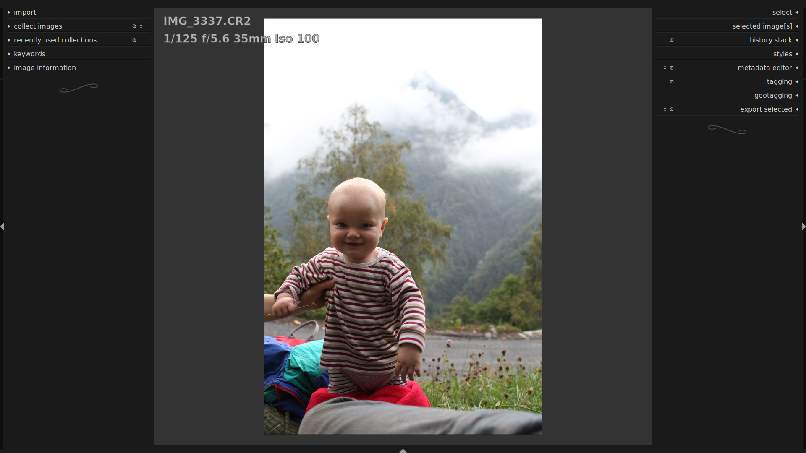
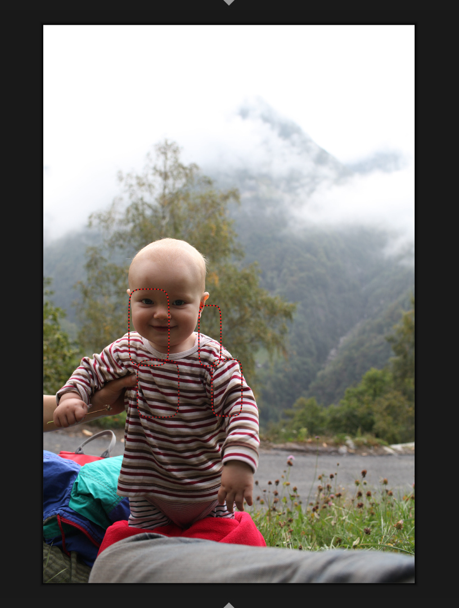
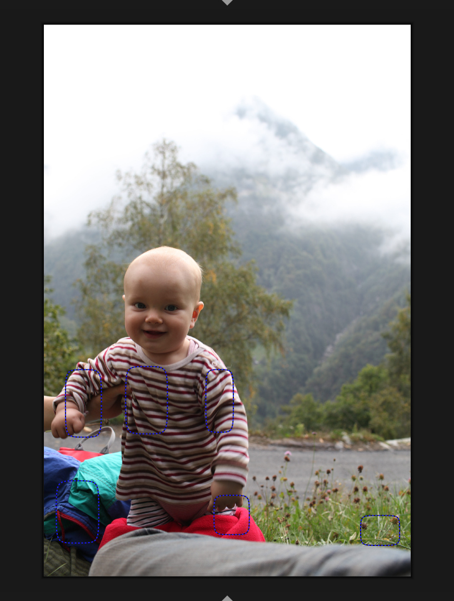
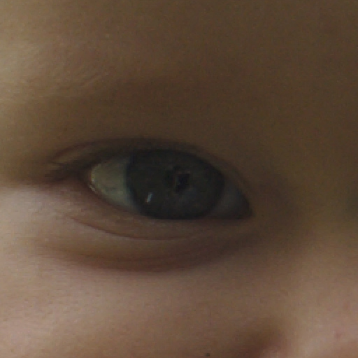

author: jo
comments: true
date: 2013-11-01 16:50:01+00:00
layout: post
link: http://www.darktable.org/2013/11/determining-focus-in-lighttable/
slug: determining-focus-in-lighttable
title: determining focus in lighttable
wordpress_lede: penguin.jpg
wordpress_id: 3097
tags: blog

wouldn't it be great if you could judge sharpness of your images in lighttable mode? this mode is limited to small and medium sized thumbnails of your images, so we can deliver the required speed to browse a lot of them.

to tell whether or not you got the focus right during the shoot, we would like to look at the full resolution. the most you get out of lighttable mode will look like this:

@

@

which one is sharper?

if you're not using the embedded jpg thumbnail or if you have worked on the history stack, these thumbnails are actually processed through our image pipeline. so depending on what you did with the image, processing the full-resolution can take seconds if not minutes. we really don't want to do that for all visible images.

# full-res embedded thumbnails

an average raw file stores quite a lot of thumbnails. often there is even a full resolution jpg to be found. couldn't we make use of that?

now displaying this thumbnail is quite useless (there is a secret backdoor in dt to do it, but i'm not going to talk about it), as the resolution is usually smaller than what you'd get from the raw, highlights will look different, there are differences in color management and basecurves. it's just different and if nothing else it confuses my perception of colors when looking at the developed raw after that.

so even if we don't want to look at the thumbnail, we can extract focus information from it.

# how it works

i tried simple edge-detection filters, such as the ones used for in-camera focus detection in the excellent [magic lantern firmware](https://magiclantern.fm/). since different lenses have different sharpness and high-iso might make these numbers noisy, dt uses a slightly different approach.

we do a two-scale decimated cdf 2,2 wavelet transform and use a threshold on the detail coefficients. the second scale is only computed if the first scale (the sharper one) doesn't yield any results. visually, these are displayed as red clusters (first scale, very sharp) and blue clusters (second scale, not quite as sharp).

to account for any cropping and lens or keystone correction potentially applied to the image, we transform the clusteres detected on the embedded jpg thumbnail through the image pipeline, as we do with drawn masks. that means you'll get sharpness clusters on the correct spot without processing the image.

# how to use it

switch on the new gui setting `plugins/lighttable/display_focus` or _indicate focus regions_ in the gui preferences dialog.

if you now select a picture in lighttable mode and press `z' to switch to full res preview, you should get something like

@
&nbsp;
@

double checking in darkroom mode and zooming to 200% shows that the one with the red boxes is indeed sharper:

@

@

# where to get it

this code is currently in a branch `full-res-preview' and about to be merged into master, for release in the upcoming 1.4 release.

