author: dtorop
comments: true
date: 2014-08-02 08:24:01+00:00
layout: post
link: http://www.darktable.org/2014/08/using-x-trans-cameras-with-darktable/
slug: using-x-trans-cameras-with-darktable
title: Using X-Trans cameras with darktable
lede: xtrans_21_wide.png
wordpress_id: 3334
tags: blog, development, upcoming feature, darktable, demosaicing, dynamic range, fujifilm, interpolation, x-trans

There is now a development branch of darktable with experimental support for raw files from many recent Fujifilm cameras. These cameras include those with the X-Trans sensor (X-Pro1, X-E1, X20, X100S, X-M1, XQ1, X-E2, and X-T1), X-Series cameras with conventional sensors (X100, X10, X-S1, XF-1, X-A1), and some from Fujifilm’s other lines (S6000fd, E550, IS-1, S3Pro, S5Pro, S5600, E900, S2Pro, S5000, S5200, S5500, S6500fd, S9500, S9600, S9600fd). Previously, darktable would fail to read RAF-type raw files produced by these cameras.

Using darktable with Fujifilm cameras is similar to using it with any other camera’s raw files. There are a few differences, though, in the case of the X-Trans sensor. The X-Trans sensor uses an exotic design (unlike the Bayer pattern which is in most cameras), and hence darktable must use different math to process what the sensor records.

@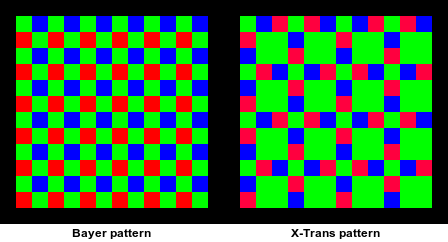

There will be more technical information about this processing in a second blog post.

## Demosaic

The demosaic module has different options when you are working with an X-Trans image. For Bayer images, the module looks something like this:

@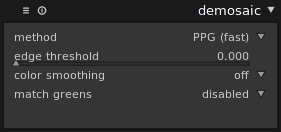

For X-Trans images, you will see a simpler set of options:

@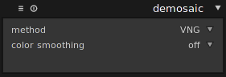

The “method” sets how darktable processes what the sensor sees (a mosaic of red, green, and blue) into a color image. The current default X-Trans demosaicing is done via a VNG demosaic. This is a decent quality and relatively fast method. For producing images for screen resolution, it should be great. If you are a pixel peeper, or are making large prints, you may not be happy with VNG. It can produce artifacts in fine detail and at sharp edges.

Clicking on VNG will show you some higher quality choices:

@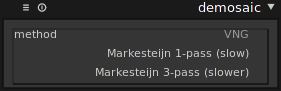

Markesteijn 1-pass is a vast improvement over VNG, though it is also twice as slow. If even Markesteijn 1-pass is producing artifacts, the 3-pass variant will offer a slight improvement at the cost of twice as much processing time again. Here are example crops at 200% of the three methods:

@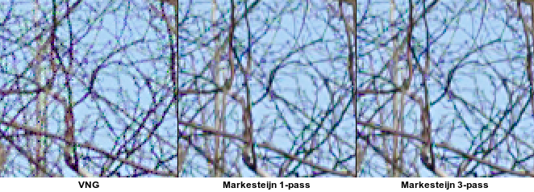

The color smoothing option is the same one used with conventional Bayer sensors. It eliminates color artifacts with a median filter. This may be helpful if you have an image with exceptionally fine detail such as a camera test pattern. Here is an a 200% detail of a problematic X-Trans image with increasing color smoothing applied:

@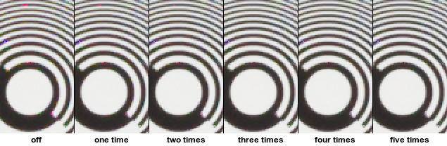

Note that the bright color fringes disappear with more color smoothing.

## Processing speed

No matter what demosaic method you use for X-Trans images, darktable will take at least twice as much time to process them as similar Bayer images. In the darkroom view, you may find that the image updates slowly when you adjust modules such as white balance which work directly on the underlying sensor data. This is because darktable goes back to the original raw file to perform these operations, then demosaics the result. While this produces high quality output, it unfortunately requires re-running the demosaic after each adjustment, which takes some time.

One solution is to go to the global preferences, select the “core options” tab, and set “demosaicing for zoomed out darkroom mode” to “always bilinear (fast)”:

@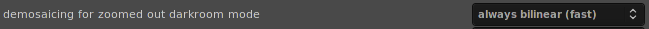

When you are not at 100% or 200% zoom, darktable will now display the image with an extremely fast but low quality demosaic method (bilinear). This will allow modules which depend upon the mosaiced image data (any active modules displayed below “demosaic”) to respond more fluidly. The trade-off is that you may see some artifacts as you zoom out the image to just slightly below 100%. Regardless of this setting, image export will always use the method you choose in the demosaic module. The modules which will be more responsive if you choose “always bilinear” are raw denoise, hot pixels, chromatic aberrations (though see the note below), highlight reconstruction, white balance, and invert.

## Defaulting to higher quality demosaic

Currently the default demosaic method for new images is VNG. If you want imported image to default to a higher quality default (such as Markesteijn 1-pass), you can do this via a preset. Take any X-Trans image, set the demosaic method to your preference, then click on the "hamburger" menu and choose “store new preset...”:

@

Then choose to auto-apply the preset to raw images from your camera. For example, if you have an "X100S", you might do this:

@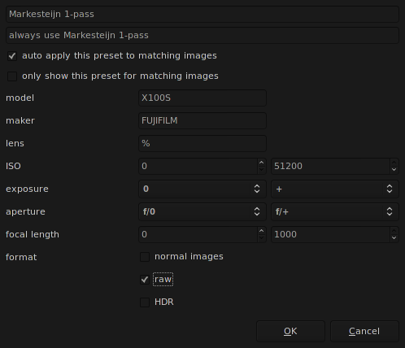

Another possibility would be to make a style in the lighttable based on an image for which you've applied your chosen demosaic method. Then in Exporter you can choose this style under global options.

## Other modules

Other modules besides demosaic should behave as expected. An exception is the “chromatic aberrations” module. It cannot currently handle non-Bayer sensors, and hence will always be disabled for X-Trans images:

@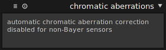

If your camera and lens are supported in the “lens correction” module, you may be able to get good results via its TCA correction:

@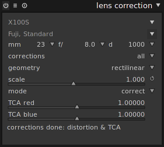

Note that support for particular cameras and lenses comes via the great [Lensfun](http://lensfun.sourceforge.net/) project. The version of Lensfun which you have installed will change your lens support.

The basecurve module may have a custom basecurve for particular Fujifilm cameras. Otherwise darktable will use the “fujifilm like” curve, which should be good enough.

The “create HDR” function currently does not work for X-Trans images.

## Dynamic Range

When darktable processes X-Trans images, it will not replicate the JPEG which the camera produces. X-Trans cameras have JPEG-specific options such as film simulation, highlight tone, shadow tone, color, and sharpness which do not alter raw file data. You are on your own with darktable to tune the image as you choose&nbsp;– whether to simulate these settings or to do what you feel best serves the particular image.

Of particular note is the Fujifilm “Dynamic Range” option, which controls image contrast. As with similar options on other cameras (“Nikon Active D-Light”, “Canon Auto Lighting Optimizer (ALO)”, “Sony Dynamic Range Optimizer (DRO)” or “Samsung Smart Range”), darktable will not specially handle images taken when Dynamic Range is enabled.

Images taken with DR200, DR400, or AUTO DR will look as expected in lighttable upon import, as darktable will display a camera-processed preview JPEG. But when these images are opened in darkroom mode, they will appear quite dark. Here is how the camera-processed JPEG of a DR400 image looks compared to the image which darkroom mode initially shows:

@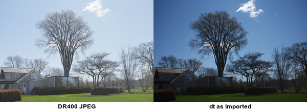

What you are seeing in darkroom is the image as recorded by the sensor without post-processing to compensate for the Dynamic Range setting. Dynamic Range exposes the image at a lower ISO without altering f-stop or shutter speed. This preserves highlight detail at the cost of forcing more image data into the dark tones. In photo-talk terms, Dynamic Range and its ilk are an “expose to the left” solution to highlight retention.

As appealing as the DR feature is, it may be worth instead photographing at DR100. You can then turn on the histogram display and alter exposure such that highlights are not cropped while being cognizant of not forcing too much information into the shadows. This should produce similar results to DR200/DR400, with finer control. Of course such images will look too dark initially in both lighttable and darkroom modes, and will also require special care to develop.

Regardless of whether you rely on the DR feature or purposely underexpose, you will most likely want to raise the image exposure overall (e.g. by 1 EV if the image is exposed with DR200, by 2 EV if it is exposed with DR400) while figuring out a way to retain some highlight detail. One way to do the latter is by setting the exposure module's blend mode to "parametric mask" and setting the gray (“g”) tab’s two input sliders such that the mask starts at black and fades out across the midtones (you'll have to tune this by eye):

@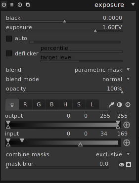

This will lighten the shadows and midtones while smoothly tapering the exposure adjustment in the highlights. Here is that DR400 image processed with an exposure mask:

@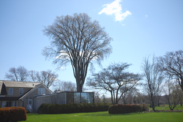

If you don’t appreciate sensor noise, you may want to use a denoise module as well.

There are some other ways to deal with these images: In the “zone system” module, you can set the minimum number of zones and drag the zones to the right. In the “global tonemap” module, you can leave the operator on "drago" and adjust "target" until the the tonality looks right. Or in the “levels” module, drag the middle handle to the left. All those solutions come a bit later in the processing pipeline than the exposure module, hence are not ideal. There has been some suggestion that basecurves specific to particular Dynamic Range modes could also be helpful.

Dealing with Fujifilm Dynamic Range images is, as they say, a field of continuing research. The choices in processing these images are akin to those in processing HDR images&nbsp;– how to fit a large tonal range into a constrained output space. The camera does record EXIF data describing if DR200 or DR400 is set, so it would be interesting to code an automatic compensation for these settings. It is not yet clear, though, what such automatic compensation should be.

## Improving and Continuing X-Trans support

Though darktable now can read and process X-Trans files, there are plenty of opportunities to improve camera support. In particular, as mentioned in "[What's involved with adding support for new cameras]({filename}/blog/2012-10-23-whats-involved-with-adding-support-for-new-cameras/2012-10-23-whats-involved-with-adding-support-for-new-cameras.md)", each camera model could benefit from its own [basecurve]({filename}/blog/2013-10-28-about-basecurves/2013-10-28-about-basecurves.md), white balance presets, lens correction, and [noise profile]({filename}/blog/2012-12-11-profiling-sensor-and-photon-noise/2012-12-11-profiling-sensor-and-photon-noise.md). Bug reports and ideas for improvement are also most welcome.

There has been understandable reluctance to support an exotic image sensor such as the X-Trans. Such support requires much intervention into the darktable code, for a technology which may just be a flash in the pan. But many open source and commercial image processing developers have now either chosen to support X-Trans raw files or are moving towards such support. X-Trans raw handling in darktable allows for enthusiast users of these cameras to enjoy darktable’s finely crafted image processing environment.
