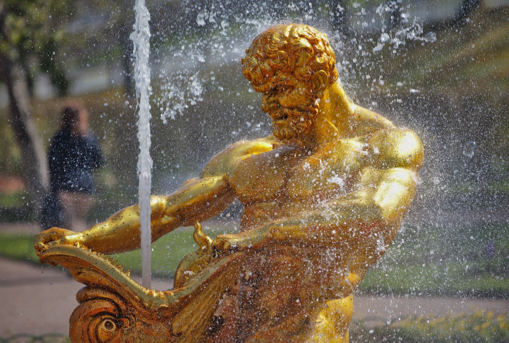
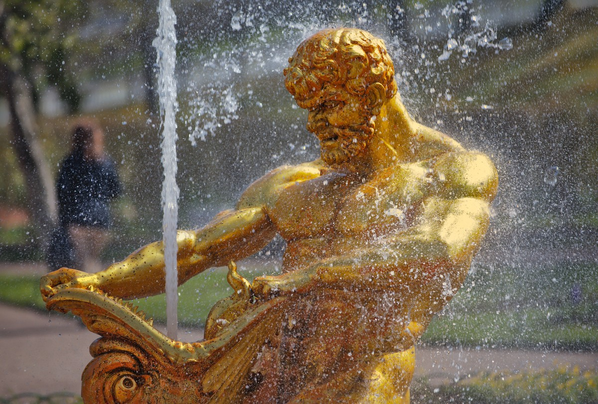
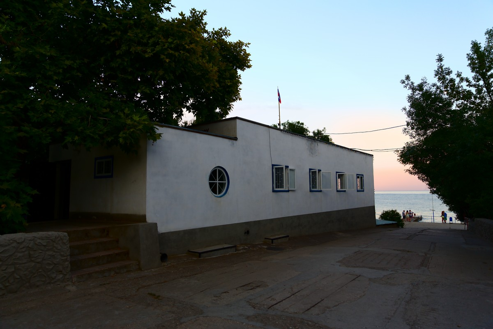
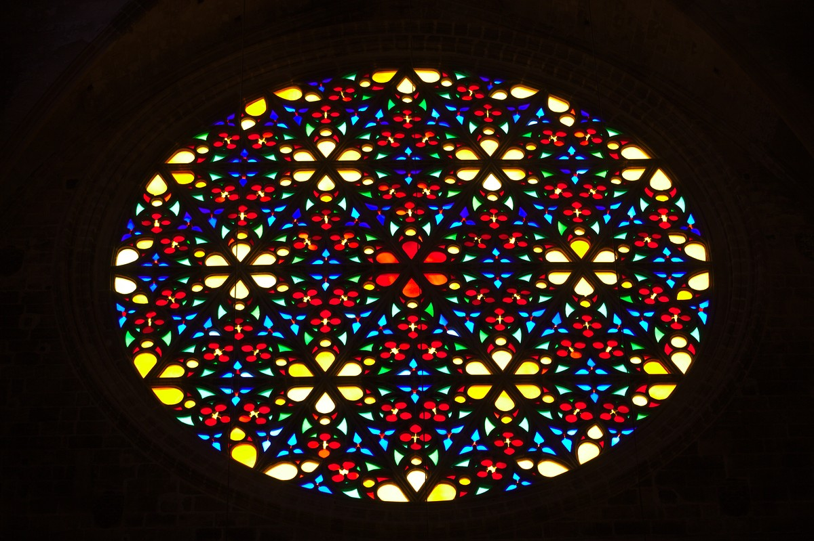
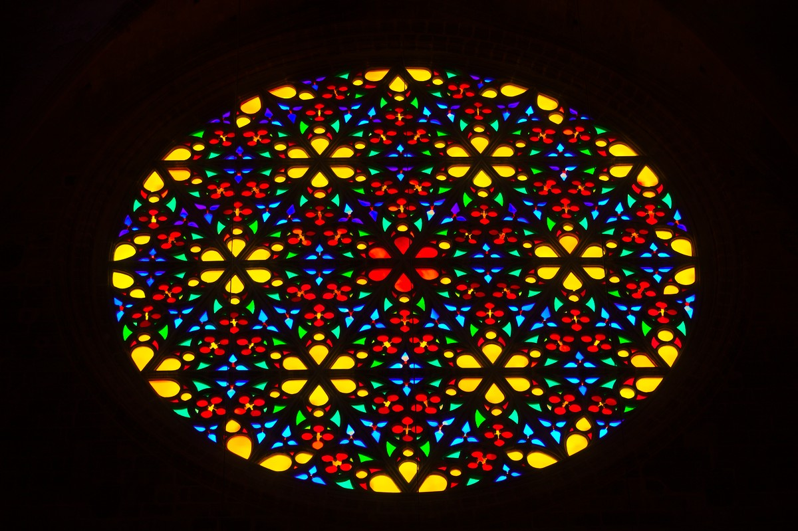

author: upegelow
comments: true
date: 2015-03-07 20:13:22+00:00
layout: post
link: http://www.darktable.org/2015/03/color-reconstruction/
slug: color-reconstruction
title: Color Reconstruction
lede: colorreconstruction_icon_wide.png
wordpress_id: 3590
tags: blog, development, upcoming feature, bilateral, color, color reconstruction, highlights, Lab, overexposed

**If you overexpose a photo with your digital camera you are in trouble. That’s what most photography related textbooks tell you – and it’s true. So you better pay close attention to your camera’s metering while shooting. However, what to do when the “bad thing” happened and you got this one non-repeatable shot, which is so absolutely brilliant, but unfortunately has some ugly signs of overexposure?**

In this blog article I’d like to summarize how darktable can help you to repair overexposed images as much as possible. I’ll cover modules which have been part of darktable for a long time but also touch the brand new module “color reconstruction”.

# **Why overexposed highlights are a problem?**

The sensor cells of a digital camera translate the amount of light that falls onto them into a digital reading. They can do so up to a certain sensor specific level – called the clipping value. If even more light falls onto the sensor it does not lead to any higher reading, the clipping value is the maximum. Think of a sensor cell as a water bucket; you can fill the bucket with liquid until it’s full but you cannot fill in more than its maximum volume.

For a digital camera to sense the color of light three color channels are required: red, green and blue. A camera sensor achieves color sensitivity by organizing sensor cells carrying color filters in a certain pattern, most frequently a Bayer pattern.

Combining this fact with the phenomenon of overexposure we can differentiate three cases:

1. All three color channels have valid readings below the clipping value
2. At least one color channel is clipped and at least one color channel has a valid reading
3. All three color channels are clipped

Case (1) does not need to concern us in this context: all is good and we get all tonal and color information of the affected pixels.

Case (3) is the worst situation: no tonal nor any color information is available from the pixels in question. The best we can say about these pixels is that they must represent really bright highlights at or above the clipping value of the camera.

In case (2) we do not have correct color information as this would require valid readings of all three color channels. As it’s often the green channel that clips first, pixels affected by this case of overexposure typically show a strong magenta color cast if we do not take further action. The good news: at least one of the channels has stayed below the clipping value, so we may use this one to restore the tonal information of the affected pixels, alas, without color.

# **Dealing with overexposure in darktable**

darktable has a modular structure. Therefore more than one module is typically involved when working on overexposed images. This is different from other applications where all the functionality may be part of a single general exposure correction panel. It is in the philosophy of darktable to not hide from the user the order in which modifications are made to an image.

Just in order to manage expectations: a heavily overexposed image or one with a fully blown-out sky is beyond repair. Only if at least some level of information is left in the highlights and if highlights represent only a limited part of the image there is a realistic chance to get a convincing result.

# **Correcting overall image exposure**

Logically one of the basic modifications you need to consider for an overexposed image is an exposure correction. A negative exposure correction in the “exposure” module is frequently indispensable in order to bring brightest highlights into a more reasonable tonal range.

Additionally you should take into account that the curve defined in the “base curve” module has a strong effect on highlights as well. You may try out different alternatives as offered in the module's presets to find the one that best fits to your expectations. A base curve with a more continuous increase that slowly reaches the top right corner (right example) is often better suited for images with overexposed areas than one that already reaches the top at a moderately high input luminance level (left example).

&nbsp;

# **Bringing back detail into highlights**

The “highlight reconstruction” module comes early in the pixel pipeline acting on raw data. This is the central module that deals with the different cases of overexposure as described above. As a default the module uses the “clip highlights” method: it will make sure that pixels, which have all or only part of the RGB channels clipped (cases 2 and 3), are converted to neutral white highlights instead of showing some kind of color cast. This is the minimum you want to do with highlights. For that reason this method is activated by default for all raw input images.

As an alternative option the “highlight reconstruction” module offers the method “reconstruct in LCh”. This method is able to effectively deal with case (2) as described above. The luminance of partly clipped pixels can be reconstructed, the pixels get back their tonal information but result in a colorless neutral gray.

A third method offered by the “highlight reconstruction” module is called “reconstruct color”.

At first the idea of reconstructing color in highlights may sound surprising. As you know from what has been said above, overexposed highlights always lack color information (cases 2 and 3) and may even miss any luminance information as well (case 3). How can we then expect to reconstruct colors in these cases?

Now, the method that is used here is called “inpainting”. The algorithm assumes that an overexposed area is surrounded by non-overexposed pixels with the same color that the overexposed area had originally. The algorithm extrapolates those valid colors into the clipped highlights. This works remarkably well for homogeneous overexposed areas like skin tones.

Often it works perfectly but sometimes it might struggle to successfully fill all the highlights. In some cases it might produce moiré like patterns as an artifact, especially if the overexposed area is superposed by some sharp structures. As you will be able to identify limitations and potential problems immediately this method is always worth a try.

# **Bringing colors into highlights**

The existing limitations of the “highlight reconstruction” module when it comes to colors has led to the development of a new module called “color reconstruction”. This module is currently part of the master development branch and will be part of darktable with the next feature release.

As we have discussed above there is no way to know the “true” color of a clipped highlight, we can only make an estimate.

The basic idea of the module is as follows: pixels which exhibit a luminance value above a user selectable threshold are assumed to have invalid colors. All pixels whose luminance value is below the threshold are assumed to have valid colors. The module now replaces invalid colors by valid ones based on proximity in the image’s x and y scale and in the luminance scale.

Let us assume we have an area of overexposed highlights, e.g. a reflection on a glossy surface. The reflection has no color information and is displayed as pure white if the “highlight reconstruction” module is active. If this overexposed area is very close to or surrounded by non-overexposed pixels the new module transfers the color of the non-overexposed area to the uncolored highlights. The luminance values of the highlight pixels remain unchanged.

# **Example 1**

The following image is a typical case.

@

The fountain statue has a glossy gold-plated surface. Even with proper metering there is virtually no chance to get a photo of this object on a sunny day without overexposed highlights – there is always a reflection of the sun somewhere on the statue unless I would have gone for an exact back-lit composition (which would have had its own problems). In this case we see overexposed highlights on the left shoulder and arm and partly on the head of the figure – distracting as the highlights are pure white and present a strong contrast to the warm colors of the statue.

With the “color reconstruction” module activated I only needed to adjust the “luma threshold” to get the desired result.

The highlights are converted into a gold-yellow cast which nicely blends with the surrounding color of the statue.

@

The “luma threshold” parameter is key for the effect. When you decrease it, you tell darktable to assume that an ever growing portion of the pixels is to be regarded as having invalid colors which darktable needs to replace. At the same time the number of pixels which are regarded as having valid colors decreases. darktable only replaces an invalid color if a “good” fit can be found – good means that a source color is available within a certain distance in terms of image coordinates and luminance relative to the target. Therefore, when shifting the slider too far to the left at some point the results gets worse again because too few valid colors are available – the slider typically shows a marked “sweet spot” where results are best. The sweet spot depends on the specifics of your image and you need to find it by trial and error.

The “color reconstruction” module uses a so called “bilateral grid” for fast color look-up (for further reading see [1]). Two parameters “spatial blur” and “range blur” control the details of the bilateral grid. With a low setting of “spatial blur” darktable will only consider valid colors that are found geometrically close to the pixels that need replacement. With higher settings colors get more and more averaged over a broader area of the image which delivers replacement colors that are more generic and less defined. This may or may not improve the visual quality of your image – you need to find out by trial and error. The same is true for the “range blur” which acts on the luminance axis of the bilateral grid. It controls how strong pixels with luminance values that are different from the target pixel, contribute to the color replacement.

# **Example 2**

Here is a further example (photo supplied by Roman Lebedev).

@

The image shows an evening scene with a sky typical of the day time shortly after sunset. As a starting point a basic set of corrections has already been applied: “highlight reconstruction” has been used with the “reconstruct in LCh” method. If we would have used the “clip highlights” method the small cloud behind the flag post would have got lost. In addition we applied a negative exposure compensation by -1.5 EV units in the “exposure” module, we used the “lens correction” module mainly to fix vignetting, and we used the “contrast brightness saturation” module for some boosting effect on contrast and saturation.

Obviously the sky is overexposed and lacks good rendition of colors – visible by the arch-like area with wrong colors. With the “reconstruction module” and some tweaking of the parameters I got the following result, qualified by a much more credible evening sky:

@

These are the settings I used:

If you let darktable zoom into the image you will immediately see that reconstructed colors change with every zoom step. This is an unwanted side-effect of the way darktable's pixel pipeline deals with zoomed-in images. As only the visible part of the image is processed for speed reasons our “color reconstruction” module “sees” different surroundings depending on the zoom level. These lead to different colors in the visible area. It is therefore recommended to adjust the “color reconstruction” parameters while viewing the full image in the darkroom. We'll try to fix this behavior in future versions of the module** [ see below for an update ]**.

# **Example 3**

As a final example let's look at this photo of the colorful window of a Spanish cathedral. Although this image is not heavily overexposed in the first place, the rose window clearly lacks color saturation, especially the centers of the lighter glass tiles look like washed out, which is mostly due to an too aggressive base curve. As an exercise let's try how to fix this with “color reconstruction”.

@

This time I needed to make sure that highlights do not get colored in some homogeneous orange-brownish hue that we would get when averaging all the various colors of the window tiles. Instead we need to take best care that each tile retains its individual color. Therefore, replacement colors need to be looked for in close geometrical proximity to the highlights. This requires a low setting of the “spatial blur” parameter. Here are the details:

And here is the resulting image with some additional adjustment in the “shadows and highlights” module. The mood of the scene, which has been dominated by the rich and intensive primary colors, is nicely reconstructed.

@

One final word on authenticity. It should be obvious by now that the “color reconstruction” module only does an assumption of the colors that have been lost in the highlights. By no means can these colors be regarded as “authoritative”. You should be aware that “color reconstruction” is merely an interpretation rather than a faithful reproduction of reality. So if you strive for documentary photography, you should not rely on this technique but better go for a correct exposure in the first place. :)

# Update

The behavior of this module on zoomed-in image views has been improved recently. In most cases you should now get a rendition of colors that is independent of the zoom level. There are a few known exceptions:

* If you have highlight areas which are adjacent to high-contrast edges, you may observe a slight magenta shift when zooming in.
* If you combine this module with the “reconstruct color” method of the “highlight reconstruction” module, highlights may be rendered colorless or in a wrong color when zooming in.

These artifacts only influence image display – the final output remains unaffected. Still we recommend to finetune the parameters of this module while viewing the full image.

[1] Chen J., Paris S., and Durand F. **2007**. Real-time Edge-Aware Image Processing with the Bilateral Grid. In _Proceedings of the ACM SIGGRAPH conference. _([http://groups.csail.mit.edu/graphics/bilagrid/bilagrid_web.pdf](http://groups.csail.mit.edu/graphics/bilagrid/bilagrid_web.pdf))
