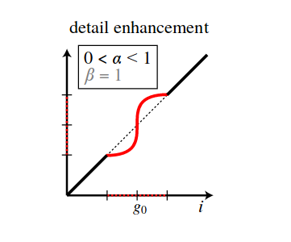
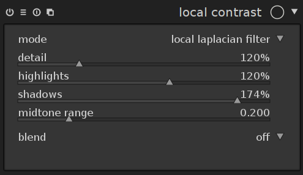
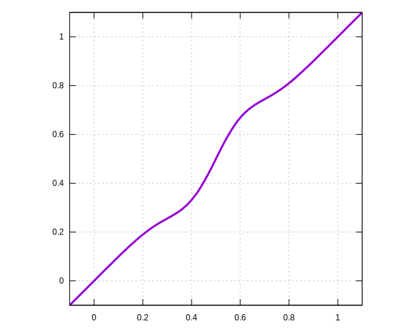
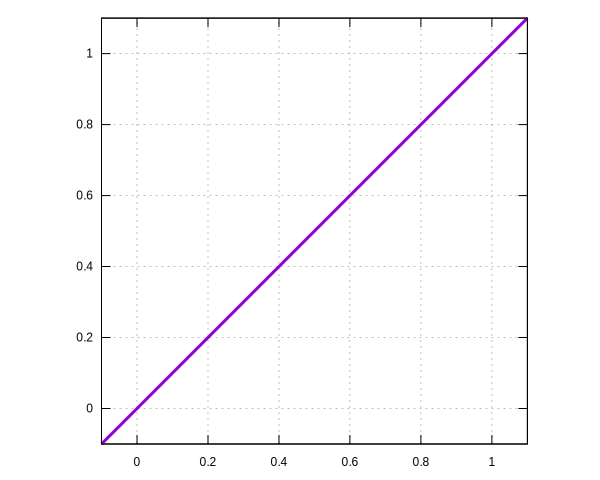

author: jo
date: 2017-11-21 20:21:45+00:00
layout: post
slug: local-laplacian-pyramids
title: local laplacian pyramids
lede: header.jpg
lede_author: <a href="https://jo.dreggn.org/home/">jo</a>
tags: blog, development, further reading, upcoming feature

# improving contrast with the local laplacian filter

sometimes difficult lighting situations arise which, when taking
photographs, result in unappealing pictures.
for instance very uniform lighting on a cloudy day may give dull
results, while very contrasty illumination (such as back lit) may
require to compress the contrast to embrace both highlights and
shadows in the limited dynamic range of the output device.

refer to the following two shots as examples:

* input + high contrast b/w
* hdr + compressed

many options to achieve this exist in literature and many of them are
implemented in darktable already.

this post is about yet another approach to this which turned out to be
extremely versatile, almost artifact-free, and reasonably fast to compute:
the local laplacian pyramid.

repeat figure with curves and then it's pretty much exposure fusion with
many different images (one per gray level)

## local contrast with the local laplacian pyramid

[vanilla laplacian pyramids](http://persci.mit.edu/pub_pdfs/pyramid83.pdf) [0]
are known to be a good tool to blend over between two images. for their
applicability to local contrast, not so much.
perhaps surprisingly, following up on exposure fusion (we
[blogged about that for darktable before]({filename}/blog/2016-08-09-compressing-dynamic-range-with-exposure-fusion/2016-08-09-compressing-dynamic-range-with-exposure-fusion.md) ),
a clever way to modify local
contrast based on laplacian pyramids [has been devised](https://people.csail.mit.edu/sparis/publi/2011/siggraph/) [1]:
it works by pretty much creating a separate laplacian pyramid for every pixel
in the image, and then selecting coefficients from these these based on certain
criteria.

luckily, [this can be reduced to processing the image only a small, fixed number
of times](http://www.di.ens.fr/~aubry/llf.html) [2]. the procedure is then basically:

* process the image n times, mapping it through a curve (see below for examples)
* create the n laplacian pyramids that go with the images
* merge into a final laplacian pyramid
* collapse this output pyramid to create the output image.

this is nicely illustrated in this video exported from halide:

<iframe width="650" height="400" src="https://www.youtube-nocookie.com/embed/t4mbrKYRmvs?rel=0" frameborder="0" gesture="media" allow="encrypted-media" allowfullscreen></iframe>

also, as it turns out, the gpu is really good at processing laplacian pyramids.
the opencl port of this turned out to be very useful.

## the mapping function

why can we get away with this small fixed number n of processed pyramids?
[2] gives the explanation in sec. 3:

*If r is band-limited,*

(r is the family of curves which is applied to the input image).

now if you look at the left image (which is taken from fig. 6 in [1]),
it has clear kinks where the center part joints the straight lines.
not band limited at all. don't use this curve at home. it will produce
random aliasing when used with the fast local laplacian code.

@
&nbsp;

darktable uses what is shown on the right instead: the contrast-s curve in the center
part is modelled by a derivative of gaussian (with infinite support), which is added
to the straight lines on either side, which are blended over using a quadratic
bezier curve. you can
[look up the precise code](https://github.com/darktable-org/darktable/blob/master/src/common/locallaplacian.c#L289) if you're interested.

now changing the contrast-s curve in the middle changes local contrast, that's great.
looking at the sides of this curve, we would immediately want to use it for shadow lifting
and highlight compression too. in fact that's possible (see following section with images
and accompanying curves). unfortunately some of the proposed optimisations in the original
papers can't be applied any more. for the shadow/highlight use case, the pyramid needs
to be constructed all the way all the time, we can't stop after three levels (or else
the shadow lifting would depend on the scale of the image).

this means darktable will always build the full pyramids, making this a little slower,
but yielding best results.

## the darktable ui

you can find our implementation of this filter in the `local contrast` module, when
switched to local laplacian mode:

@

it allows you to change detail (or clarity or local contrast), highlight
contrast, and shadow contrast separately.  the last slider governs how wide the
central region of the curve is, i.e. what is classified as shadow vs. mid-tone.

in the following, we'll go through these contrast sliders, showing a couple of
corresponding conversion curves and the resulting effect
on the output image.

drag the separator in the middle to compare before/after!

### increased local contrast:

&nbsp;

COMPIMG(id0001,images/flower.jpg,images/flower_01.jpg,original,clarity)

### pulled highlights down:

yes, the curve changes the bottom part. which you would think belongs to the
shadows. turns out it doesn't.

&nbsp;

COMPIMG(id0002,images/flower.jpg,images/flower_02.jpg,original,highlights compressed)

### pushed shadows up:

&nbsp;

COMPIMG(id0003,images/flower.jpg,images/flower_03.jpg,original,shadows lifted)

### inverse of the above
and the inverse is also possible, top to bottom, left to right: original,
removed details, pushed highlights out even more, pulled shadows deeper.

COMPIMG(id0004,images/flower.jpg,images/flower_06.jpg,original,details removed)

COMPIMG(id0005,images/flower.jpg,images/flower_04.jpg,original,highlights pushed)

COMPIMG(id0006,images/flower.jpg,images/flower_05.jpg,original,shadows deepened)

## application to hdr compression

in the following there are some comparison images from the previous post on exposure
fusion. these have been processed again with a different approach:

* to compress the dynamic range, a very flat base curve has been used which maxes out at 0.5 for input values of 1.0.
* as contrast-s curve, the tone curve module has been used, in rgb mode for automatic colour saturation compensation.
* the curve was created to match an out of camera raw+jpg pair using `darktable-chart` which also created a clut for the colour lookup table module.

this approach will leave the image flat and dull (due to the flat base curve). to add back
additional detail, we use the local laplacian module. this turns out to work a lot better
together with a contrast-s tone curve than with a contrast-s base curve, since the base
curve comes before the local contrast module in the pipeline, while the tone curve
comes after. this way, the local contrast module receives more linear input.

in fact, sometimes a contrast-s curve is not necessary at all for hdr input.
exposure fusion shows some nicer behaviour with respect to colour saturation at
times, but sometimes produces halo like artifacts. i find it easier to create
good results with the local laplacian when aiming for a low key look (see the
definition in the darker clouds in the left of the first image). really up
to you and any given input images which method works better.

example history stacks are in the example comparison images seen below:
[0](images/img_0002.jpg)
[1](images/img_0004.jpg)
[2](images/img_0006.jpg).

COMPIMG(id0007,images/img_0001.jpg,images/img_0002.jpg,exposure fusion,local laplacian)

COMPIMG(id0008,images/img_0003.jpg,images/img_0004.jpg,exposure fusion,local laplacian)

COMPIMG(id0009,images/img_0005.jpg,images/img_0006.jpg,exposure fusion,local laplacian)

## application to high contrast monochrome

COMPIMG(id0010,images/bw_0002.jpg,images/bw_0001.jpg,original,local laplacian)

COMPIMG(id0011,images/bw_0004.jpg,images/bw_0003.jpg,original,local laplacian)

## a note on noise

when increasing contrast, you want to make sure the input isn't noisy, or else
that noise would be accentuated even more. but even when not increasing
contrast, the local laplacian filter will show structured artifacts for noisy
input. i find this mostly goes away when enabling at least chroma denoising for
instance in the profiled denoising module.

## literature

* [0] [laplacian pyramids classic paper](http://persci.mit.edu/pub_pdfs/pyramid83.pdf)
* [1] [local laplacian pyramids project page](https://people.csail.mit.edu/sparis/publi/2011/siggraph/)
* [2] [fast local laplacian filters](http://www.di.ens.fr/~aubry/llf.html)

