title: darktable 2.6
author: Nilvus (traduction de l'article écrit par moy)
date: 2018-12-24
lede: butterfly.jpg
lede_author: 
tags: annonce, darktable-release

TODO: intro.

Among the new major features:

* A new "retouch" module, similar to the "spot removal" module with
  smart cloning ("heal") and ability to act on each level of detail
  individually.

* A new "filmic" module, able to manage most aspects of the tone of an
  image in a single module.

* A complete rework of the "color balance" module, which can now be
  seen as a color-aware variant of "levels", and can do most
  adjustments automatically thanks to new color picker buttons.

* The ability to guide the bluring of the blend mask, to select an
  object precisely with minimal effort.

# Fonctionnalités principales

## Un nouveau module : "retouche"

Alors que darktable se focalise principalement sur le développement raw, 
les dernières versions ont introduit des fonctionnalités habituellement réservées 
aux éditeurs orientés pixels tel que GIMP, comme le module "liquéfier". 
Une étape importante de plus dans cette direction est faite avec ce nouveau module "retouche", 
qui remplace essentiellement le module "correction des tâches", avec séparation des fréquences
pour une retouche fine.

### Améliorations comparées au module "correction des tâches"

Le module a bien plus d'options que le module "correction des tâches", mais tout ce que vous pouviez
faire avec le précédent reste disponible dans le module "retouche".

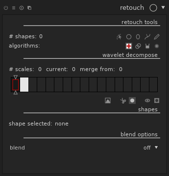

Comme avec "correction des tâches", vous sélectionnez une forme (cercle,
ellipse, chemin, ou brosse, cette dernière n'existait pas dans "correction des tâches") et
vous cliquez simplement sur la partie de l'image que vous souhaitez effacer. Le module va copier
une autre partie de l'image pour la masquer. Glissez au lieu de cliquer pour choisir la source à cloner,
ou ajustez les contrôles ensuite.

De nombreux détails vont vous faciliter la vie :

#### Outil de correction, de meilleurs résultats en moins d'efforts

Par défaut, la copie utilise un algorithme de "correction"  (*heal* en anglais)
(emprunté de l'outil correcteur de GIMP), qui adaptes la source au 
contexte de l'emplacement cloné. Vous n'avez pas besoin de copier 
*exactement* la bonne partie de l'image. Prenons un exemple 
classique, un petit défaut dans un ciel pas complètement uniforme :

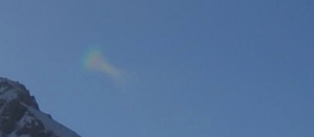

Une mauvaise tentative pour fixer cela avec l'outil de copie donnerait :

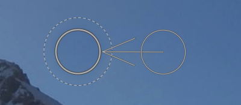

Le morceau de ciel copié pour masquer le défaut est un peu plus sombre que
l'endroit où il a été copié. Ce n'est pas évident tant que les outils de contrôle 
sont affichés sur l'image, mais l'image finale est vraiment mauvaise :

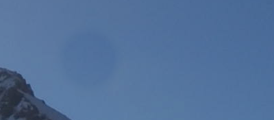

La même retouche  avec le nouvel "outil de correction"
() donne ceci :

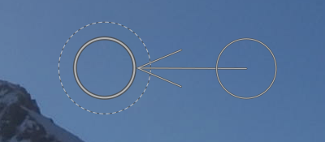

Cette fois, l'image finale est indistinguable d'un ciel sans défaut :

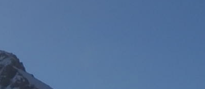

Même en clonant des parties de l'image de couleurs complètement différentes, 
l'outil de correction réagit étonnament bien. Poussons le module un peu :

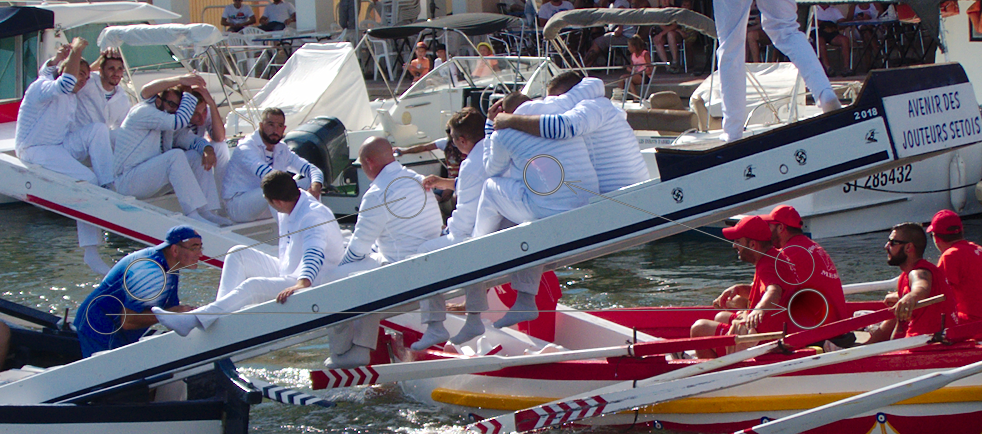

Le morceau blanc est copié vers le t-shirt bleu, le t-shirt bleu vers le rouge, 
et le rouge vers le blanc. Chaque fois, le contraste local est conservé, 
mais la couleur générale et la luminance du morceau sont adaptés pour s'ajuster 
à la destination.

L'outil de copie basique (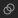) est toujours 
disponible pour les rares situations où vous en auriez besoin.

#### Remplir et flouter, quand vous n'avez rien à cloner

En plus des outils copie et de correction (qui fonctionnent seulement quand vous 
avez une partie de l'image à dupliquer sur celle à effacer), le module "retouche"
fournit un outil de remplissage ()
(remplir une forme avec une couleur) et un outil de flou (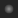) 
(appliquer un flou pour adoucir une partie de l'image). Ces outils sont particulièrement 
utiles pour l'édition par séparation de fréquence (voir plus bas).

#### Une activation, plusieurs corrections : ajout continu

Les outils peuvent être activés en une fois pour plusieurs corrections.
Utilisez simplement la combinaison Contrôle-clic sur l'un des outils 
cercle, ligne, ellipse ou chemin (au lieu d'un simple clic), et l'outil 
restera actif jusqu'à ce que vous le désactiviez explicitement.
Ceci est très pratique lorsque vous avez à corriger plusieurs endroits de la 
même image, comparé au précédent flux de travail qui vous obligeait à 
cliquer sur le bouton de l'outil pour chaque correction.

#### Visualisation de la source de correction

Pour les outils de copie et de correction, chaque correction consiste à sélectionner une source et une destination. Un simple clic permet de définir la destination et, par défaut, darktable sélectionne une zone arbitraire pour la source. Une autre option est de définir la source et la destination par un glisser-déposer avec le curseur de la destination vers la source.

"retouche" introduit un mécanisme plus avancé :

* En déplaçant le curseur sur l'image, la destination à corriger est marquée par une forme, alors que la source est marquée par une petite croix :

  

  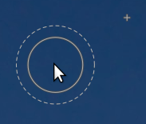
  

* Pour sélectionner une source, utiliser Majuscule-clic sur l'image. La croix est alors placée sur l'emplacement du curseur et ne bougera plus jusqu'à ce que vous sélectionnez la destination, via un simple clic. Ceci est particulièrement intéressant combiné à une activation permanente de l'outil mentionné ci-dessus : plusieurs corrections sont ainsi possibles sur l'image, la source restant à des coordonnées relatives à la destination

* Une variante : utiliser Contrôle-Majuscule-Clic au-lieu de Majuscule-Clic. Ceci définira également l'emplacement de la source, mais cette fois, celle-ci restera fixe, selon des coordonnées absolues et non plus relatives à la destination à corriger.

### Édition par séparation de fréquence

Un difficulté classique de la retouche photo, typiquement pour le portrait, est de souhaiter masquer certaines tâches, et parfois réduire le contraste local afin de rendre la peau plus lisse, tout en conservant la texture de la peau.
Un effacement brutal rendrait la peau trop lisse et donnera à la photo, au mieux, un aspect "excessivement post-traité".

Prenons une image comme exemple (reprise du [défi pixls.us PlayRaw](https://discuss.pixls.us/t/playraw-hillbilly-portrait/5518) :

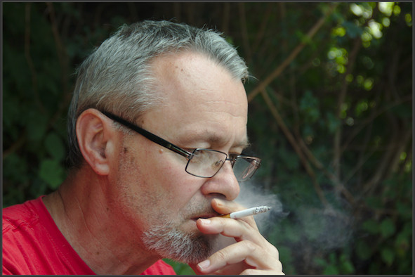

Une technique commune pour ce type de retouche est de séparer l'image en plusieurs images correspondant à plusieurs niveaux de détails, et de les combiner ensemble. C'est ce que permet le [greffon "Décomposer en ondelettes" de GIMP](https://pixls.us/articles/skin-retouching-with-wavelet-decompose/), par exemple. 
Après séparation, one gets a blurry image
corresponding to the coarse details, and one or several images
containing details only.
Dans notre exemple, nous obtenons :

  

  

  

  

  

  

  

  

This kind of transformation is used internally by the "equalizer"
module, which allows you to increase or decrease the importance of
each level of detail in the image. While "equalizer" works globally on
the image, "retouch" allows you to select the level of detail and the
portion of image you want to work with.

Dans le module retouche, cela correspond à la partie décomposition en ondelettes de l'interface :

  

  

This part shows one rectangle per scale (fine-grained on the left,
coarse-grained on the right). The dark rectangle on the left
corresponds to the full image, and the white one on the right to the
residual image, i.e. the image where all other levels of details have
been removed. By default, darktable always shows the final image, but
you can visualize the details scales and residual image by clicking
the "display wavelet scales
()
button.

The currently selected image appears with a red rectangle.
Move the bottom slider to change the number of details scales to use.
Depending on the zoom level, some details scale may be finer than your
screen resolution, hence unusable. The grey line above the scales
shows which scales are visible at the current zoom level.

When viewing the details scales, contrast may be too weak or too
strong so the module proposes a levels adjustment (which apply only on
the on-screen preview, not on the final image):

  

  

Each of the tools presented above (heal, clone, fill, blur) is usable
on any of these scales. Think of them as layers obtained from the
source image, and re-combined together after retouching to obtain the
final image. This is where "fill" and "blur" tools make most sense:
"fill" defaults to an erase mode where the fill color is black, which
corresponds to remove the details when used on details scales. One can
also pick a color and fill with this color (most useful on the
residual image scale). Using "blur" directly on the image usually
results in clearly visible post-processing, but using it selectively
on scales results in very subtle effects.

#### Example 1: spot reduction instead of spot removal

Let's focus on the spot below the glasses. If we want to completely
remove it, it's pretty easy to do so with the "heal" tool. Now, what
happens if we decide that we want to keep it, but reduce it to avoid
drawing the attention. We can just remove it from the coarse detail
scale (scale 6 in our example). The spot is no longer visible on the
residual image, so removing it from the details scale is sufficient.
The "heal" tool allows us to do that cleanly, but when dealing with
the details scale, the "fill" and "blur" tools can also give good
results. Here's the result on scale 6 (before on the left, after on
the right):

  

  

L'image finale sera transformée comme suit :

  

  

Now, we may decide that the healing we did on scale 6 should also be
applied on scale 5. We can redo the same thing manually, but we can
also use the top slider, called "merge scale", to automatically
replicate shapes to multiple scales. Any shape created on the right
hand side of this slider will be replicated on all finer scales up to
the merge slider (except if the slider is completely set to 0, which
means deactivate the merging). By setting the slider to 5, we apply
our healing to both scales 5 and 6, and get the following:

  

  

If we move the slider further to the left, the spot disapears
progressively. Using the same principle, we can remove marks on the
skin while preserving the hair of the beard:

  

  

(Just one "heal" shape on scale 7, propagated to scale 5 using the
merge slider)

#### Example 2: playing with the skin's texture

If we want to change the texture of the skin on the cheek, we can
apply a blur on a shape like this:

  

  

and get the following before/after result:

  

  

Obviously, this kind of retouching should be done with great care:
when pushed too far, one gets an overly artificial look. When unsure,
you can always get back to your retouch and use blending with an
opacity lower than 100%, or change the opacity or blur radius of each
shape individually.

#### Example 3: having fun with the residual image

Just for fun (do not reproduce at home, ugly images to be expected!),
we can get a tatoo effect by using the clone tool on the residual
image:

  

  

While not really elegant, this example illustrates the
"split-frequency" principle: we've kept the fine details from the
cheek, and cloned the coarse ones in the residual image.

## Nouveau module: filmique

cf. https://hackmd.io/BoyDhxRwQFq3z3H2d6wjqA?view#

## Revamp of the "color balance" module

6. le module de balance des couleurs propose deux nouveaux modes basés
sur ProPhotoRGB et en HSL

## Edge-aware bluring for blend masks

The "blend" feature of darktable allows selecting a part of the image,
called the mask, and applying the transformation of a module
selectively to this part. After creating a mask (drawn, parametric),
one can soften the edges of this mask with a bluring.

darktable 2.6 gives you more control on the way mask bluring is
performed. To understand how it works, let's look at the two main
kinds of bluring. The common one is "gaussian blur", and gives roughly
the same effect as an incorrectly focused photo. In gaussian blur, the
value (luma and chroma) of each pixel is spread uniformly to the
neighbouring pixels. The influence of a pixel reduces with the
distance. In darktable, gaussian bluring is available in the lowpass
module:

  

  

Another very useful kind of bluring is the
[bilateral filter](https://en.wikipedia.org/wiki/Bilateral_filter),
sometimes called "surface bluring" (because of the name of the
corresponding tool in Photoshop), or edge-aware bluring. In this mode,
the value of each pixel is spread to the neighbouring pixels, but the
influence of a pixel is also reduced when the pixels have different
values. For example:

  

  

A similar bluring algorithm can be applied to the mask, but this time
the mask is blured, and the image being processed serves as a blur
guide. This allows doing a very rough approximation of a mask, and
refining precisely with the sliders.

Suppose we want to improve the color of the sky. In the "color zones"
module, we can select the sky approximately with a drawn mask:

  

  

Obviously, a gaussian blur on this mask (i.e. the only available with
darktable 2.4) only makes things worse:

  

  

However, pushing the "feathering radius" slider, the mask
automatically adjusts to the sky, without spreading to the mountains.
The feathering reduced the opacity of the mask a little, but we can
compensate this with the "mask opacity" slider. And voilà:

  

  

  

Note that by pushing the "feathering radius" and "mask opacity"
sliders, one gets a tool similar to the "magick wand" selection of
GIMP, often requested by darktable users: select a few pixels inside
an area to select, and let the tool select surrounding similar pixels.

For example, a brush stroke inside the house:

  

  

And now with feathering:

  

  

# Lighttable and map improvements

* Search for the map view should work better.
  TODO: details?

* The look of the lighttable has been improved. The background text
  showing the image format was often unreadable because it was hidden
  by the picture. The state of the local copy is now displayed in the
  top right corner.

* One can now sort images by aspect ratio (possibly after croping
  within darktable):

  

  

* It is also possible to specify the order manually, by selecting
  "custom sort" and then drag-and-dropping the images to reorder them:

  

  

* Collections can be filtered by aspect ratio, shutter speed
  (exposure) and state of local copy:

  

  

* When selecting a filter to collect images, the number of images
  corresponding to each filter is displayed. In the example below, 13
  images were taken at 1/2000 and 27 at 1/1600:

  

  

2. amélioration visuelle de la table lumineuse, code couleur, type image, état de copie locale, possibilité d'afficher des informations directement sur la miniature

3. possibilité d'avoir des ascenseur sur la table lumineuse ou sur la table lumineuse et la chambre noire
11. amélioration du support de turboprint (choix du type de papier, dialogue turboprint complet affiché avant impression) 
30. meilleur support des groupes (étoiles, notes sur toutes les photos regroupées)
31. ajout un tri par groupe de photo
28. différents types de sélection pour les tags hiérarchiques dans le module collection

# Other important features

## Finer control on noise for profiled denoise and raw denoise

TODO

## A new "log" mode for "unbreak input profile"

TODO

## Ability to adjust the opacity of each stoke in "spot removal"

TODO

## Improvement of monochrome RAW files support

TODO

## Improvement of multiple modules instance support

### Ability to rename module instances

TODO

### Cut-and-paste improvement

TODO

### One click to apply a preset in a new instance

TODO

## Ratio-preserving crop in the perspective correction module

The perspective correction module now allows a semi-automatic cropping
preserving the original image's format:

  

  

Just drag the mouse over the image to select the portion to crop:

  

  

The area is adjusted automatically to avoid including black parts in
the target image. This avoids having to switch to the "crop and
rotate" module.

# Usability improvements

## Contextual help

TODO

## Module organisation into tabs

TODO

## Import/export to other software

10. amélioration de l'import Lr (“creator”, “rights”, “title”, “description”, “publisher”)
33. nouveau script pour récupérer les collections de Capture One Pro

## Other improvements

* More widgets are themable through CSS. In particular, some widgets
  hardcoded a light foreground and black background so it was not
  possible to make a clean white background theme.

* 50%, 400%, 800% and 1600% zoom level are available in darkroom mode.
  While most operations provided by darktable are meant to improve the
  overall image tone and colors, it is sometimes interesting to get a
  precise pixel-level view of a small part of the image. The highest
  zoom factor previously available (200%) was not always sufficient,
  especially on high-dpi screens. Note that these zoom levels are
  available from the menu in the preview area, but not with mouse
  wheel.

  

  
  

* All masks are previewed and can be adjusted before being drawn. This
  also applies to the "liquify" module's shapes.

* The color picker's behavior has been reworked.
  TODO: details ?
