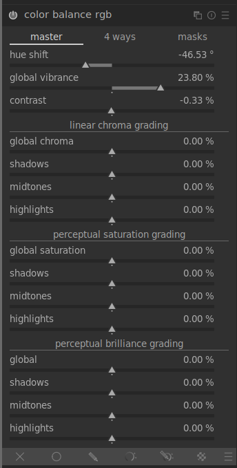
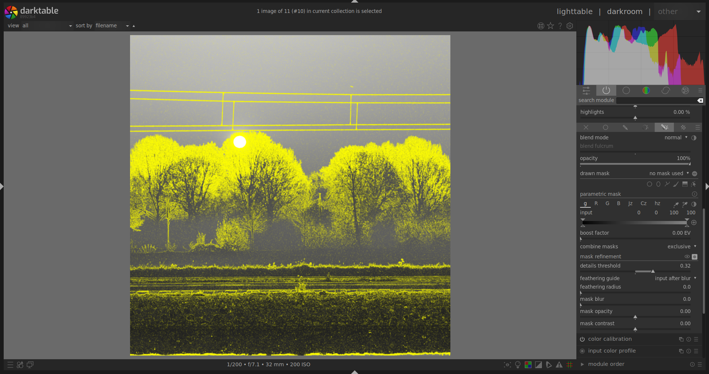
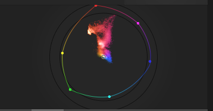

title: darktable 3.6: Summer Release 2021
author: the darktable team
slug: darktable-3-6
date: 2021-07-03
lede: trona-pinacles-ir.jpg
lede_author: paperdigits
tags: announcement, darktable-release

Translations of this article: [German](https://www.bilddateien.de/blog/2021-07-03-darktable-3-6-weiteres-update.html), [French](https://darktable.fr/2021/06/darktable-3-6-sortie-de-la-version-ete-2021)

The darktable team is proud to announce our second summer feature release, darktable 3.6. Merry (summer) Christmas!

This is the first of two releases this year and, from here on, we intend to issue two new feature releases each year, around the summer and winter solstices.

## Documentation

Thanks to countless hours of work of very dedicated contributors, all of the new features are fully documented in time in the [user manual](https://www.darktable.org/usermanual/3.6/en), which is now available in epub format along with the existing online and pdf versions. Help links within darktable have been updated to point to the new manual and the old version will now be officially discontinued. The user manual is still English-only for the moment, but translations are in progress ([here](https://darktable-org.github.io/dtdocs/)) and we expect other languages to be available in time for darktable 3.8.

This time we are also launching a new version of the lua documentation, [here](https://www.darktable.org/lua-docs/3.6/).

## Module Groups and the Quick Access Panel

### Quick Access Panel

The [*quick access panel*](https://www.darktable.org/usermanual/3.6/en/darkroom/organization/quick-access-panel/) is a replacement for the *basic adjustments* module and much more. This feature provides a new interface to the existing processing modules within a single unified layout. Users can add controls from _any_ module to the quick access panel for increased productivity and enhanced ergonomics.

This new implementation is GUI only -- controls and pixel filters still belong to their respective modules and can be properly moved along the pipeline individually using their original, linked, module.

### Module Groups

Modules can now be quickly added to or removed from a module group by right-clicking on the group tabs. This avoids the need to modify the group in the maintenance window, but bear in mind that it doesn't yet update your custom presets. You can also quickly access the *manage module layouts* window by `Ctrl`+clicking on the preset menu icon.

The [*manage module layouts*](https://www.darktable.org/usermanual/3.6/en/darkroom/organization/manage-module-layouts/) window has also been enhanced to include setup for the quick access panel. You can also now auto-apply module group presets depending on the type of image you are editing.

## Color Science Modules

Now that scene-referred image processing is virtually feature-complete in darktable 3.6, scene-referred is now the default workflow. The legacy workflow can still be manually enabled in the preferences.

### New spline in Filmic RGB

A new interpolation method, dubbed *safe*, is the new default to build the characteristic "S" shaped tone curve. This method uses a rational polynomial (similar to the Michaelis-Menten equation) which prevents the under- and over-shooting that sometimes occurs with high contrast and latitude when using the "hard" and "soft" interpolation methods.

The trade-off is that this method gives muted contrast near white and black (unless the latitude is increased), but allows much more drastic settings on the user-side without nasty side effects on the curve.

### Color balance RGB

The [*color balance RGB*](https://www.darktable.org/usermanual/3.6/en/module-reference/processing-modules/color-balance-rgb/) module brings several unique innovations to help colorists edit pictures in a cinematographic way and with a refined level of control in a scene-referred and HDR-ready workflow.

First, it sanitizes the color gamut in the RGB working space at the output of the module and internally between each color space conversion. This ensures that color-grading does not push colors outside of the valid range, which could happen quickly when increasing saturation (as in the former color balance module). This makes daring color editing a lot safer and enables the creation of rich colors that won't degrade into artifacts later.

Second, it uses luminance masks that explicitly split the image into real shadows, highlights and midtones, so that each can be color-graded separately. The classic slope/offset/power settings mostly affect highlights, shadows, and midtones implicitly, as an algorithmic side effect. The internal color algorithm is the usual slope/offset/power where the slope has been decomposed into two parts -- a shadows lift and a highlights gain -- each applied separately on different luminance masks. The luminance masks are user-defined and viewable to allow complete and transparent control over the regions where the grading settings apply.

Third, the module introduces a real "saturation" setting that honors the Munsell and CIE (International Commission on Illumination) definition of saturation: colorfulness relative to lightness. It is important to note that, what 99% of software calls "saturation" is actually a setting that alters *chroma* (colorfulness irrespective of lightness). While desaturating (in real saturation) also brightens and allows you to reach pastel colors (red degrades to pink), chroma reduction takes place at constant lightness and allows you only to reach a shade of gray with the same luminance (red degrades to gray), which is quite unpleasant and inconsistent with painting. A chroma setting is also provided. Both saturation and chroma settings can be tuned globally and separately for shadows, midtones and highlights, using the luminance masks.

Finally, the linear color-grading takes place in a special-purpose RGB color space (published in 2019) to exhibit a uniform repartition of Munsell hues across the luminance range. This makes all color corrections uniform and well-behaved across hues, which is generally not the case for standard RGB spaces (sRGB/Rec709, Rec2020, ProPhoto RGB, etc.). The perceptual part of the color-grading uses the JzAzBz space (published in 2017), which is already used in scene-linear parametric masks. This is a fully perceptual color space (similar to CIE Lab 1976) suitable for HDR signals up to 10,000 Cd/m². Pushing chroma or saturation keeps the hue unchanged, which can be easily ascertained with the new vectorscope graph ([see below](#Vectorscope)), and has not previously been the case with other chroma and saturation settings in darktable.

Vibrance and contrast settings have been ported from other modules to take advantage of the special RGB space used in color balance RGB, making it the all-purpose hub for all things color in darktable 3.6, with modern, perceptually accurate and HDR-ready color science inside.

The color balance RGB module is provided with an OpenCL kernel for GPU offloading that is 6× to 22× faster than the CPU implementation, depending on hardware.

### Color calibration: add color checker support

Color checkers are well-known tools in the industry, consisting of a hardware array of reference color patches, to be shot on-location, and used to ensure color constancy and accuracy over a series of pictures no matter the lighting conditions or the camera used.

A new interface has been added to the [*color calibration*](https://www.darktable.org/usermanual/3.6/en/module-reference/processing-modules/color-calibration/#extracting-settings-using-a-color-checker) module that allows you to quickly extract the best white balance and RGB mixer settings from a color checker image, to minimize color deviation. An internal solver computes the best-suited settings following user-set strategies, for example to minimize the deviation or some hues in priority, or in average. A report gives the user feedback on the quality of the fitting, showing the average and maximum delta E of the remaining color-deviation after calibration. The computed settings can then be defined as presets or copy-pasted to all photos taken in the same lighting conditions, as a primary color-grading.

The same interface can also be used as a quality control, to measure the color deviation over the color checker. This is useful to assert the quality of a generic input ICC profile, for example.

X-Rite/Gretag Macbeth Passport 24 (pre-2014 and post-2014) and Spyder ColorCheckr 24 and 48 (pre-2018 and post-2018) are currently supported. We do not plan to let users add their own charts, and only reference charts from reputable manufacturers will be added to the library in the future.

Note that this tool is intended to refine the standard input color profile of the camera in the current lighting situation, not to replace it or to create generic ICC profiles.

This feature makes color adjustments a lot faster and a lot more reliable, enabling darktable use in exigent color pipelines and professional setups, or simply allowing for fast correction of undesirable color casts and low-CRI lighting.

darktable 3.6 also introduces an OpenCL kernel for color calibration, which should be 1.3× to 8× faster than the CPU path, depending on hardware.

## Censorize Module

The [*censorize*](https://www.darktable.org/usermanual/3.6/en/module-reference/processing-modules/censorize/) module allows you to quickly blur and pixelate parts of an image, in an aesthetically pleasing way, for anonymization purposes and to comply with social media regulations regarding body parts.

It applies physically realistic Gaussian blur and Gaussian noise in linear RGB. As such, it can also be used for various creative effects, including the Orton effect (bloom).

Note that the censorization module does not prevent forensic reconstruction of the censorized parts (using machine-learning and AI). For real forensic-level anonymization, you need to paint solid colors over the sensitive parts of the image.

## Crop, Shapes, Retouch and Pipe Distortions

A number of enhancements have been made so that the pipeline can better handle shapes and distorting modules.

When shapes are drawn on the image, they are actually drawn on the original raw image coordinates and then distorted through the pipe along with the underlying image. This can mean, for example, that straight gradient lines appear curved, or circular masks are drawn as ellipses. In darktable 3.6 you will see these distortions in your drawn shapes _before_ you place them on your image and while you are editing any already-placed shapes. The retouch module has also been enhanced to better manage distortions in the source and target shapes. In addition, the gradient mask can now have its curvature set before it is placed on the image, and with greater accuracy (each scroll event now alters curvature by a smaller amount).

The existing *crop & rotate* module is becoming very hard to maintain, mostly because it tries to do three things (crop, rotate, keystone) at the same time, and the code to do this has become very convoluted. As part of an ongoing project to improve and replace crop & rotate, a new module, [*crop*](https://www.darktable.org/usermanual/3.6/en/module-reference/processing-modules/crop/), has been created. This module has been placed after the retouch module in the pipeline so that retouch can use source spots outside of the cropped image area. You are recommended to use the new module for cropping and, for now, to use the original *crop & rotate* module for rotation and keystone correction only.

## Demosaic & Details Mask

### New Demosaic Algorithms

A new [Ratio-Corrected Demosaicing](https://github.com/LuisSR/RCD-Demosaicing) (RCD) algorithm has been added to the [*demosaic*](https://www.darktable.org/usermanual/3.6/en/module-reference/processing-modules/demosaic/) module for Bayer array sensors. This is essentially an improvement over the AMaZE method, offering almost the same amount of detail recovery but with fewer artifacts. Notably, low-ISO and astro-photographs will be smoother and noise will appear less grainy. This method is also significantly faster than AMaZE and an OpenCL version is provided for GPU execution.

To take advantage of the strengths of different demosaicing methods, new "dual demosaicing" modes have also been added, similarly to RawTherapee. This allows the use of different algorithms on different parts of the image, depending on content.

### Details Mask Refinement

A new parametric masking option has been added to allow you to include or exclude sharp edges and details from parametric masks. This is especially useful to apply sharpening and blurring effects that ignore out-of-focus (bokeh) regions, or, to sharpen only the blurry parts, preventing over-sharpening of in-focus regions. This option is only available for RAW files, as it depends on details taken from the demosaic stage.

## Masks Refactoring

The masks GUI has been improved. The "reversed" blending modes are now accessible from an "invert" icon and the blurring (using Gaussian blur) and feathering (using edge-aware guided filter) mask refining steps can be applied in a user-defined order.

The darktable default for blending modes is to apply the module output over the module input with some optional transparency (using classical [alpha compositing](https://en.wikipedia.org/wiki/Alpha_compositing) and assuming a fully opaque input). The reversed modes instead apply the input over the output.

As of darktable 3.4, the mask feathering (using a guided filter) was always applied before the mask blurring (using a Gaussian blur). Both techniques aim at ensuring contiguous image regions are masked continuously, without holes, especially in the presence of noise and when using chromaticity masks. However, the Gaussian blur is not edge-aware and can leak out of the boundaries of masked regions, producing edge halos in some situations, whereas the guided filter is taped closely to edges. While the Gaussian blur is more effective to deal with noise, using it after the guided filter voids the edge-awareness of the latter. Applying in reversed order may help to more aggressively correct noise while still retaining the edge-aware properties of the guided filter (use small blurring radii).

## Chromatic Aberrations

### Old Module

The existing *chromatic aberrations* module has been renamed [*raw chromatic aberrations*](https://www.darktable.org/usermanual/3.6/en/module-reference/processing-modules/raw-chromatic-aberrations/) and now has a new option to prevent color shifts. Note that this module only works for Bayer sensors and is therefore limited in usefulness.

### New Module

A new [*chromatic aberrations*](https://www.darktable.org/usermanual/3.6/en/module-reference/processing-modules/chromatic-aberrations/) module has been added. This module works in RGB after demosaicing and is therefore available for all images and sensor types. It brings a new filtering technique (inspired by [adaptive manifolds](https://www.inf.ufrgs.br/~eslgastal/AdaptiveManifolds/), published in 2012) that allows it to guide, more or less closely, two of the RGB channels with the third, to ensure the gradients of all 3 channels are correlated. Note that chromatic aberrations occur either because gradients of the RGB channels are slightly spatially shifted in the image with respect to one another, or because gradients are more blurry in one channel than in others.

The radius of the neighborhood used for correcting gradients and the strength of the correction are user-defined. This works much better on large chromatic aberrations (above f/2.8) than the old module and regularizes some of the noise as a side effect. It can also be used with several instances using different guiding strategies to overcome the most difficult cases without producing gray fringes at edges.

### Lens Correction

The chromatic aberration correction that is built into the *lens correction* module can now be overridden entirely. Also, a bug in the pixel coordinate remapping, whereby chromatic aberrations were actually being *created* at the image borders when using manual override, has been fixed.

## Vectorscope

A [vectorscope](https://www.darktable.org/usermanual/3.6/en/module-reference/utility-modules/shared/histogram/#vectorscope) view has been added as a complement to the histogram and waveform views. The vectorscope is a hue/chroma diagram that shows [chromaticity](https://en.wikipedia.org/wiki/Chromaticity) isolated from lightness or spatial information.

The graph represents color "volume" by rendering the more frequently used colors in the image in lighter tones. Graph points are colored to represent the chromaticity that each point describes.

A graticule marks the primaries/secondaries of the histogram profile. A "hue ring" represents the maximum possible chroma of each hue (in bounded RGB) in the histogram profile.

The vectorscope can describe the image in either the [CIELUV color space](https://en.wikipedia.org/wiki/CIELUV) (a well-known standard) or [JzAzBz](https://www.osapublishing.org/oe/fulltext.cfm?uri=oe-25-13-15131&id=368272) (generally more perceptually accurate but slower to calculate). It can represent chroma either in a linear (accurate to the color model) or logarithmic scale (to understand low-chroma images).

This tool, originally used in video editors, is useful for color-matching different images in a series by showing what the dominant colors are. This means that users only have to ensure the consistency of dominant colors between frames. It can also be used to analyze, teach and further understand the effects of module settings on image colors.

Some things that the vectorscope cannot do:

- The hue ring is not a gamut check, as a color can be within the hue ring, yet still out of gamut due to its darkness/lightness.
- When adjusting an image based on a color checker, faster and more accurate results will come from using the new "calibrate with a color checker" option in *color calibration* ([see above](#Color-calibrationnbspadd-color-checker-support)).
- The vectorscope does not have a "skin tone line." Skin tone varies in chromaticity, hence any such line would inevitably represent a presupposition. Furthermore (see next point), this scope does not provide specific guidance to correct for specific image content.
- The vectorscope represents a colorimetric encoding of an image, which inevitably diverges from a viewer's perception of the image.

## Darkroom UI Changes

The header line of processing modules has been amended to include a mask indicator, for those modules where a drawn or parametric mask has been used. You can click on this icon to show or hide the mask.

A number of processing modules include drawn elements (for example, the charts in _filmic rgb_ or the spline curves in the _contrast equalizer_). These elements default to a 16:9 aspect ratio, but can be resized by hovering your mouse over them and scrolling with the mouse's scroll wheel while holding `Ctrl`.

## Performance

Many pixel routines have been optimized for speed on both CPU and GPU, most notably the intermediate color space conversions that happen in the pipeline between Lab and RGB modules or in parametric masks, as well as the drawn masks coordinate conversions. On those parts of the code, you can expect up to a 3× speed-up.

Users who want maximum performance are advised to compile darktable themselves using the `Release` build in order to fully utilize the specific optimization set provided by their hardware: see the following [short](https://github.com/darktable-org/darktable#compile) or [detailed](https://www.darktable.org/install/) instructions. Note that pre-built packages are compiled with conservative and one-size-fits-all optimizations that are guaranteed to work on any typical hardware since 2004 (Intel Pentium IV), but do not take advantage of all available optimizations for your hardware.

## Deprecated Modules

The following modules are deprecated because they have internal design weaknesses that cannot be fixed or because they are now redundant. They have been replaced by alternatives:

- Spot removal (This is a subset of functionality already provided by the _Retouch_ module)
- Vibrance (Now part of _Color Balance RGB_)
- Basic adjustments (Replaced by the Quick Access Panel -- see above)
- Defringe (Replaced by the new _Chromatic Aberrations_ module -- see above)

These modules have been retained to preserve old edits, but will be no longer available for new edits with the next release.

## Lighttable Changes

### Import

With the release of darktable 3.6 the two buttons *Image...* and *Directory...* buttons in the [import](https://www.darktable.org/usermanual/3.6/en/module-reference/utility-modules/lighttable/import/) module have been replaced by two new options:

- The _add to library_ option takes images that already exist on your file system and adds them to the library database (this is the equivalent of the previous functionality).
- The _copy & import_ option creates copies of images before importing those copies into the library. This will most often be used for images that are stored on an external data carrier like a memory card or camera and need to be copied to your local file system before import. You can choose to rename images as part of the copy process.

Both options present you with a single dialog that allows you to select either individual images or directories for import, and optionally allows you to view image thumbnails before they are imported.

Also new is the ability to specify metadata and keywords for the imported images directly in the import module of the lighttable (previously only accessible from a sub-dialog).

Furthermore, a problem regarding the star rating during import has been fixed. The user can now choose to take the star rating from the image's Exif data or to hard-code it to the same value for all imported images.

### Collect

The "collect images" module has been renamed to [collections](https://www.darktable.org/usermanual/3.6/en/module-reference/utility-modules/shared/collections/) in order to provide clarity and consistency with other modules. You can now toggle between folder and film roll view by clicking an entry while holding `Ctrl`+`Shift`.

While in folder view, you can toggle between various views of the images in that folder as follows:

- Double-click to show only the images in the selected folder
- `Ctrl`+click to show only the images from any sub-folders
- `Shift`+click to show the images from the current folder plus all sub-folders

## Map and Geotagging Changes

A number of changes have been made to the [map view] (https://www.darktable.org/usermanual/3.6/en/map/) and the layout of the [geotagging](https://www.darktable.org/usermanual/3.6/en/module-reference/utility-modules/shared/geotagging/) module has been updated in both the lighttable and map views.

## Others

- You can now use keyboard shortcuts to access blending controls in processing modules.
- Some preferences have been moved out of the global preferences menu and into new options within module "presets" menus.
- Tagging changes: A quick way to organize the tag structure is to drag and drop the tags. In the _tree_ view mode, you can drag any tag (node or leaf) and drop it on top of another one (node or leaf). The first tag and its descendants, if any, become descendants of the second tag. Dragging over a node automatically opens the node.
- Press the "export" button at the bottom of the _Preferences_/_Presets_ window allows you to export all of your presets (excluding predefined presets) to a chosen directory.
- You can now use the reset button on the styles module to remove all styles.
- Within the lighttable view, you can now switch display mode using a newly-designed suite of icons. These replace the previous drop-down menu.
- The export module has been added to the left-hand panel in the darkroom.
- You can now create a new instance of a module with a given preset by right-clicking on the preset name (instead of middle-click as it was in 3.4). This should make this shortcut accessible to more users. Similarly, right-click on the multi-instance menu to directly create a new module instance.
- The prompt that appears before exporting in overwrite mode is now optional.
- Zoom scaling on 4K and high-DPI displays is fixed, so 100% zoom level is now 1:1 pixel no matter the viewport pixel scaling.

## What's Next

Our next release is already being planned for December. Here are some of the things you can look forward to:

- A new method of defining shortcuts, that can be used with a much wider range of input devices, including midi controllers
- A new diffuse/sharpen module, which uses a physical model for particle diffusion, modified for edge-awareness. This module can be used to add or revert atmospheric hazing, lens blur, inpaint clipped highlights or damaged image parts, or create artistic effects like watercolor painting or line drawing
- More enhancements to the histogram module
- Changes to the print view to allow multiple images to be displayed
- Further improvements to color handling within the pixelpipe
- A new LMMSE demosaic algorithm, that is particularly suited to high-ISO images
