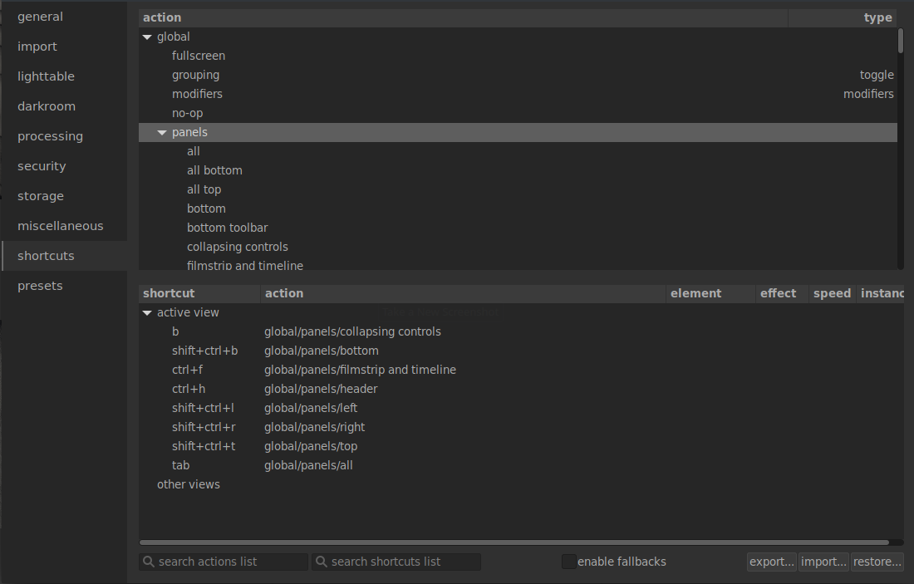
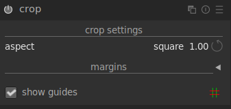
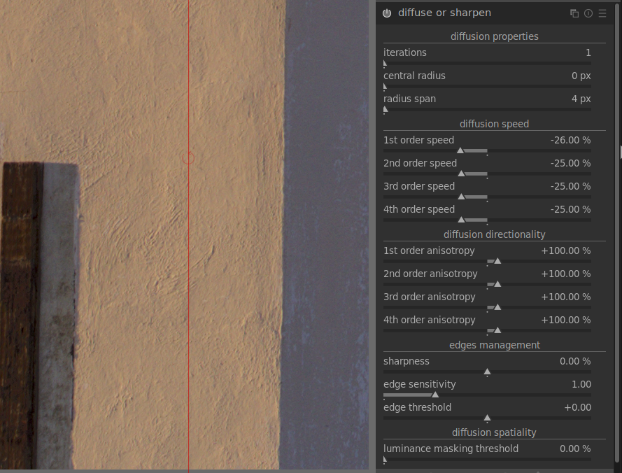
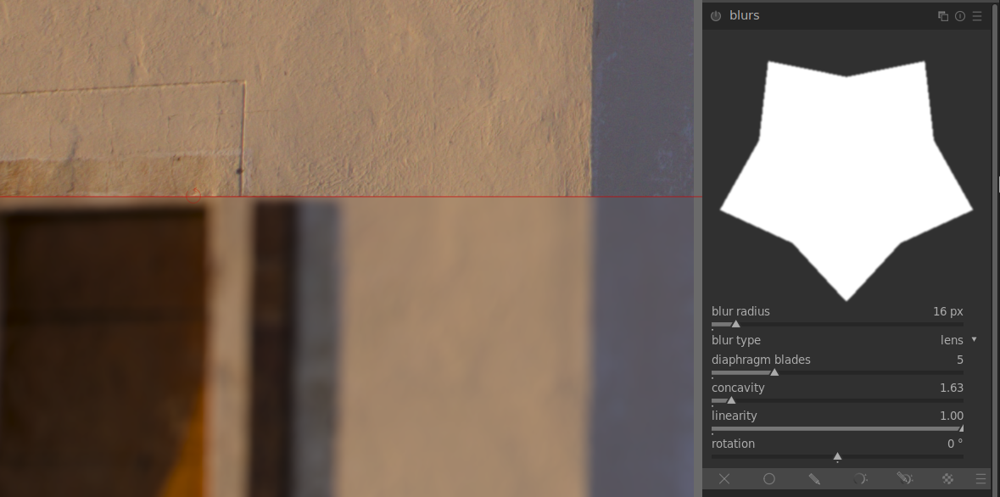
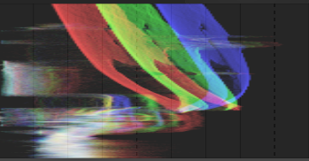

_Translations of this article: [German](https://www.bilddateien.de/blog/2021-12-24-darktable-3-8-tastaturbefehle-ueberall.html)._

The darktable team is proud to announce the second feature release of 2021.

# Documentation

As is becoming the norm now, all new features are fully documented in the latest version of the user manual. We have also added a new introductory section to act as a guide for new users and those unfamiliar with scene-referred workflow.

A few completed translations were quietly introduced to the documentation website alongside the 3.6.1 release and darktable 3.8 now introduces a some more translations (**perhaps**), fully integrated into darktable's help link system. Translated versions of the epub and pdf manuals are also available (**maybe**). Due to the amount of work involved in translating the documentation we will probably provide further updates over the next month so if your language isn't supported at the moment, please check back in the new year. Please see [this page](https://darktable-org.github.io/dtdocs/en/special-topics/translating/) if you want to find out how to contribute your own translations.

The [darktable.org](https://darktable.org) website has been upgraded to use the [Hugo](https://gohugo.io) static site generator (the same tool used for the documentation) and, while the content hasn't changed much (for now), we have taken the opportunity to amend the URLs for the documentation, so please go to [this site](https://docs.darktable.org/usermanual/3.8/en/) for the new version of the user manual and **this site** for the Lua documentation.

# Revamped Shortcut Mapping

We have removed all of your custom keyboard shortcuts. Sorry about that.

To compensate for that loss have introduced an entirely [new shortcut system](https://docs.darktable.org/usermanual/3.8/en/preferences-settings/shortcuts/) that now supports MIDI and game controllers. You can now control virtually all of darktable's functionality with buttons, knobs, sliders and joysticks as well as the keyboard and mouse (for the traditionalists). The new system is fully tested and compatible with the Behringer X-touch Mini controller but should support (to a greater or lesser extent) any MIDI device. See [here](https://docs.darktable.org/usermanual/3.8/en/special-topics/midi-device-support/) for some more information on device support.

For those who want to continue just using the keyboard and mouse, you can now use single, double and triple clicks or key-presses, long-clicks, and mouse cursor movements in your shortcuts, for maximum flexibility.

As a by-product of this work, the quick access panel now supports a number of graphical module controls, such as tone curves and wavelet-based spline curves, so every control from every module can now be added to the quick access panel.

# Canon CR3 Support

Canon CR3 files are now fully supported by darktable -- for a complete list of supported cameras please see the **release notes**. This support is provided by LibRaw and requires (at least) exiv2 version 0.27.4 with BMFF support enabled. We are aware that some people have been using builds with experimental CR3 support and, while this (LibRaw) solution is quite different those experimental builds, we are not aware of any conflicts with the new implementation.

# RIP Crop & Rotate

We mentioned in the darktable 3.6 blog post that the _crop & rotate_ module has become very hard to maintain, mostly because it tries to do three things (crop, rotate, keystone) at the same time, and the code has become very convoluted. The project to replace this module is complete and _crop & rotate_ is now deprecated.

Its functionality is now shared between three modules:

- The new [_crop_](https://docs.darktable.org/usermanual/3.8/en/module-reference/processing-modules/crop/) module (we'll leave you to guess what it does) was introduced in darktable 3.6. Its position in the pipeline means that the _retouch_ module can now take its source patches from outside of the cropped image area.
- You can horizontally/vertically flip your image in the [_orientation_](https://docs.darktable.org/usermanual/3.8/en/module-reference/processing-modules/orientation/) module.
- Rotation and keystone correction can now be found in the _perspective correction_ module (now renamed to [_rotate and perspective_](https://docs.darktable.org/usermanual/3.8/en/module-reference/processing-modules/rotate-perspective/)), which has been enhanced to include controls for rotating the image and manually defining perspective (keystone) correction. We have also ported the right-click-and-drag method of defining horizontal/vertical orientation to this module.

If you miss the convenience of all of this functionality in a single module, don't forget that you can also assign shortcuts or add controls from all three modules to the quick access panel.

Finally, the [compositional guide overlays](https://docs.darktable.org/usermanual/3.8/en/module-reference/utility-modules/darkroom/guides-overlays/) (previously only available from the _crop & rotate_ and _crop_ modules) have now been enhanced so that they can be permanently enabled by clicking on the guide lines button in the bottom panel. Right-click on the same button to change the type and color of the displayed lines. If you wish to retain the old behavior (only show the guides when cropping) you can still do this as well.

# New Processing Modules

Our resident color scientist Aurélien Pierre (support him on [liberapay](https://liberapay.com/aurelienpierre/) or [paypal](https://www.paypal.com/paypalme/aurelienpierre)) has been hard at work developing some more toys for you and darktable 3.8 introduces two new modules.

## Diffuse or Sharpen

Diffusion is a family of physical processes by which particles move and spread gradually with time, from a source that generates them. In image processing, diffusion mostly occurs in two places:

- diffusion of photons through lens glass (blur) or humid air (hazing),
- diffusion of pigments in wet inks or watercolors.

In both cases, diffusion makes the image less sharp by "leaking" particles and smoothing local variations.

The [_diffuse or sharpen_](https://docs.darktable.org/usermanual/3.8/en/module-reference/processing-modules/diffuse/) module uses a generalized physical model to describe several kinds of diffusion, and can be used by image makers to either simulate or revert diffusion processes.

As it is a highly technical module, several presets are provided to demonstrate its use for various purposes.

Diffusion can be removed in order to:

- recover the original image from sensors with an anti-aliasing filter or mitigate the blur created by most demosaicing algorithms (use the _sharpen sensor demosaicing_ preset and move the module before the _input color profile_ module in the pipeline),
- reverse static lens blurring/defocusing (use one of the _lens deblur_ presets),
- remove atmospheric haze (use the _dehaze_ preset),
- add extra acutance for better legibility (use the _local contrast_ preset).

Note that motion blurs cannot be reverted by undoing the diffusion process, as they are not diffusive in nature.

Diffusion can be added in order to:

- create a bloom or Orton effect (use the _bloom_ preset),
- inpaint missing or damaged parts of an image (use the _inpaint highlights_ preset),
- denoise in an edge-preserving way (use one of the _denoise_ presets)
- apply a surface blur (use the _surface blur_ preset).

Since the process is physical, even its glitches may be used for creative purposes. For example, you can:

- simulate line drawing or watercolor (use the _simulate line drawing_ and _simulate watercolor_ presets),
- create random patterns and textures by increasing noise (over time, with iterations, noise will connect with neighbours to create random specks).

For more information, Aurélien has produced a [comprehensive video](https://www.youtube.com/watch?v=DREdq7guNz4) describing the use of this module.

## Blurs

The [_blurs_](https://docs.darktable.org/usermanual/3.8/en/module-reference/processing-modules/blurs/) module allows you to simulate physically-accurate blurs in scene-referred RGB space.

Three types of blur are provided:

- lens blur: Simulates a lens diaphragm with a configurable number of blades and blade curvature to create synthetic bokeh.
- motion blur: Simulates the effect of camera motion with a configurable path.
- gaussian blur: This is not really an optical blur but can be used for denoising or for creative effects using blend modes

A diagram at the top of the module shows the shape of the blurring operator (known as the point spread function). The module will turn each luminous point from the scene into a blot shaped like the displayed blurring operator.

# Histograms and Scopes

Over the last few releases, the histogram module has been gradually enhanced to include more scopes (waveform, vectorscope) and, as such, the name "histogram" no longer really fits. This module is therefore renamed to "[scopes](https://docs.darktable.org/usermanual/3.8/en/module-reference/utility-modules/shared/scopes/)" and has been further enhanced as follows:

- A new vertical waveform scope has been added. This is particularly useful for portrait images.
- A new preference has been added to allow the scopes module to be moved to the left-hand panel.
- The vectorscope now supports RYB mode.
- You can now use the global color picker to display live samples on the vectorscope.
- The waveform and parade scopes now have improved color rendering.

# Print Layouts

Support has been added for multiple images in the [print view](https://docs.darktable.org/usermanual/3.8/en/module-reference/utility-modules/print/print-settings/). The page can be filled with multiple areas, each of which can be moved around and placed on the page with the ability to snap to a grid for placement precision.

# Other Changes

- Improved curve handling in the [_filmic rgb_](https://docs.darktable.org/usermanual/3.8/en/module-reference/processing-modules/filmic-rgb/) module means that the filmic curve should now be easier to control -- the black, white and contrast parameters are now less dependent on one another
- When [extracting color calibration settings using a color checker](https://docs.darktable.org/usermanual/3.8/en/module-reference/processing-modules/color-calibration/#extracting-settings-using-a-color-checker), the profile generation now better handles some cameras (Canon) and deals with color checker shots where the image has non-uniform brightness. Delta E improvements of 0.5 and more have been observed during testing. See [this video](https://www.youtube.com/watch?v=EteAhSN9W8s) for a detailed guide to creating custom profiles. 
- A new LMMSE [demosaic](https://docs.darktable.org/usermanual/3.8/en/module-reference/processing-modules/demosaic/) algorithm has been introduced. This algorithm is particularly suited to high ISO and/or noisy images
- A [new option](https://docs.darktable.org/usermanual/3.8/en/preferences-settings/storage/#xmp) has been added to allow you to choose when to start writing XMP sidecar files. Choose to (a) never write XMP, (b) write XMP as soon as the image is imported; or (c) write XMP only after you start editing the image.
- A [new default pipe order](https://docs.darktable.org/usermanual/3.8/en/module-reference/utility-modules/darkroom/module-order/) has been introduced specifically for JPEG images and module order [presets](https://docs.darktable.org/usermanual/3.8/en/darkroom/processing-modules/presets/) can now be auto-applied based on image properties.
- When using the [copy & import](https://docs.darktable.org/usermanual/3.8/en/module-reference/utility-modules/lighttable/import/) functionality, you can now browse for a base directory to add to your file naming formula
- You can now select color pickers in area mode with right-click as well as Ctrl+click
- New [substitution variables](https://docs.darktable.org/usermanual/3.8/en/special-topics/variables/) have been added: `$(SENSOR_HEIGHT)` and `$(SENSOR_WIDTH)` for the absolute pixel dimensions of the sensor; `$(MAX_HEIGHT)` and `$(MAX_WIDTH)` for the raw image size; and `$(EXPORT_HEIGHT)` and `$(EXPORT_WIDTH)` for the post-cropping final image size
- Chosen menu options (presets/blend modes) are now indicated with a check mark to make selection clearer
- You can now [alter the "active" module group](https://docs.darktable.org/usermanual/3.8/en/darkroom/organization/manage-module-layouts/#global-controls) to show all modules in the [history stack](https://docs.darktable.org/usermanual/3.8/en/module-reference/utility-modules/darkroom/history-stack/), whether or not they are enabled. You can also Shift+click an entry in the history stack to open the corresponding module
- Mask scroll options (opacity, size feathering etc.) can now be inverted with a [configuration preference](https://docs.darktable.org/usermanual/3.8/en/preferences-settings/darkroom/#general) (i.e. scroll down to increase values and vice versa)
- The [_watermark_](https://docs.darktable.org/usermanual/3.8/en/module-reference/processing-modules/watermark/) module now supports PNG files
- The [_denoise (profiled)_](https://docs.darktable.org/usermanual/3.8/en/module-reference/processing-modules/denoise-profiled/) module now uses wavelets mode by default and its default settings in Y0U0V0 mode have been improved
- The automatic mask tuning has been improved in the [_tone equalizer_](https://docs.darktable.org/usermanual/3.8/en/module-reference/processing-modules/tone-equalizer/#masking-tab) module

This is just a brief guide to the major changes in darktable 3.8. For details of other changes/fixes please see the **release notes**.

# darktable 4.0

The next planned feature release will be darktable 4.0 in Summer 2022 and we are hard at work on more exciting features. Among other things, changes (now made possible by the linear scene-referred pipeline) will allow you to:

1. Ensure color and exposure consistency of the same object over different pictures by normalizing the CAT and exposure settings. The main goal is to ensure that the secondary color-grading (color balance RGB settings) have the same effect over a series, which is not guaranteed if you simply duplicate the history.
2. Force some object or reference color, for which you know (a priori) the color coordinates, to have these exact coordinates at the output of color calibration

Both features allow you to perform an exact white-balancing even when you don't have neutral greys in the image, provided that you still have another reference color you can use. They can also be useful when the lighting changes during a shooting session. A "measure" mode allows you to sample a reference color/exposure and a "correction" mode allows you to apply that reference to another image. This will be of particular use in event/book/catalogue photography.
