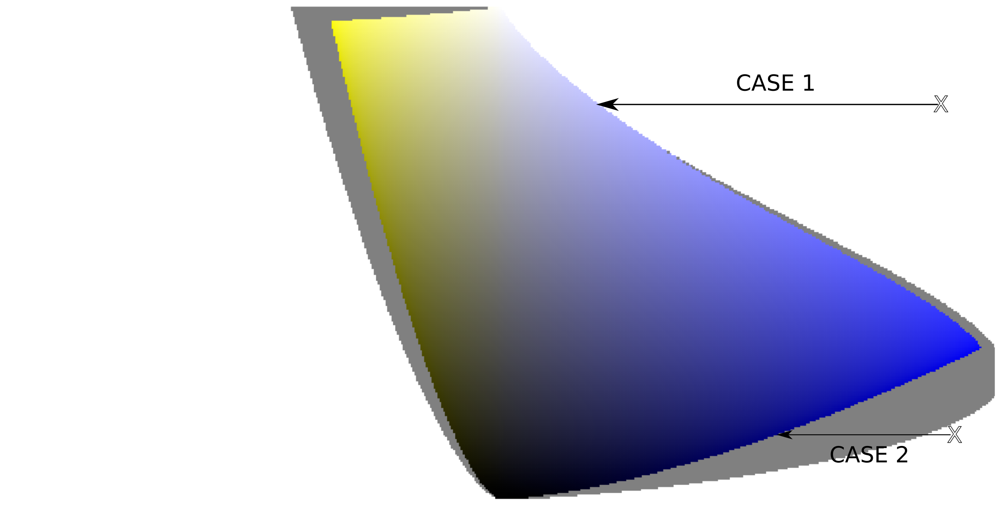
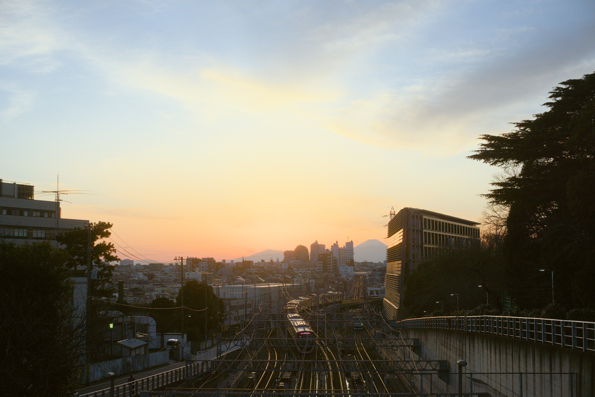
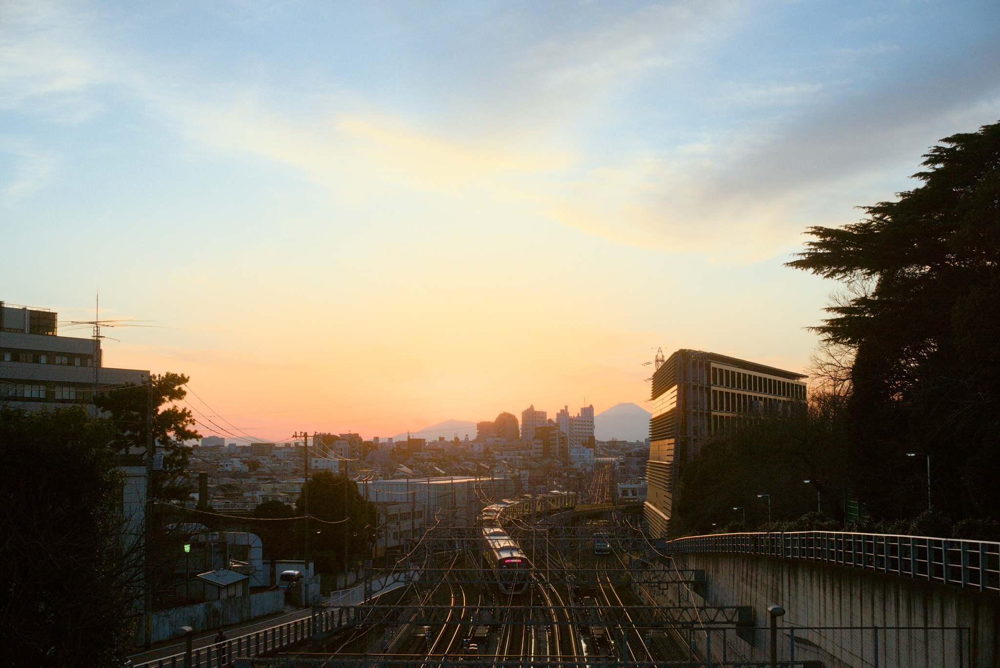
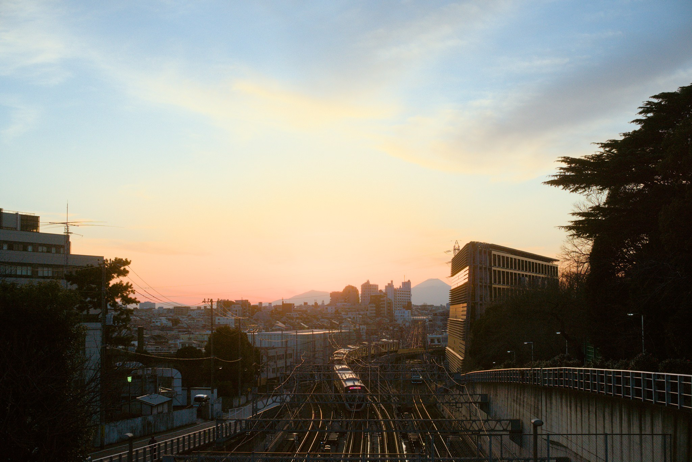

## Photography is color reproduction

Each photographic medium (film, sensor, file, print, screen, hologram, you name it…) is by nature a __reproduction__ that only fixes a scene onto a permanent support. So we only ever transfer a photograph from a medium to another to create a reproduction that will be seen by the audience. These media are unfortunately not equal, namely the most colorful red of some medium may be only half as colorful as another medium's red (and same for all other primary colors), or the reference white of some medium might be slightly colder or warmer than another.

To quantify how colorful each medium is compared to another, we create color spaces, which are mostly geometric 3D cubic spaces where each R, G, B intensity gets a value. Basically, we move the color rendition problem to the math world, because that's the only way we can solve it.

Then we write the cooking recipe of the conversion from space to space (that is, from medium to medium) inside a color profile, to be able to rescale those R, G, B numbers in order to get the same perceived color while we reproduce the photograph on another medium.

Color profiles are translation recipes allowing to switch color spaces in a controlled fashion when you slap that image onto a different medium. Because, no matter the medium, you want the same color (as much as possible).

Problems occur when the medium you want to print on is much less colorfull than the medium holding your original file. This means the destination color space is shorter than the original space. Which means some colors of your original will not fit in your reproduction. This occurs quite a lot because digital sensors can actually record beyond what is even printable.

The volume of colors (volume, because it's a 3D space) that can fit on a medium, that is within its color space, is called the gamut. So, the thing we need to mind when converting from color space to color space are the colors that fall out of gamut after the conversion. Because we will not be able to print or display them at all, and yet they are still part of the image.

## Out of gamut, you said ?

Out-of-gamut colors typically happen when the target RGB space does not have coordinates in [0; 100] % able to represent a particular color. Typically, this is because the color is requesting a chroma that is too high for its luminance, and the target color space does not have it in store.

The graph below shows a gamut slice of the sRGB volume at constant hue, in a perceptually uniform gradient (lightness-chroma), for the hue of the RGB primary blue. Visible colors that lie outside of sRGB are represented in grey. We have 2 main cases for out-of-gamut:

1. case 1 occurs when at least one RGB value is > 100%,
2. case 2 occurs when at least one RGB value is < 0%.

There might be a third case where we have at the same time one value > 100% and one < 0%, but I have never seen that happen in practice.

The ICC colorimetric intents define various strategies to deal with that:

* perceptual relies on AtoB/BtoA look-up tables (LUT) that contain vendor heuristics dealing with gamut mapping implicitely, and usually compressing the whole range of colors. These LUT need to be stored within the ICC profiles.
* relative colorimetric states that "colors should be clipped to the boundary of the gamut". For the longest time, I thought this implied "chroma-clipped at constant hue", but I actually didn't find anything clearly saying that.

In all cases, we will need to remap the out-of-gamut colors to the closest color in gamut. But then, the closest color may not have the same hue as the original. So we may need to add constraints like constant hue and constant luminance.

## How that is supposed to be handled in darktable

Little CMS2, when enabled, should take care of the intent and gamut mapping to the output (display or exporting) color space. But that [relies solely on what properties the ICC profile defines](https://github.com/mm2/Little-CMS/issues/221#issuecomment-646492821). So the existence and quality of the gamut-mapping entirely depends on the quality of the color profiles used and the ICC tags it declares.

## What really happens in darktable

First, we don't define the AtoB/BtoA look-up tables for our internal profiles, so the perceptual intent actually falls back to something close to relative colorimetric. This applies to all internel profiles like sRGB, Adobe RGB compatible, etc. The reason we don't do it is those look-up tables are based on hand-tuning, involving taste, art, preferences and a bit of black magic. We can't simply calibrate them.

Then, for third-party profiles (like the ones your printer may provide you), what happens is entirely up to the profile. You better hope that whoever provides it did a good job.

That is to say, not much gamut-mapping happens at the output of darktable if you export to generic sRGB profile or self-calibrated medium profiles.

Good candidate pictures to test this are sunset pictures, because those bright and saturated reds are guaranteed to be out of pretty much any display gamut. If you cycle between perceptual and relative colorimetric in these pictures, you should see a difference if things work properly. Most likely, you won't.

## How to improve gamut mapping in darktable

The ICC provides an [sRGB v2 profile](https://color.org/srgbprofiles.xalter#v2) with the proper data, such that it actually enables gamut-mapping for perceptual and relative colorimetric intents with Little CMS2. You can download it and install it in `~/.config/darktable/color/im`, restart darktable and it will appear in the list under `sRGB2014`.

Without the proper tags and data registered in the ICC profile, unfortunately, nothing will happen and out-of-gamut colors will be simply clipped in RGB, resulting in hue shifts and non-constant luminance (see below).

This is the reason why filmic v6, that will be shipped in darktable 4.0, embeds a gamut clipping at constant hue and luminance, that preserves the original hue of the image before the tone-mapping. Using a test-conversion to output RGB space (either export or display), it will detect out-of-gamut colors and compute the maximum chroma allowed in gamut at current hue. It will make users less dependent on the quality of the output ICC profiles and will allow a more neutral conversion from scene to display, mapping both dynamic range and color space, with as little color distortion as possible.

Of course, since most legacy display-referred modules still lie in the pipeline after filmic, that leaves plenty of opportunities to push colors out of gamut later. In this case, you will have to rely on Little CMS2 and on the profile it uses, but that previous safety jacket should prevent most issues. Note that there is also gamut-mapping against the pipeline working space (Rec 2020 by default) at the output of color balance RGB, and a "perceptual" gamut compression at the output of color calibration, so the color consistency is not solely managed at the end of the pipeline anyway.

## How to test it

This is a test picture exported in Adobe RGB space and gamut-mapped through filmic v6 (which uses relative colorimetric intent by design), without Little CMS at the output :

You may find this particular image as a RAW by Bao on [pixls.us](https://discuss.pixls.us/t/sunset-scene-with-darktable-rawtherapee/23139), licensed as CC-BY-SA 4.0. Your browser will need proper color-management since the file is saved as Adobe RGB, and the profile is tagged in its metadata. If your screen is not able to display Adobe RGB space, then you will get a clipped variant of the picture, with gamut-mapping left to the care of the color management system of your browser.

If we re-import this particular JPEG, then export it as sRGB using darktable's internal sRGB profile, with Little CMS2 in relative colorimetric, this is what we get :

Notice the highlights shift to infamous rat-piss yellow, so typical of poorly color-managed applications in similar sunset situations. Highlights also get darkened because the clipping does not preserve luminance either.

Now, do everything the same, but with the sRGB v2 profile from the ICC:

Red again, and smoother. Win ! Now, export with sRGB using the internal darktable profile with filmic v6 gamut mapping (again, relative colorimetric by design):

Pretty much the same result as before, but it works also for bad color profiles, as long as they are RGB and matrix-based (no LUT-based profiles).

Now, to finish, let's see how it looks to use the ICC sRGB v2 profile in perceptual mode :

The change is almost imperceptible, but highlights get slighly less saturated.

## Conclusion

It is an understatement to say that most photographers are overwhelmed by the technicalities of color management. Most of them just install and use color profiles hoping they will magically solve all their issues. But not all color profiles are equal, some are bad and actually worse than no color management at all.

In this mess, it is useful to recall that all the maths at work, no matter how advanced and complicated, only aim at emulating and predicting how the eye will see. So the human perception is the only valid reference. Which means that you need to trust your eyes before everything else, criticize what you see, and everything is fine as long as it looks fine.

Problems occur in the opensource world, that is known to attract technically-minded people, who have a tendency to trust numbers above perceptions. And while perceptions can be subjected to many illusions, they are not only the best we have in the art world, but also the fundamental reference upon which are built all image processing math involved in color manipulations and conversions.
