This is a beginner-friendly and simple workflow for developing photos in darktable 5.4 using some new tools made available in this version. The intent is not to go in-depth on any particular tool, but rather to show off how a small number of modules can be used to process an image quickly. This article can hopefully serve as a relatively non-technical introduction to darktable and a reliable starting framework for developing your own photos whether you're new to RAW editing or an experienced photographer looking into using darktable.

I am a mostly self-taught amateur photographer, though there are many people from around the world who have provided free information through the power of the Internet. I have been doing insect and macro photography since mid-2023 and have been using darktable since December 2024. I've approached this article as if I am writing to myself one year ago, when I was facing choice paralysis and ingesting hours of videos while learning what darktable has to offer.

I have chosen a photo of a skipper butterfly to share for this article, so feel free to download the RAW file and follow along.

[Download the RAW file here](https://discuss.pixls.us/uploads/short-url/1LMNp6TozsQGlw3gDOCULsPrmlu.CR3)

<a href="https://discuss.pixls.us/uploads/short-url/1LMNp6TozsQGlw3gDOCULsPrmlu.CR3">Untitled Skipper Butterfly</a> © 2025 by <a href="https://www.flickr.com/photos/raublekick/">Andrew Raub</a> is licensed under <a href="https://creativecommons.org/licenses/by-nc-sa/4.0/">CC BY-NC-SA 4.0</a>

### A bit about my hardware

I shoot on a Canon R10 using a fully manual Laowa lens, a Godox flash on manual settings, and an AK Diffuser flash diffuser. The flash and diffuser are important to this process for a few reasons:

- Using a flash and diffuser means that generally my subjects are not lit by natural light
- The diffuser does a great job of spreading light across the scene and avoiding harsh reflections
- Even with the diffuser, there can sometimes be harsh highlights as a result of the flash reflecting off of surfaces like insect wings or carapaces
- Because of the flash, backgrounds can often quickly fall off into darkness
- Using a flash and diffuser means I have a consistent white balance and exposure coming straight out of the camera

My camera settings are mostly static when shooting insects:

- Aperture: f/11
- Shutter speed: 1/200
- ISO: 200
- White balance: 5600k
- Flash power: start at 1/16 and adjust as needed

These settings and the gear I use give me a consistent starting point for most of my photos.

## Helpful tools

### Color assessment mode

[Documentation](https://docs.darktable.org/usermanual/development/en/module-reference/utility-modules/darkroom/color-assessment/)

darktable has a color assessment mode that can be enabled by clicking the color assessment mode icon at the bottom of the _darkroom_ view. It helps with evaluating exposure by wrapping the image in a white border, which is surrounded by the 18% gray background (if you are using the default theme).

### Guide lines

[Documentation](https://docs.darktable.org/usermanual/development/en/module-reference/utility-modules/darkroom/guides-overlays/)

By default the crop module will turn on the guide lines, but the guide lines can be enabled and configured independently from the crop module by right clicking the guide lines icon at the bottom of the _darkroom_ view.

### Histogram, waveform, RGB parade, and vectorscope

[Documentation](https://docs.darktable.org/usermanual/development/en/module-reference/utility-modules/shared/scopes/)

In addition to the commonly used _histogram_, darktable also includes _waveform_, _RGB parade_, and _vectorscope_ views. The _waveform_ is useful for assessing color and luminosity across your image in a spatial context. The _vectorscope_ allows you to see what colors are in your image, and there are several overlays you can apply, for example, to show complimentary colors.

### Snapshots

[Documentation](https://docs.darktable.org/usermanual/development/en/module-reference/utility-modules/darkroom/snapshots/)

The _snapshots_ allows you to take a snapshot of your image and then later use it to compare with the current version of your image. You will see this in some of the screenshots throughout this article.

### Module presets

Most modules have some presets defined which you can access by clicking the "hamburger" menu icon ( ☰ ) on the right side of the module header.

## The workflow

This workflow uses a small number of darktable's processing modules organized into the following objectives:

- Technical corrections
- Cropping, exposure, and white balance
- Tone mapping
- Sharpening and local contrast
- Color and contrast

It is important to note that darktable uses a pixel pipeline where modules are processed in a specific order that may differ from the order in which I make adjustments. For example, tone mappers tend to be processed near the end of the pipeline, but are usually adjusted near the beginning of the photo development process.

**Note:** This workflow assumes you are using the pixel workflow _scene-referred (agx)_. To change to this, open the preferences and navigate to _processing -> auto-apply pixel workflow defaults_ and select "scene-referred (agx)". Alternatively, simply turn off the _filmic rgb_ or _sigmoid_ modules and search for _agx_ in the module list.

### The photo

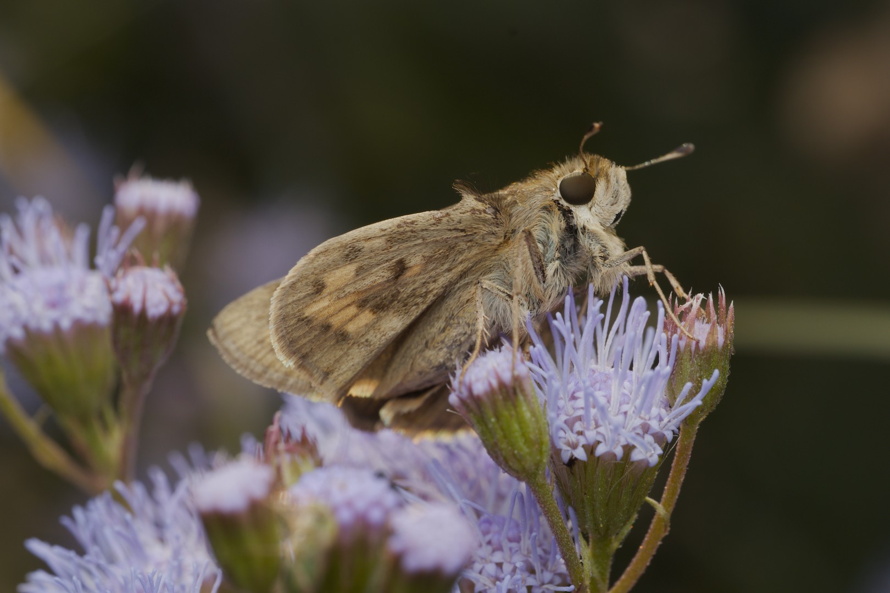
Here is an export of the photo in its initial state after opening the _darkroom_ view. The default look from a newly opened RAW image in darktable might look a bit bland at first, as there is no camera profile applied to give it a camera JPEG look as a starting point. But we can work with this and quickly turn it into something much more.

I chose this image because there are some bright areas, some dark areas, a nice smooth background, and lots of detail in the butterfly's head and thorax. This is fairly typical of the starting point for the images I shoot.

### Technical corrections

This section is a set of modules that can be turned on with little or no configuration required and serve to refine your RAW image and address technical imperfections of your camera and lens.

#### demosaic (capture sharpening)

[Documentation](https://docs.darktable.org/usermanual/development/en/module-reference/processing-modules/demosaic/)

Capture sharpening is a method of sharpening a RAW image early on in the demosaicing process. In darktable 5.4, capture sharpening was introduced into the _demosaic_ module, borrowing from the tools available in **RawTherapee**.

In the _demosaic_ module, enable the capture sharpening option by toggling it on. This will calculate the parameters based on your image, but those options can be changed at any time.

**Hint:** If you ever find that enabling capture sharpening results in an error stating that it can't calculate a reliable capture radius, make sure you are zoomed out and temporarily turn off the _crop_ module.

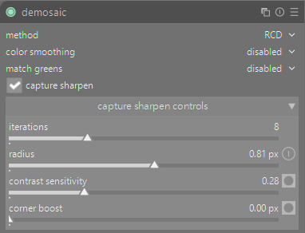

#### denoise (profiled)

[Documentation](https://docs.darktable.org/usermanual/development/en/module-reference/processing-modules/denoise-profiled/)

If your camera is supported, enabling this module will apply a denoising profile based on your camera and the ISO of the image. The effect in my experience is much more subtle than what you might get from Lightroom or DxO PhotoLab, but it is satisfactory for my needs.

 module")

#### lens correction

[Documentation](https://docs.darktable.org/usermanual/development/en/module-reference/processing-modules/lens-correction/)

The _lens correction_ module applies a profiled set of corrections for vignetting and distortion based on the characteristics of your lens. If your lens is supported, a correction profile will be applied. My lens is not supported so I leave this off. I have not noticed any distortions or vignetting from my lens, but your results may vary.

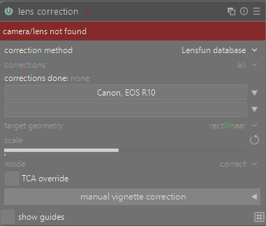

#### Review

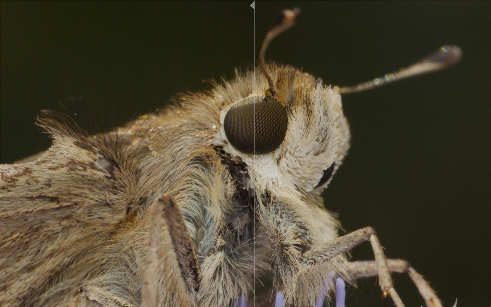
Here is what the image looks like now, fully zoomed in and with a snapshot of the original image on the left and the current state on the right of the dividing line. You can especially see just how much capture sharpening has improved the image in the eye and details of the hairs.

### Cropping, exposure, and white balance

These are "big picture" changes that I am grouping together because they set the stage for the rest of the modules.

#### crop

[Documentation](https://docs.darktable.org/usermanual/development/en/module-reference/processing-modules/crop/)

The _crop_ module has selections for many pre-defined aspect ratios, or allows using a freehand selection. Mostly this module will be intuitive if you've used any other RAW editor. I'll give the image a slight crop in the original image aspect ratio.

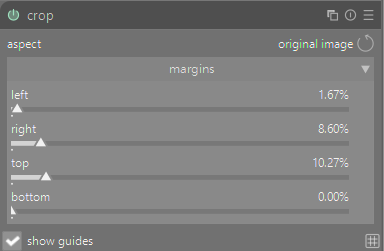

#### exposure

[Documentation](https://docs.darktable.org/usermanual/development/en/module-reference/processing-modules/exposure/)

The _exposure_ module is generally used to get the mid-tones to an appropriate level near mid-gray. This is important for tone mappers covered in a later section. You can click the picker to place a resizable overlay onto the image, which will adjust the exposure based on the selected area. I'll draw an area somewhere over the butterfly to get a rough estimate of what the exposure might be. I don't worry about it too much as long as the waveform or histogram aren't clipping.

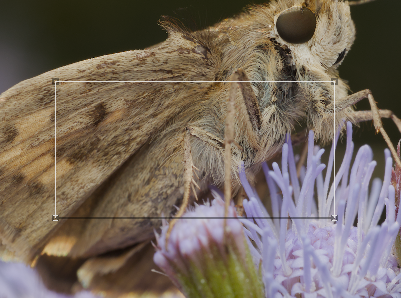
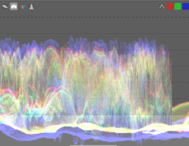
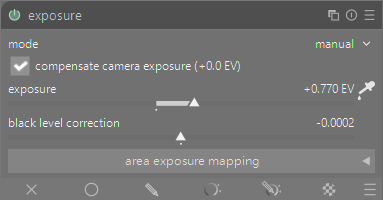

This module also allows adjusting the black level, but I personally do not use it. There are other modules that can make adjustments to the black point as well.

**NOTE:** By default, darktable applies a +0.7 EV adjustment to all images. Per the documentation, this is "to provide a midtone brightening comparable to the +0.5 to +1.2 EV typically added by in-camera tone curves". In other words, it's compensating for the exposure increase that camera styles or profiles would apply to an image in the camera preview or in other software.

#### color calibration

[Documentation](https://docs.darktable.org/usermanual/development/en/module-reference/processing-modules/color-calibration/)

In darktable, the _white balance_ module is a technical module and in most cases is best left alone. The _color calibration_ module is where users can make color corrections in a way similar to white balance tools in other editors. The documentation goes into detail about how _white balance_ and _color calibration_ work together and what the purpose of each is, however it is very technical information.

There are many more options in this tool than simply adjusting "white balance" and "tint", but for our purposes we can ignore most of them. By default, the module will read the white balance information from the image exif data (if available) to set the initial white balance. Because I have my in-camera white balance set consistently to 5600k and am using a flash, my lighting is consistent across all photos and in most cases I don't care to make any adjustments to the default settings.

Clicking the picker icon will bring up a selection overlay similar to what we did in the _exposure_ module. You can now create a selection over a neutral area in your photo and the module will calculate a setting based on that selection.

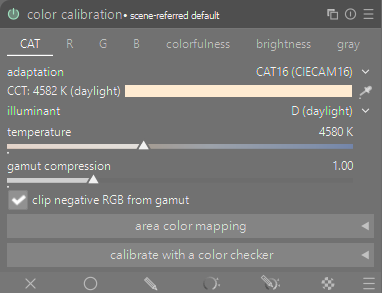

#### Review

At this point we gave the image a slight crop and bumped the exposure a bit. It doesn't look significantly different than before, but we haven't gotten to the more creative modules yet.

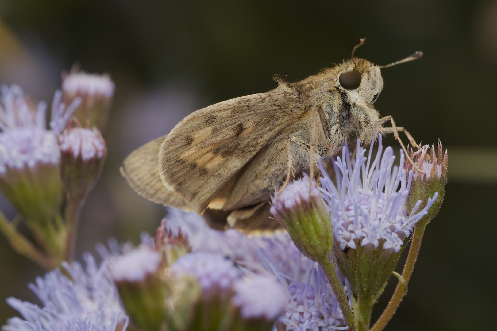

### Tone mapping

Tone mappers are an important part of the darktable development process, and each tone mapper has its strengths for different scenarios. In short, tone mappers control how the software converts your high dynamic range RAW image into the smaller dynamic range of your display.

The way I use these tone mappers is more corrective than artistic. The goal is to get a good starting point for contrast and color management. The result does not have to be perfect, I am mostly just trying to get a decent dynamic range in the waveform or histogram that is appropriate for the image, with some wiggle room for further adjustments.

#### agx

Documentation coming soon

The _agx_ module is a newer tone mapper released in darktable 5.4. I personally find that it provides better results in how it handles hue shifts and subtleties in flowers and insects compared to the other tone mappers _filmic rgb_ and _sigmoid_. The _agx_ tone mapper has many controls which affect the overall contrast, saturation, colors, and more. For the sake of simplicity, we will ignore most of them.

The only thing we will do with this module is click the picker icon for "auto tune levels". This will set the white and black relative exposure parameters based on the image.

**NOTE:** This may cause a warning icon to show up next to the "shoulder power" slider. This is NOT an error or a problem to be fixed, simply a warning that the curve being applied by the tone mapper now renders the "shoulder power" slider non-functional.

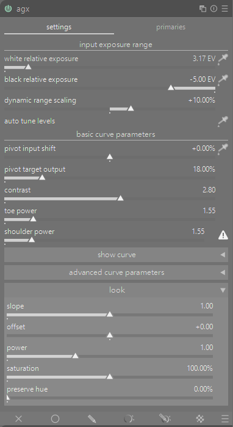

Here we can see the waveform before and after the adjustments. The before image shows that there is some latitude in the upper and lower bounds. The after image shows how the highlights and shadows have been stretched to increase contrast, but the mid-tones were not affected.

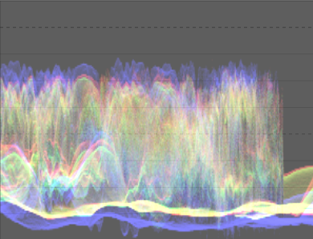
Waveform before _agx_ adjustments

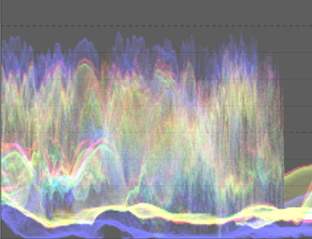
Waveform after _agx_ adjustments

### Sharpening and local contrast

There are many modules which can handle sharpening and local contrast with their own strengths and weaknesses. To simplify the options, here are the two I use.

#### diffuse or sharpen

[Documentation](https://docs.darktable.org/usermanual/development/en/module-reference/processing-modules/diffuse/)

The _diffuse or sharpen_ module is one of the most complex and powerful modules in darktable, but thankfully comes with a large set of useful presets to sharpen, blur, or apply local contrast. I find the "lens deblur | medium" preset to be adequate for sharpening my photos. Others like the two "sharpen demosaicing" presets. What works best for you may depend on your camera and tastes.

#### contrast equalizer

[Documentation](https://docs.darktable.org/usermanual/development/en/module-reference/processing-modules/contrast-equalizer/)

The _contrast equalizer_ module can do many of the same things as the _diffuse or sharpen_ module, but with a much different interface and using different methods. You can experiment on your own to see which module fits your needs best. It's relatively simple to use: move the nodes up or down to increase or decrease contrast where the nodes affect coarse to fine details in the image.

I use the contrast equalizer module to apply some "pop" to the subject using the clarity preset. The clarity preset is a uniform change in contrast across all the nodes. I reduce the mix to around 20 as a starting point and generally never increase the mix beyond 40 or so.

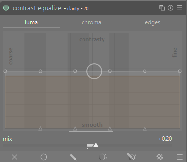

#### Review

Now we've tinkered with the tone mapper, added some more sharpening, and applied some clarity to the image. On the left of the divider is where we left off before the tone mapping, and on the right of the divider is how things look now with the new modules applied. The image is beginning to look less flat and more interesting.

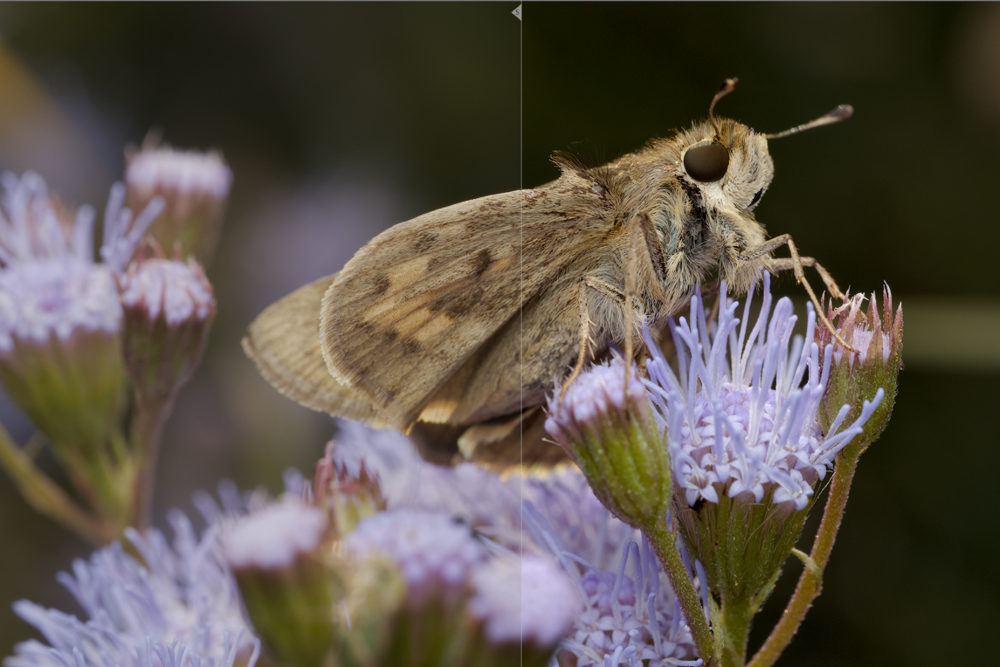

### Color and contrast

Now we get to the more creative and fun aspects of RAW editing. This section will cover three main objectives:

- Adjusting the color saturation
- Color grading
- Adjusting the overall contrast of the image

#### color balance rgb

[Documentation](https://docs.darktable.org/usermanual/development/en/module-reference/processing-modules/color-balance-rgb/)

The _color balance rgb_ module is a powerful set of tools that can be used for all of the aforementioned objectives.

##### Saturation

While other software may have controls for "saturation" and "vibrance", the _color balance rgb_ module allows for much more refined controls regarding vibrance, chroma, and saturation. For the sake of simplicity, we will focus on the "perceptual saturation grading" section, which has four controls:

- global saturation
- shadows
- mid-tones
- highlights

This means that we can control the saturation adjustments of different areas of the histogram in a way that is more natural than simply turning up global saturation across the entire histogram. For example, our eyes tend to perceive darker areas as more saturated and lighter areas as less saturated. A common starting point on these controls is to significantly increase the shadows saturation, increase the mid-tones saturation, and slightly decrease the highlights saturation. The saturation controls tend to allow a lot of leeway and do not require precision adjustments.

In some cases I increase the "global vibrance" control slightly, which restores some colorfulness in the less colorful areas of the image. This is useful for certain flowers or parts of an insect where the flash can create an exaggerated uncolorful look.

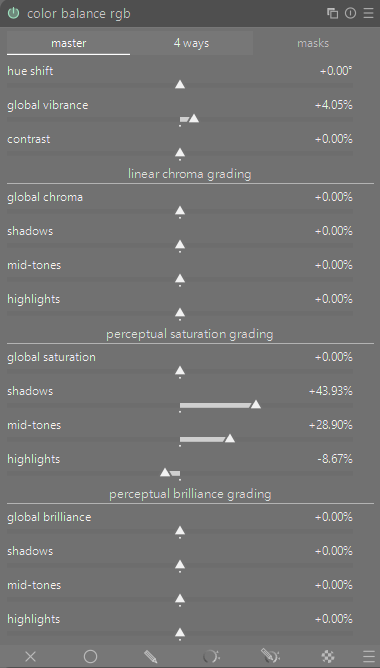

##### Contrast

In the "perceptual brilliance grading" section are similar controls:

- global brilliance
- shadows
- mid-tones
- highlights

These control the brightness of different regions of the histogram, affecting both luminosity and chroma, so you will notices changes to the color saturation. Because the tone mapper already increased contrast, the changes required here may be quite minimal.

For my tastes, I generally make the following adjustments but of course every image is different and your tastes will differ from mine. First I lower the shadows by a small amount as the flash can often fill in a lot of light in the image. I may raise the highlights but since the flash can sometimes exaggerate the highlights, I may only increase it by a tiny amount. Finally, I raise the mid-tones to increase some of the contrast in the lower end of the histogram.

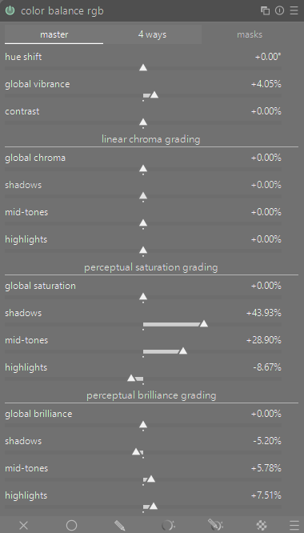

##### Color grading

In the "4 ways" tab of the _color balance rgb_ module are many controls that can be used for color grading. The documentation specifically mentions that these tools can be used to neutralize color casts in the image. Clicking the picker icons will allow you to select an area and it will calculate the opposing color and chroma increase.

Color grading can be as much a creative process as it can be a technical correction process, so play around and see how these sliders affect your images. Here I will just use the shadows picker to select an area in the butterfly's body. This is a effect to create some color separation in the image.

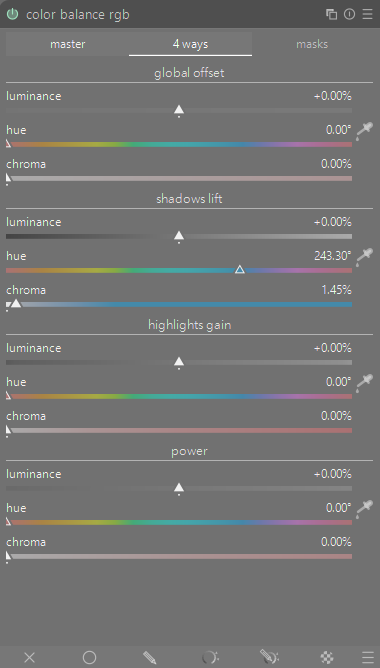

#### Review

Using only _color balance rgb_ we've further adjusted the overall contrast of the image, increased the color saturation, and applied some light color grading. Now the image feels much more alive. Here is a comparison against a snapshot of the initial import. The flowers are glowing, the greens are more lush, and the details in the butterfly stand out more.

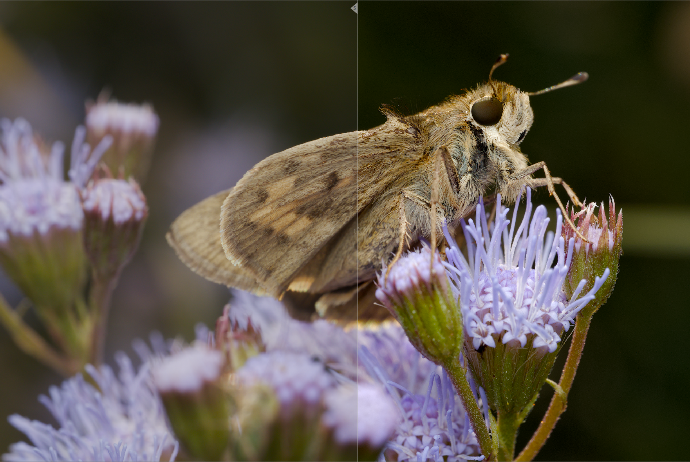

## The final image

Here is the finished photo and a review of what was done:

- Profiled technical corrections with the _denoise (profiled)_ and _lens correction_ modules
- Cropping and exposure correction using the _crop_ and _exposure_ modules to set the correct exposure for the subject
- One-click tone mapping adjustments to increase contrast in the highlights and shadows
- Sharpening with the _demosaic_ capture sharpening feature and the _diffuse or sharpen_ module using the "lens deblur | medium" preset
- Local contrast with the _contrast equalizer_ clarity preset
- General contrast, color saturation, and color grading in the _color balance rgb_ module

The edits I walked through make up fairly simple, quick, and consistent framework. It can hopefully serve as a solid starting point while exploring and learning how to process images in darktable.

## Next steps

The process in this walkthrough was fairly simple. Every module was applied globally and many of them simply required the press of a button or using a preset. We barely scratched the surface of the modules we used and there are many more powerful tools available in darktable. Below are some tools and resources that may help you take the next steps into your darktable journey.

### Module instances

[Documentation](https://docs.darktable.org/usermanual/development/en/darkroom/processing-modules/multiple-instances/)

Modules in darktable can be duplicated for different uses. For example, the _exposure_ module can be duplicated to have one instance that is the global exposure, and other instances using masks to have local adjustments or combined with a mask to do vignetting. Instances can be labeled to make it clear what it is used for.

In the _color balance rgb_ section I went over three specific objectives. We could have three instances of the module for each of those objectives: one for saturation, one for contrast, and one for color grading. This is useful because you can disable those instances as needed to compare only the changes for that purpose, such as seeing how color grading effects the image without also effecting the saturation and contrast changes.

Here I have created two more instances of _color balance rgb_ and labeled each of them with their respective task. Each can be independently adjusted or turned off and on.

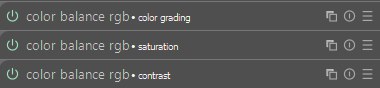

### Masking

[Documentation](https://docs.darktable.org/usermanual/development/en/darkroom/masking-and-blending/overview/)

All of the edits so far have been on the entire image, but darktable has powerful masking features that we can use. Each module (and module instance) can have its own mask using shapes, drawn paths, parametric masks for various attributes like hue and brightness, and also allows for a combination of drawn and parametric masks. Additionally, masks can be re-used between modules.

Since much of the photo is going to be out of focus I don't need to apply sharpening to the entire image. Returning to the _diffuse or sharpen_ module, we can use the masks feature to draw a path mask roughly around the area of the subject that is in focus. I keep a small feather distance on the mask and apply a feathering radius of somewhere around 50px. The purpose of the feathering is to keep a smooth transition between the sharp parts of the subject and the out of focus parts.

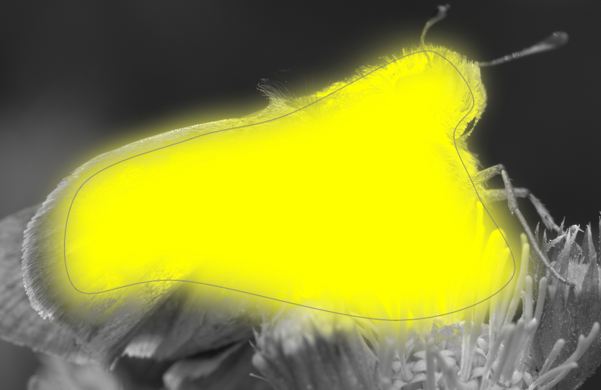

The icon under the "hamburger" menu icon ( ☰ ) will toggle whether the mask is shown or hidden.

##### Reusing a mask

Similarly to sharpening, I don't need to add the "clarity" effect from the _contrast equalizer_ module to the entire image. I can simply reuse the mask I created for the _diffuse or sharpen_ module by clicking the "drawn mask" section, selecting "use same shape as", and picking the correct module shape. You will have to apply feathering and other settings to each module, but the shape itself is re-used.

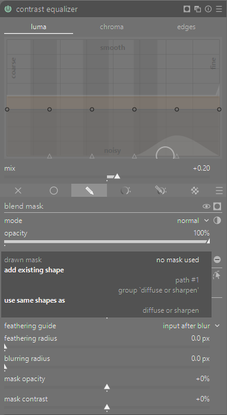

When selecting "use same shape as", changing the shape in any module using that shape will affect any other module using the shape. So changing the shape in the _contrast equalizer_ module will change the shape in the _diffuse or sharpen_ module even though the shape was created first in the _diffuse or sharpen_ module. This is useful for making adjustments to a shape without having to redo every module.

With darktable's powerful module instances and masking tools, you can do all sorts of localized adjustments in your images. These examples are just the tip of the iceberg.

### Advanced modules

There are many more modules in darktable to explore. A full list of the image processing modules can be found [here](https://docs.darktable.org/usermanual/development/en/module-reference/processing-modules/).

A few suggestions:

#### tone equalizer

[Documenation](https://docs.darktable.org/usermanual/development/en/module-reference/processing-modules/tone-equalizer/)

A powerful, complex, and often misunderstood module. Upon first glance it may look like a simple tone curve, but it is much more than that.

#### retouch

[Documentation](https://docs.darktable.org/usermanual/development/en/module-reference/processing-modules/retouch/)

Healing, cloning, fill, and blur tools with powerful wavelet decomposition for precision control.

#### color equalizer

[Documentation](https://docs.darktable.org/usermanual/development/en/module-reference/processing-modules/color-equalizer/)

Selective adjustments of hue, saturation, and brightness.

### Module presets

[Documentation](https://docs.darktable.org/usermanual/development/en/darkroom/processing-modules/presets/)

In almost every module you can store presets based on your common use cases. You can even have these presets auto-applied to images based on various criteria like camera model, lens, ISO, and much more.

### Create your own workflow

[Documentation](https://docs.darktable.org/usermanual/development/en/darkroom/organization/manage-module-layouts/)

The layout of modules in the _darkroom_ view is fully customizable. I have my modules divided between two tabs. One is the common modules I used for most images. The other is a set of corrective modules that I only sometimes use as needed.

## Deep dive

### Some thoughts on tone mappers

In darktable many of the modules work in the _scene-referred_ space, before the tone mapper conversion happens, utilizing the full dynamic range of the RAW image before converting into the _display-referred_ part of the pipeline. The tone mappers allow you to fine tune this conversion though they each work off of different concepts and have their own flavor. The controls these tone mappers offer is helpful when dealing with skin tones, skies, bright highlights, and so on.

Don't worry if this all sounds complex, it is, but this is a powerful set of tools that most other RAW editors don't provide. You don't have to understand them much at all to make use of them. Having _agx_ or _sigmoid_ (not both!) turned on will generally be a better starting point than not having them, even if you don't make any adjustments. For a generally well exposed photo, the amount of tinkering required with the tone mappers is minimal.

[Avid Andrew - AgX and The Evolution of Tone Mappers in Darktable](https://avidandrew.com/agx-evolution-tone-mappers.html)
Here is an article from another **dartkable** enthusiast that has a brief history of tone mappers in darktable, what the tone mappers do, and why the _agx_ module is a powerful new addition to the toolbox.

[Boris Hajdukovic - Darktable Episode 93: AgX in darktable](https://www.youtube.com/watch?v=ZFGxdb2pH8g)
An in-depth preview of the _agx_ module showing off how you can use _agx_ almost exclusively to develop a photo. Also has some comparisons to the other tone mappers. Boris has so many other valuable videos, please check them out.

### Other resources

Here are a few more resources that have helped me with darktable over the past year.

[Pixls.us Discourse](https://discuss.pixls.us)
Ask questions, discuss topics, and participate in knowledge sharing with the "play raw" category.

[Bruce Williams Photography - darktable new users playlist](https://www.youtube.com/watch?v=06V0XwmM0l4&list=PLlYWvzmJQTrQV8CjwNJgcig7RpspxlhK6)
Though some of these videos are five years old at this point, this serves as a similar high level intro to darktable.

[Bruce Williams Photography - darktable playlist](https://www.youtube.com/watch?v=s41rmYxOQ0g&list=PLlYWvzmJQTrRq7JrYdD7k3-8-v-uHnhK_)
Bruce's full darktable content. Around episode 153 he rebooted the series but many of the older videos are still valuable and have a lot of context.

[a dabble in photography - ENG darktable diffuse and sharpen](https://www.youtube.com/watch?v=DV8eey79ukc)
This is a great technical overview of how the _diffuse or sharpen_ module works.

[Darktable Landscapes - One Module Does Nearly Everything in Darktable!](https://www.youtube.com/watch?v=HZJWElE5OSE)
A overview of how _color balance rgb_ can be used to do even more than what I described.
