darktable 5.6 ships its first AI features: an *AI object mask* that turns a single click into a vector mask around any subject, and a *neural restore* module for ML-based denoise and upscale. Our focus was on building the foundation that loads and runs open computer-vision models locally on your CPU or GPU – so darktable can host AI tasks suitable for photography as the open model landscape evolves. This post is the hands-on tour: what each tool does, how to use it, and where it falls short.

To follow along, you can grab the five sample raws used in the walkthroughs:

- [Download "a Cat named Ebby_ND7_5751.NEF" (24 MB)](https://discuss.pixls.us/t/a-cat-named-ebby/23592) – used for the AI object mask walkthrough.
"A cat named Ebby" © 2020 by [Suki2019](https://discuss.pixls.us/u/suki2019), licensed under [CC BY-SA 4.0](https://creativecommons.org/licenses/by-sa/4.0/).
- [Download "DSC01318.ARW" (20 MB)](https://discuss.pixls.us/t/a-whole-lot-of-penguins/57817) – used for the multi-object mask example.
"A whole lot of penguins!" © 2025 by [Klogg](https://discuss.pixls.us/u/klogg), licensed under [CC BY-SA 4.0](https://creativecommons.org/licenses/by-sa/4.0/).
- [Download "_DSC0488.NEF" (15 MB)](https://discuss.pixls.us/t/chrysanthemum-flowers/14785) – used for the title image.
"Chrysanthemum Flowers" © 2019 by Xavier Bartol ([XavAL](https://discuss.pixls.us/u/xaval)), licensed under [CC BY-SA 4.0](https://creativecommons.org/licenses/by-sa/4.0/).
- [Download "07 Monkey ISO 6400.CR3" (43 MB)](https://discuss.pixls.us/t/a-raw-denoise-cross-comparison/48666) – used for the neural denoise walkthrough.
"A Raw Denoise Cross-comparison" © 2025 by [Dave22152](https://discuss.pixls.us/u/dave22152), licensed under [CC BY-SA 4.0](https://creativecommons.org/licenses/by-sa/4.0/).
- [Download "20250629_0012.NEF" (13 MB)](https://discuss.pixls.us/t/hoverfly-on-flower/50946) – used for the upscale walkthrough.
"Hoverfly on flower" © 2025 by [Fenny](https://discuss.pixls.us/u/fenny), licensed under [CC BY-SA 4.0](https://creativecommons.org/licenses/by-sa/4.0/).

Thanks to Suki, Klogg, Xavier, Dave, and Fenny for sharing these.

## Ground rules

A few principles we set early on, that ended up shaping every later decision:

**Optional.** Built without `USE_AI`, the whole subsystem disappears. The official binaries include it, but distros can opt out, and so can you – none of the existing modules depend on it.

**Local.** Nothing leaves your machine. No cloud inference, no telemetry, no "we'll improve the model with your data". Every model runs on your CPU, or your GPU if you have one. As a photographer myself, I'd never paste a raw file into a black-box service, and I wasn't going to ask anyone else to.

**Curated open models.** Every model we offer is documented in a separate repository – [darktable-ai](https://github.com/darktable-org/darktable-ai) – with its source code, training data and license. Binary weights are not bundled inside darktable itself, and models whose provenance isn't clear don't get included. That bar means our catalog is smaller than commercial competitors. That's the trade we chose.

**Extensible.** The catalog is a starting point, not a fence. Each AI task in darktable (object masking, denoise, upscale, ...) has a defined ONNX interface – input shapes, output shapes, expected pre- and post-processing. Any model matching that interface can be installed manually and used like a first-party one. If you know how to convert a published model to ONNX, or train your own, you can bring it to darktable without waiting for us to ship it. The catalog is for everyone; the door is open if you want to go further.

**Off by default.** Nothing is downloaded until a feature you enable needs it.

### Turning it on

AI features stay off until you turn them on – nothing is installed or loaded unless you ask for it. Open *preferences → AI* and tick *enable AI features*. The easiest start is the *download / update default* action: one click pulls down the recommended set so every feature works immediately. Once installed, models live on disk and load on demand.

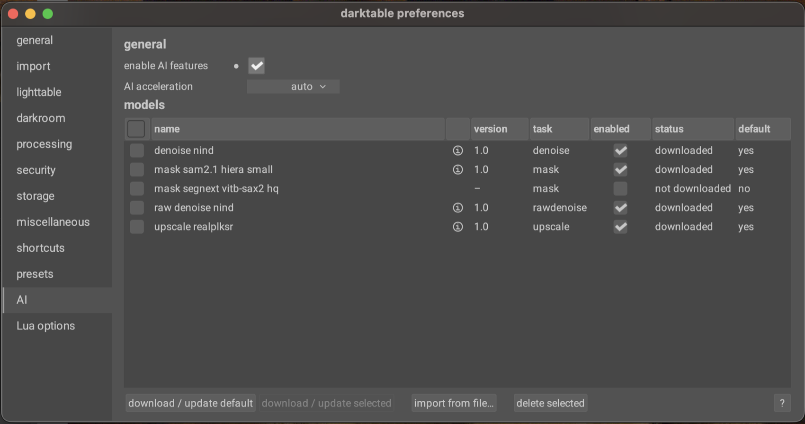

If you have a GPU, wire up a matching execution provider – CoreML on macOS, CUDA on NVIDIA, ROCm on AMD, DirectML on Windows, OpenVINO for Intel. Setup varies per platform; the [GPU acceleration page in the manual](https://docs.darktable.org/usermanual/development/en/special-topics/ai/gpu-acceleration/) walks through each one. CPU works too, just slower.

## The AI object mask

This is the feature that's changed my workflow the most. Drawn masks in darktable have always been powerful – brush, path, gradient, ellipse, parametric intersection – but masking, say, an animal against a busy background has always meant either patience with the brush or settling for an approximation.

The AI object mask short-cuts that. A click on an object gives you an accurate, hard-edged selection of that object, converted on the fly to a regular vector path – the same kind drawn masks produce, with edge nodes you can move, feather you can adjust, and intersections you can combine with other masks.

### Walkthrough: masking Ebby

Open `a Cat named Ebby_ND7_5751.NEF` in the darkroom. Pick any module that supports masking – I'll use *color balance rgb* for the demo. Open its mask manager and pick the *AI object mask* tool.

The first click on a new image triggers the encoder pass – 1 to 10 seconds depending on hardware. Once it's done, the model is ready to answer click prompts interactively for as long as you stay on this image.

Click somewhere near the centre of Ebby. The model returns a selection, vectorised into a closed path you can see overlaid on the canvas. Right-click to commit it.

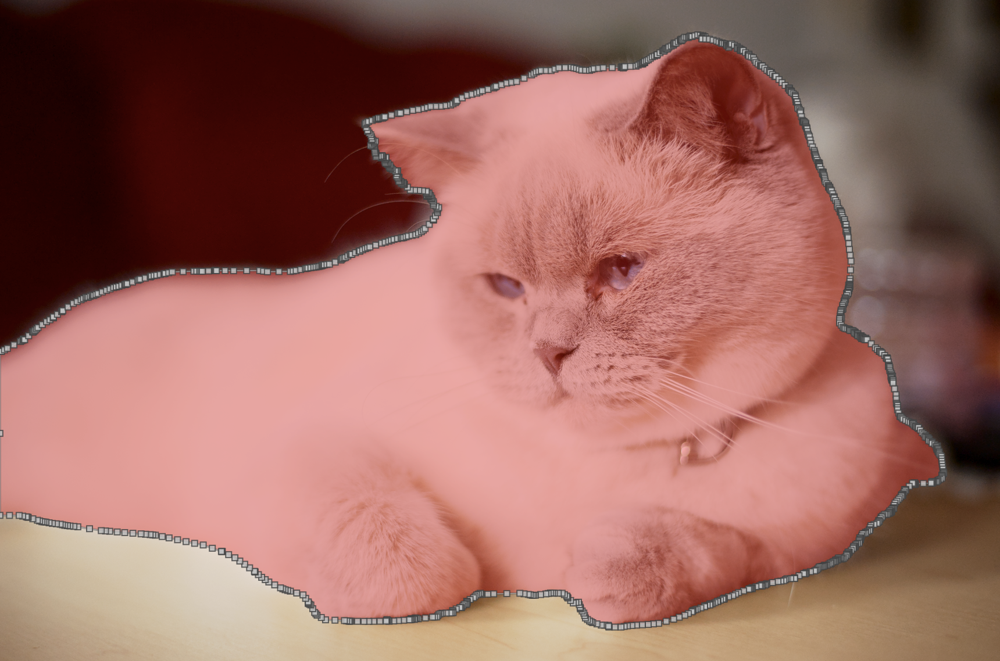

Two controls shape the result before you commit:

**Smoothing** controls how many anchor points the vectorisation produces. The default is 0 – maximum anchors, path hugs the silhouette closely (and is busier to edit). Raise it for soft-edged subjects (clouds, flower petals) to get a smoother curve with fewer anchors, at the cost of cutting corners on tight bends. The range goes up to 1.3.

**Refine boundary** is a checkbox that runs a second neural pass focused on the edge. It pulls the path tighter against the visible image contours – mostly helps with small details the initial mask cut off, like a thin tail or a sticking-up ear. (It's not what handles fur or hair – the feathering trick below does that, and it's a different problem.) Costs an extra second or two per click, but on subjects with lots of fine silhouette detail it's almost always worth it.

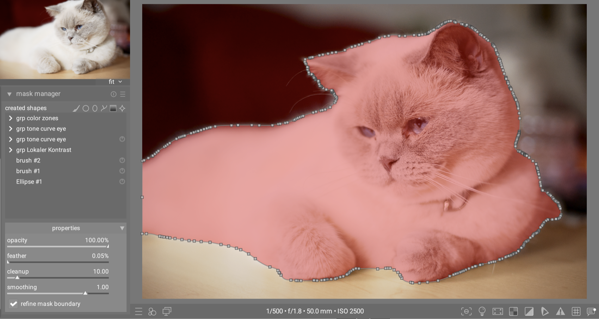

If the first selection isn't quite right – say it missed an ear or grabbed a chunk of the table – refine with extra clicks rather than restarting. A plain click adds another positive prompt ("include this too"); shift-click adds a negative prompt ("not this"). The encoder doesn't need to re-run; each refining click is interactive.

One non-obvious tip for adding a missed part – say an unselected ear: don't click right next to the boundary on the unselected area. That kind of edge-adjacent click confuses the model (it's ambiguous which side you mean). Click on an already-selected area close to the missed part instead. The model reads that as "extend the selection in this direction" and usually grabs the ear cleanly.

Once committed, the mask is a normal path. You can move its nodes, intersect it with parametric masks (good for restricting by luminance or colour), or feather its edges in the standard mask controls.

### Better fur coverage with feathering

Even with *refine boundary* on, the wispy edge of Ebby's coat doesn't translate cleanly to a hard-edged vector path. The trick I use: don't fight it on the path side; soften it on the blend side.

In the same module where you've applied the mask, scroll down to the blending options. Under *mask refinement*, bump the *feather radius* up to about 5–10 pixels. This makes the hard mask edge follow the image's local contrast instead of the literal vector line. On a furry subject the result reads natural even though the underlying path has no per-strand detail.

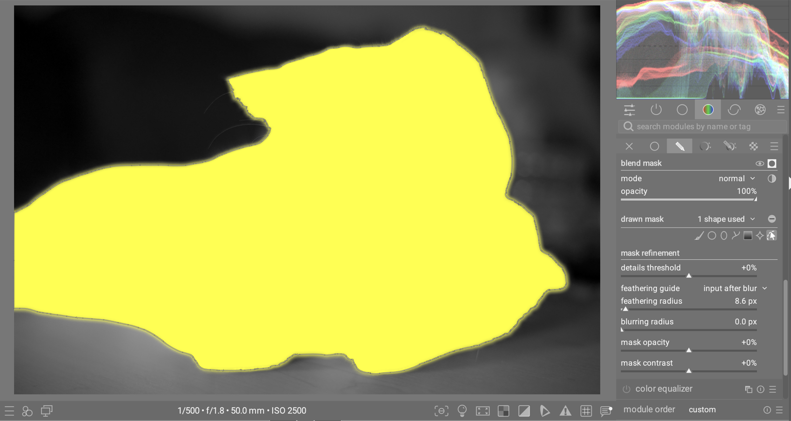

This is the technique I use for hair, fur, and foliage in almost every AI mask. A small feather radius is a much smaller intervention than trying to brush-correct the edge by hand.

### Multiple subjects: the penguins

Now open `DSC01318.ARW`. A colony of penguins in the background, with one in the foreground standing a few metres in front of the others – the kind of multi-subject scene that breaks the assumption that one click does it all.

Pick the AI object mask tool and click on the foreground penguin. The model returns a mask covering just that one penguin. Now try to extend the selection to one of the background penguins by clicking on it as a positive prompt – the foreground penguin's mask doesn't grow to include it. Visually-separated subjects can't end up in the same mask, no matter how many positive clicks you add. Each AI object mask is one connected region by construction.

A clarification, since the model's behaviour depends on whether subjects touch: clicking inside a tight cluster of penguins that are physically touching may grab several of them at once, because the model treats them as one connected region. But the foreground penguin and the colony, with a clear gap between them, are separate as far as the model is concerned.

To mask both, commit the first mask with right-click, start a new AI object mask, and click the second subject. Repeat for as many separate subjects as you have.

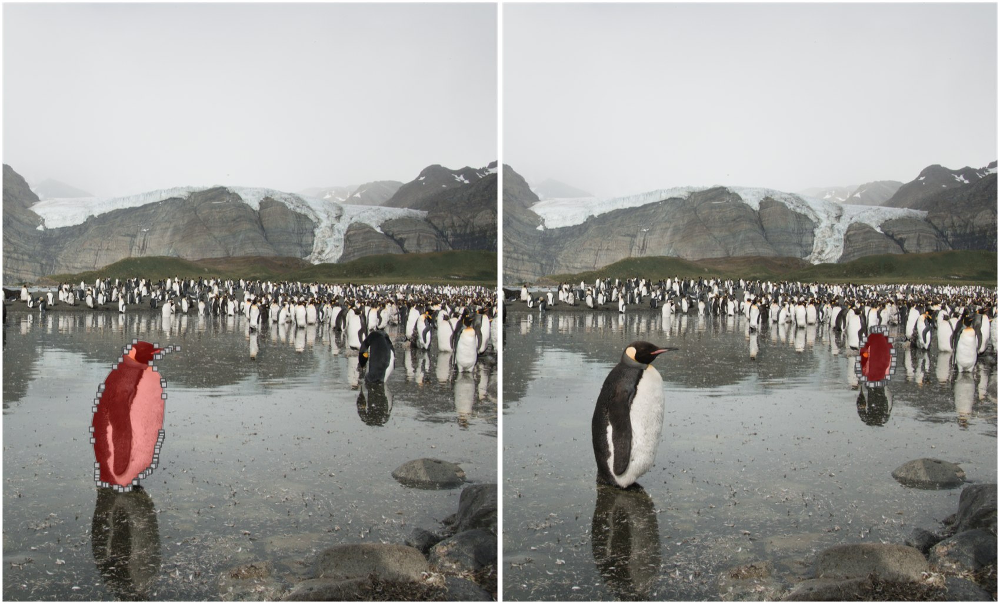

In the mask manager, the masks layer together by default in union mode – select them all and they form a combined region your module operates on.

The takeaway: the AI finds one connected thing at a time. Touching subjects can be one click. Separated subjects need one mask each. You're the orchestrator who decides which things and combines them.

### Where it may fall short

It's not magic. A few honest caveats:

**It's a vector mask underneath.** The AI tool finds a region for you and turns it into a vector path – the same kind a drawn path mask uses. Powerful, but it can't represent per-pixel detail. Wispy hair, animal fur, foliage edges – these will never come out pixel-perfect, no matter how good the model. The refinement techniques shown above (*refine boundary* + *feather radius* under *mask refinement* in blending) help a lot, but they don't solve it completely. A vector mask is the wrong abstraction for strand-by-strand precision.

**Ambiguity is real.** Clicking on a person holding a guitar might give you "person holding guitar" as one object, or just "guitar", depending on where you clicked and which model is loaded. A second click resolves it almost every time – but the first attempt isn't always what you expect.

**First selection on a new image is slow.** The encoder runs once per image – 1 to 10 seconds depending on hardware – then caches. Subsequent selections and refinements on the same image are interactive. Plan accordingly: finish an image before moving on, rather than ping-ponging.

### When the drawn tools still win

The brush and path aren't going anywhere, and for good reason:

- **Selections that aren't objects.** A corner of the sky, a wedge of foreground, "wherever the light is" – gradients and paths do this faster.
- **Pixel-perfect manual control.** When the mask edge has to land on a specific line, the brush is the right tool.
- **Tiny details.** Segmentation models weren't trained on the kinds of micro-elements you sometimes want to mask. Drawing is faster than fighting the model.

A rule of thumb that's held up: if you can describe what you're masking in a single English noun ("the cat", "the bottle", "the bike"), the AI object mask is the fastest path. If you can't, draw it.

## Neural restore

The second feature is *neural restore* – a utility module available in both lighttable (right sidebar by default) and darkroom (left sidebar). The user manual has [the full reference](https://docs.darktable.org/usermanual/development/en/module-reference/utility-modules/shared/neural-restore/); below is a hands-on tour.

Unlike the object mask, this isn't part of the pixel pipeline. It takes an input image, runs a neural network over it, and writes the result back to the lighttable as a new image. Three tasks share the panel: *raw denoise*, *denoise*, and *upscale*.

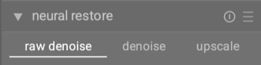

These tools sit in a different role from the pipeline modules. They're slower, and the output is always a new image – so they're a poor fit for a quick tonal tweak. For the things they're good at, they're remarkable.

### Walkthrough: denoising the ISO 6400 monkey

Open `07 Monkey ISO 6400.CR3` in the darkroom. Zoom in to 100% – you'll see the noise across the smooth surfaces (the monkey's body, the grey background) and in the shadows. This is what a camera sensor produces at high ISO; the noise is real but the underlying detail is still there to recover.

In neural restore, pick task = *denoise* and model = `denoise-nind` (the general-purpose UNet). The *strength* slider lets you dial back the effect if it's too aggressive – default works for most files; drop to 60–70% if the result is too smooth. Click *process*. On a GPU it's a few seconds; on CPU expect tens of seconds for the full frame.

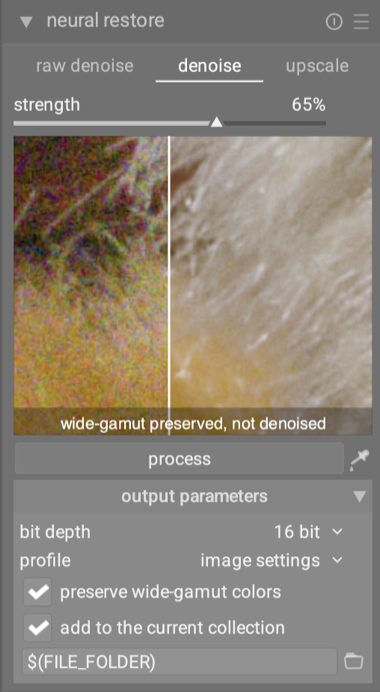

The result lands as a new image in the same film roll alongside the original. Open it and compare at 100%.

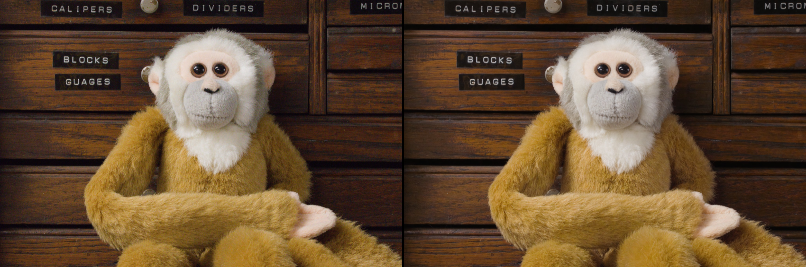

What to look for: the grain texture should be gone but the underlying detail – fur direction, fine markings, the eyes – should still read. Compare this against a profiled-denoise version of the same file. At ISO 6400 the AI usually keeps detail the profiled module flattens out, especially in low-contrast regions.

### Walkthrough: raw denoise on the same file

Same image, different attack. Switch task to *raw denoise* and select `rawdenoise-nind` – it auto-picks the Bayer variant for this Canon file (the linear Rec.2020 variant handles X-Trans, Foveon, and other non-Bayer sensors).

Raw denoise works on the pre-demosaic data. It sees the raw mosaic, denoises it, and demosaics in one step. That's a deeper intervention than RGB denoise – the model has access to per-channel noise information that the demosaicked image has already lost.

Click *process*. Same waiting, same new-image output. The *strength* slider is available here too if you want to ease the effect.

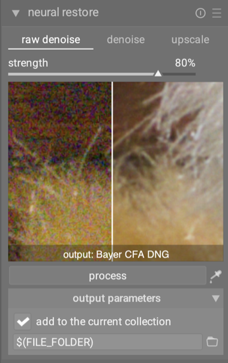

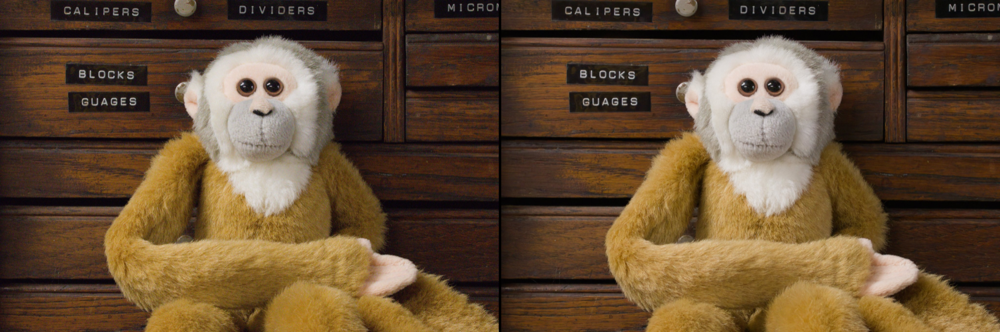

At ISO 6400 the difference between AI denoise and AI raw denoise is subtle – both look good, raw is marginally cleaner in deep shadows. Where raw denoise really earns its keep is on heavily noisy files – say the ISO 25,600 sibling in the same [cross-comparison thread](https://discuss.pixls.us/t/a-raw-denoise-cross-comparison/48666), or any extreme-ISO underexposed rescue shot. The extra signal raw denoise gets to work with before demosaic translates to better detail in the worst-case shadows.

Picking between the two is less about ISO level than about *when in your workflow* you reach for them ([per the manual](https://docs.darktable.org/usermanual/development/en/module-reference/utility-modules/shared/neural-restore/)):

- **Use *raw denoise* upfront**, when you already know the shot is noisy – high ISO, deep push, low light – and you haven't started editing. It cleans the noise at the source, before demosaic. You commit to the cleaned DNG, then do all your other edits on top.
- **Use *denoise* after editing**, when you've developed an image and noise is still bothering you in the result. It cleans the noise that survived your edit, without making you redo any of that work.
- Use one or the other, not both.
- **Film-style grain** is one thing both will erase. For that aesthetic, stay with the profiled denoise module in the pipeline – and maybe add grain back deliberately.

### Walkthrough: upscaling the hoverfly

Open `20250629_0012.NEF` – a 7 MP macro of a hoverfly on a flower, with the kind of fine detail (wing veins, compound eye facets, flower stamens) that's interesting to test on. Imagine you want to print this large or crop in tight on the insect: both call for more pixels than the sensor provided.

A workflow note before we run anything ([per the manual](https://docs.darktable.org/usermanual/development/en/module-reference/utility-modules/shared/neural-restore/)): upscale is meant to be the **last step before delivery**. Finish your edit completely, then upscale the developed result. Doing it earlier means any subsequent denoise, sharpening or grading operates on synthesised pixels instead of the originals, and the output quality suffers.

Switch task to *upscale*, pick `upscale-realplksr`, set the scale to your target (2× or 4×), and click *process*. The output is a larger image in your lighttable.

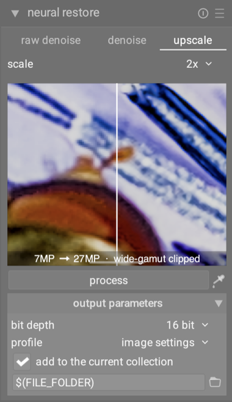

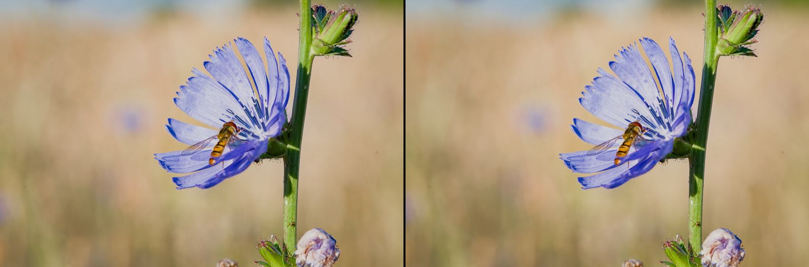

What to look for: real detail – the compound eye facets, the wing veins – preserved sharper and cleaner. No smoothing of areas that weren't smooth. And critically, no obviously invented texture in areas the source image left vague. RealPLKSR is the conservative upscaler; if it didn't see structure in the source, it won't make some up.

**Picking a scale:** 2× gives you 4× the pixels, 4× gives you 16×. The 4× model has to invent four times as many missing pixels, so fine textures and high-frequency content are noticeably less convincing at 4× than at 2×. Use 2× when it meets your resolution requirement, and only reach for 4× when you actually need that much enlargement.

For contrast, try `upscale-bsrgan` on the same crop. BSRGAN is more aggressive – it combines upscaling with implicit denoising and deblurring, and it'll invent plausible detail more freely. On a clean source like this hoverfly, RealPLKSR is the right pick. On a noisy phone snap or an old web JPEG, BSRGAN would do better because the source needs the rescue.

The rule of thumb: clean source + faithful preservation → RealPLKSR. Messy source + tolerate some invention → BSRGAN. Always compare both on a sample crop before committing to a final render. The "right" model isn't always the one you'd guess from the source's apparent quality.

### When the pixel pipeline is the right answer

- **Output sharpening** belongs in the pipeline (contrast equalizer, sharpen). An upscaler is not a sharpener.
- **Tight pixel-level control** – anywhere you want every pixel to come from a deterministic transform you can see – stays in the pipeline. Neural restore always reinterprets the image to some degree.
- **Mild noise** at ISO 100–1600 doesn't really need the AI treatment. Profiled denoise is faster, lives in the pipeline, and stays tunable.

## My take on AI in darktable

AI tools shouldn't replace your judgement. A good photograph is a stack of small decisions about light, colour, contrast, and intent – and those decisions belong to you. What AI is genuinely good at is the *mechanical* parts of editing: drawing a mask around an obvious subject, cleaning noise out of an ISO 12,800 shot, doubling the pixel count of an old scan. That's where the effort went.

5.6 is the first release of AI features in darktable, and most of the work behind it is invisible to the reader. We didn't train a single model for this release – we drew on the open-source computer vision community for models that fit photography tasks (Segment Anything, NIND, RealPLKSR, and others). The engineering went into the foundation: an AI subsystem that loads and runs ONNX models locally on CPU or GPU, a curated model catalog with documented provenance, and the integration work that makes the visible features feel like native darktable rather than bolted-on demos. Click-to-mask, neural denoise, upscale – these are the first surfaces of that foundation. We're going to keep refining what's already here, and adding new AI features in upcoming releases as the open model landscape evolves.

Use these tools when they help. Ignore them when they don't. They're additions to the toolbox, not replacements for the rest of it.

## Where to go next

- [The user manual](https://docs.darktable.org/usermanual/) covers each feature in more detail (mask manager → AI object mask, and neural restore).
- The model catalog at [darktable-org/darktable-ai](https://github.com/darktable-org/darktable-ai) lists every model with its source and license. Curious about provenance, or want to suggest a model? That's the place.
- Feedback is genuinely welcome – on [discuss.pixls.us](https://discuss.pixls.us/) in the darktable category, or as issues on GitHub. The most useful reports are the ones describing where these tools fall short of what you'd want. That's how the next round of improvements gets prioritised.

Happy editing.
